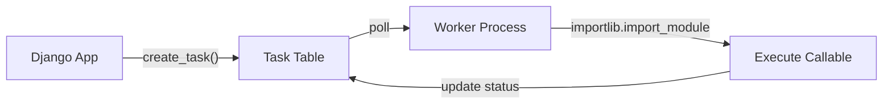
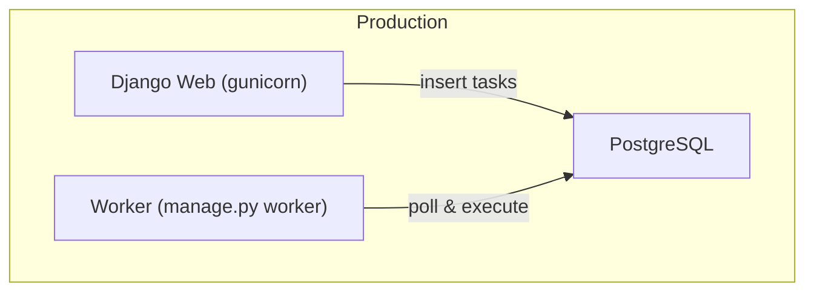

## The Insight

My friend and manager Shubham Dipt — an IISERk alum — spotted something most Django developers miss: **Django already has a persistent, transactional message broker. It's called the database.**

Every Django project connects to a database. Every database supports INSERT, SELECT, UPDATE. That's all a task queue needs: write a task (INSERT), claim it (SELECT + UPDATE), execute it, mark it done (UPDATE).

Celery adds Redis or RabbitMQ as a separate broker. For large teams processing millions of tasks, that overhead pays for itself. But for a team of 3-5 developers running a few hundred tasks per hour? You're maintaining extra infrastructure for a problem the database already solves.

Shubham built [django-simple-queue](https://github.com/shubhamdipt/django-simple-queue) — the entire thing, start to finish. I came on later to use it in a production project where I maintain my own fork with additional hardening. This series documents that journey: what the original library does well, and what production taught me to add.

## The Architecture

The entire system fits in ~300 lines of code, MIT licensed. Three concepts:

1. **Task model** — a database row with UUID, status, callable path, and JSON arguments
2. **Worker loop** — polls the database, claims tasks, executes them
3. **Resolution** — `importlib` converts a dotted path string to an actual Python callable



No broker. No result backend. No serialization framework. The database is the queue.

## The Core Model

The Task model captures everything needed to execute deferred work:

```python
class Task(models.Model):
    id = models.UUIDField(primary_key=True, default=uuid.uuid4)
    task_name = models.CharField(max_length=500)  # dotted path: "myapp.tasks.send_email"
    task_params = models.JSONField(default=dict)   # {"to": "user@example.com", "subject": "..."}
    status = models.CharField(max_length=20, default="QUEUED")
    created_at = models.DateTimeField(auto_now_add=True)
    started_at = models.DateTimeField(null=True)
    completed_at = models.DateTimeField(null=True)
    error = models.TextField(null=True, blank=True)
```

**Design decision:** `task_name` stores a dotted Python path, not a serialized function. This means the callable must exist in the worker's Python environment, but it also means tasks are inspectable — you can read the database and understand what's queued without deserializing anything.

**Design decision:** `task_params` uses Django's JSONField. No custom serialization. Arguments must be JSON-serializable, which rules out passing model instances directly — but that constraint is actually good. It forces tasks to accept IDs and re-query, which is safer across transaction boundaries anyway.

## The Worker Loop

The worker is a Django management command that polls in a loop:

```python
class Command(BaseCommand):
    def handle(self, *args, **options):
        while True:
            task = Task.objects.filter(
                status="QUEUED"
            ).order_by("created_at").first()

            if task is None:
                time.sleep(1)  # nothing to do, wait
                continue

            task.status = "PROGRESS"
            task.started_at = timezone.now()
            task.save()

            try:
                # resolve dotted path to callable
                module_path, func_name = task.task_name.rsplit(".", 1)
                module = importlib.import_module(module_path)
                func = getattr(module, func_name)

                func(**task.task_params)

                task.status = "COMPLETED"
                task.completed_at = timezone.now()
            except Exception as e:
                task.status = "FAILED"
                task.error = str(e)

            task.save()
```

**The tradeoff:** Polling introduces latency. A task waits up to `sleep_interval` seconds before being picked up. For email notifications or report generation, a 1-second delay is invisible. For real-time chat messages, it's not.

## Callable Resolution

The `importlib` trick is the clever part. Any function anywhere in your Django project becomes a task:

```python
# myapp/tasks.py
def send_welcome_email(user_id: int):
    user = User.objects.get(id=user_id)
    send_mail(
        subject="Welcome!",
        message=f"Hello {user.first_name}",
        from_email="noreply@example.com",
        recipient_list=[user.email],
    )

# myapp/views.py
from django_simple_queue.models import Task

def register_user(request):
    user = User.objects.create(...)
    Task.objects.create(
        task_name="myapp.tasks.send_welcome_email",
        task_params={"user_id": user.id},
    )
```

No decorators. No registration. No `@app.task`. Just a function and a string pointing to it.

<details>
<summary>The full importlib resolution pattern</summary>

```python
def resolve_callable(dotted_path: str):
    """
    Resolve a dotted path like 'myapp.tasks.send_email'
    to the actual callable function.
    """
    module_path, func_name = dotted_path.rsplit(".", 1)
    module = importlib.import_module(module_path)
    func = getattr(module, func_name)

    if not callable(func):
        raise TypeError(f"{dotted_path} is not callable")

    return func
```

This is the same pattern Django uses internally for `MIDDLEWARE` and `ROOT_URLCONF` resolution. Battle-tested.

</details>

## When This Beats Celery

| Factor | django-simple-queue | Celery + Redis |
|--------|-------------------|----------------|
| Infrastructure | Database only | Database + Redis/RabbitMQ |
| Setup time | `pip install`, one migration | Broker install, config, workers |
| Task throughput | Hundreds/hour | Millions/hour |
| Monitoring | Django admin | Flower, custom dashboards |
| Team size | 1-5 developers | Any |
| Deployment | Same as Django | Separate worker processes |

**Use this when:**
- Your team is small and you don't want to maintain Redis
- Task volume is low-to-moderate (order processing, email, reports)
- You want to inspect the queue with Django admin
- You value simplicity over throughput

**Use Celery when:**
- You process thousands of tasks per minute
- You need task chaining, groups, or chords
- You need multiple specialized queues
- You already run Redis for caching anyway

## The Deployment Story

The worker runs as a management command:

```bash
python manage.py worker
```

In production, a systemd service or supervisor process keeps it alive. No separate broker to monitor. No Redis memory to tune. Your existing database backup strategy covers the queue too.



Two processes, one database. That's the entire production architecture.

## What's Missing (And What's Coming)

At this point, the library has deliberate gaps:

- **No concurrency safety** — two workers can claim the same task
- **No memory management** — long-running workers accumulate state
- **No timeout enforcement** — a stuck task blocks the worker forever
- **No task allowlisting** — any dotted path gets executed

Each of these becomes a post in this series as I encounter them in production and fix them in my fork.

## Key Takeaways

1. **The database is a message broker** — INSERT/SELECT/UPDATE is all you need
2. **importlib is your task registry** — no decorators, no registration
3. **Constraints are features** — JSON-only params force clean task boundaries
4. **Simplicity has a throughput ceiling** — know when you'll outgrow it

---
