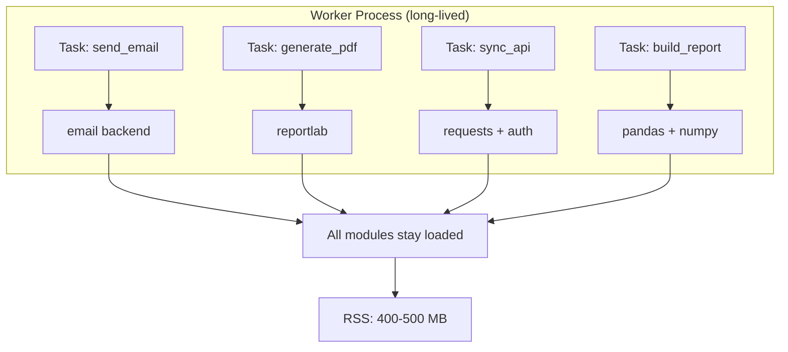
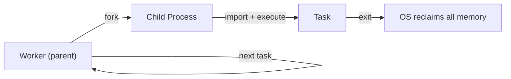

## The Symptom

Three months into production, our monitoring showed a pattern: the worker process started at ~50 MB and climbed steadily. After a day or two, it sat at 400-500 MB. It never came back down.

No crash. No OOM kill yet — that's when Linux forcefully terminates your process because it's consuming too much memory. Just a slow, steady accumulation. The kind of problem that only appears when you actually run something in production.

## Instrumenting the Problem

Before fixing anything, I needed to see what was happening. The first step was adding memory monitoring to the worker's heartbeat loop using `psutil`:

```python
import psutil
import os

def log_memory():
    process = psutil.Process(os.getpid())
    mem = process.memory_info()
    logger.info(
        f"Memory: RSS={mem.rss / 1024 / 1024:.1f}MB "
        f"VMS={mem.vms / 1024 / 1024:.1f}MB"
    )
```

Two memory metrics here: **RSS** (Resident Set Size) is the actual physical memory your process is using right now — the number you care about. **VMS** (Virtual Memory Size) is the total address space reserved, including memory that's allocated but not yet used. Think of RSS as "what's on your desk" and VMS as "the size of your desk."

Adding this to the worker's main loop — logging memory before and after each task — revealed the pattern clearly:

```
Task 1:   RSS=48.2MB → 52.1MB   (+3.9MB)
Task 2:   RSS=52.1MB → 58.7MB   (+6.6MB)
Task 3:   RSS=58.7MB → 59.2MB   (+0.5MB)
...
Task 100: RSS=187.3MB → 193.8MB (+6.5MB)
```

Most tasks added a few MB. Some added nothing. But the total never decreased.

## The Root Cause

Python's garbage collector reclaims objects, but it doesn't reclaim **modules**. Every `importlib.import_module()` call loads a module into `sys.modules`. Every module loads its dependencies. Those imports persist for the lifetime of the process.

Consider a task that sends emails:

```python
# myapp/tasks.py
from django.core.mail import send_mail  # loads email backend
from myapp.models import User           # loads model + ORM machinery
from myapp.templates import render      # loads template engine
```

The first time this task runs, all those modules load into memory. They stay loaded forever, even after the task completes. The function's local variables get garbage collected, but the modules don't.

For a worker running diverse tasks — email, PDF generation, API calls, report building — each new task type brings its own import tree. Over hours, the worker accumulates every module the entire application needs.



**The insight:** In Python, imports are effectively memory leaks. This isn't a bug — it's by design. CPython's module system isn't built for unloading. But in a long-running worker that imports diverse code, it's a real problem.

## The Fix: Subprocess Isolation

The solution is to run each task in a separate process — a child process spawned by the worker. When the child exits, the operating system reclaims **everything** — modules, objects, open connections, all of it. No Python garbage collector needed; the OS simply wipes the slate clean.

```python
import multiprocessing

def execute_task(task):
    """Run a task in a subprocess."""
    process = multiprocessing.Process(
        target=_run_task_in_child,
        args=(task.task_name, task.task_params),
    )
    process.start()
    process.join()  # wait for completion

    if process.exitcode == 0:
        task.status = "COMPLETED"
    else:
        task.status = "FAILED"
    task.save()


def _run_task_in_child(task_name, task_params):
    """This runs in the child process."""
    module_path, func_name = task_name.rsplit(".", 1)
    module = importlib.import_module(module_path)
    func = getattr(module, func_name)
    func(**task_params)
```



The parent process stays lean. It only does database polling and process management. All the heavy importing happens in children that die after one task.

## The Lean Settings File

The subprocess inherits the parent's Python environment, but we can control which Django settings it loads. A minimal `task_worker_settings.py` avoids loading unnecessary Django apps:

```python
# task_worker_settings.py
from myapp.settings import *  # noqa: F403

# Override for lean worker subprocess
INSTALLED_APPS = [app for app in INSTALLED_APPS if app not in [
    'django.contrib.admin',
    'django.contrib.staticfiles',
    'debug_toolbar',
]]

# No middleware needed in worker
MIDDLEWARE = []

# No template engines needed
TEMPLATES = []
```

**The tradeoff:** The worker can't use Django admin or templates. But it's a background worker — it shouldn't need them. Removing these shaves ~10 MB off the child's baseline.

## The Results

Before (in-process execution):
```
Hour 0:   50 MB
Hour 4:  180 MB
Hour 12: 350 MB
Hour 24: 480 MB
```

After (subprocess isolation):
```
Parent:   30-35 MB (stable, never grows)
Child:    15-50 MB (depends on task, freed on exit)
Peak:     50 MB (parent + one child)
```

From 400-500 MB steady-state to 30-50 MB. The parent process can run indefinitely without accumulating memory.

<details>
<summary>Full subprocess execution with error handling and memory monitoring</summary>

```python
import multiprocessing
import psutil
import os
import importlib
import logging
from django.utils import timezone

logger = logging.getLogger(__name__)


def log_memory(label=""):
    process = psutil.Process(os.getpid())
    mem = process.memory_info()
    logger.info(
        f"[{label}] PID={os.getpid()} "
        f"RSS={mem.rss / 1024 / 1024:.1f}MB"
    )


def execute_task_in_subprocess(task):
    """
    Fork a child process to run the task.
    Parent stays lean; child does all the heavy importing.
    """
    log_memory("parent-before-fork")

    process = multiprocessing.Process(
        target=_child_worker,
        args=(task.task_name, task.task_params),
    )

    task.status = "PROGRESS"
    task.started_at = timezone.now()
    task.save()

    process.start()
    process.join()

    log_memory("parent-after-join")

    if process.exitcode == 0:
        task.status = "COMPLETED"
        task.completed_at = timezone.now()
    else:
        task.status = "FAILED"
        task.error = f"Child exited with code {process.exitcode}"
        task.completed_at = timezone.now()

    task.save()


def _child_worker(task_name, task_params):
    """Runs in child process. Exits when done — OS reclaims all memory."""
    try:
        log_memory("child-start")

        module_path, func_name = task_name.rsplit(".", 1)
        module = importlib.import_module(module_path)
        func = getattr(module, func_name)

        func(**task_params)

        log_memory("child-end")
    except Exception as e:
        logger.exception(f"Task {task_name} failed: {e}")
        os._exit(1)
```

</details>

## Why Not Threads?

Threading doesn't solve this. Python threads share the same process memory space, so modules loaded by one thread are visible to all threads. Python also has the **GIL** (Global Interpreter Lock) — a mechanism that only lets one thread execute Python code at a time. This means threads can't speed up CPU-bound work, and they don't give you memory isolation either.

Subprocesses give true isolation:
- Separate memory space (each process has its own copy)
- Separate module registry (imports in one don't affect the other)
- OS-level cleanup on exit (everything freed automatically)
- No GIL — each process has its own Python interpreter

The cost is startup overhead (~10-50ms to create the child process) and the fact that parent and child can't share variables directly. For tasks that take seconds to minutes, 50ms of startup time is noise.

## The New Constraint

Subprocess isolation solves memory, but it creates new problems:

- The child process inherits the parent's database connections — both processes end up sharing the same network socket to PostgreSQL, which causes data corruption
- The child process inherits the parent's working directory — which can become invalid during deployment

Both of these caused production incidents. They're the subject of the next post.

## Key Takeaways

1. **Python imports are permanent** — modules loaded into `sys.modules` never get freed
2. **Instrument before fixing** — psutil in the heartbeat loop made the problem visible
3. **Subprocess isolation is the OS's garbage collector** — process exit reclaims everything
4. **Lean settings reduce baseline** — strip Django apps the worker doesn't need
5. **Every architectural fix creates new constraints** — subprocess model has its own failure modes

---
