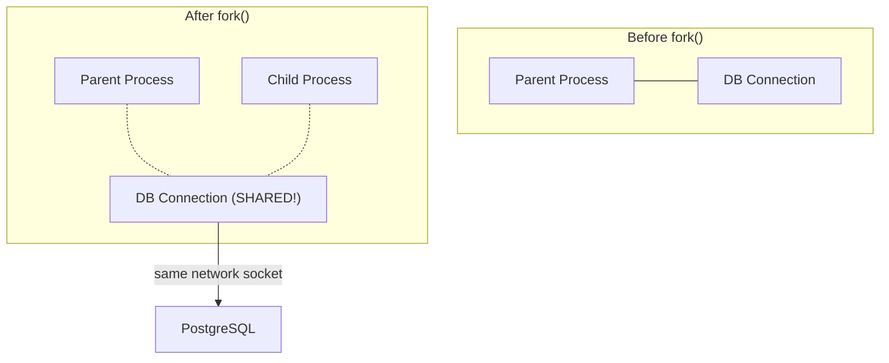
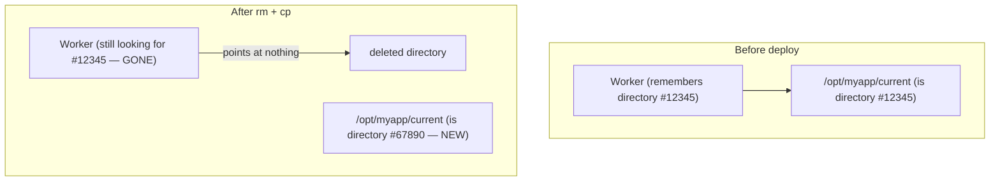
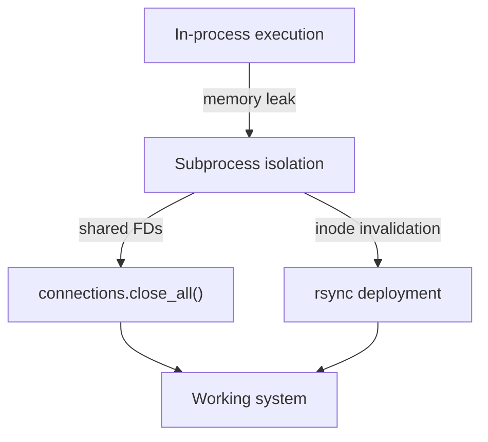

## The Consequence of Forking

The [previous post](/blog/2025-03-29-django-queue-memory-leaks) solved the memory problem by running tasks in subprocesses. Memory went from 500 MB to 50 MB. Problem solved.

Then two new bugs appeared. Both were consequences of how process creation works on Linux, and both were subtle enough to pass testing but fail in production.

**Quick background:** When Python's `multiprocessing` creates a child process on Linux, it uses a system call called `fork()`. This creates an almost-exact copy of the parent process — same memory contents, same open network connections, same everything. The child is a clone that starts running from the point of the fork. This is different from starting a fresh Python interpreter; the child inherits whatever state the parent had at that moment.

## Bug 1: The Shared Database Connection

### The symptom

Intermittent database errors in production. Not every task — maybe 1 in 20. Errors like:

```
django.db.utils.OperationalError: server closed the connection unexpectedly
psycopg2.InterfaceError: connection already closed
```

Tasks that worked fine in-process started failing randomly after we switched to subprocesses.

### The cause

Under the hood, a Django database connection is a network socket — a live communication channel between your Python process and PostgreSQL. When `fork()` copies the parent process to create a child, it copies the references to all open connections too. But it doesn't create *new* connections. Both parent and child now point to the **same** underlying network channel to PostgreSQL.



This is like two people trying to talk on the same phone call simultaneously. When the child finishes a task and exits, Python's cleanup hangs up the connection. Now the parent's connection object points to a dead line. The next time the parent tries to query the database — error.

Even worse: if both parent and child try to query the database simultaneously, their messages get interleaved on the same connection. PostgreSQL sees garbled data and drops the connection entirely.

### The fix

Close all database connections in the child process before doing any work:

```python
from django.db import connections

def _child_worker(task_name, task_params):
    """Runs in child process."""
    # CRITICAL: close inherited connections before doing anything
    connections.close_all()

    # Now import and execute — Django will create fresh connections
    module_path, func_name = task_name.rsplit(".", 1)
    module = importlib.import_module(module_path)
    func = getattr(module, func_name)
    func(**task_params)
```

`connections.close_all()` tells Django to close every database connection it currently holds. This drops the inherited (shared) connections. When the task code subsequently accesses the database, Django automatically opens a **new** connection — one that belongs exclusively to the child process. No sharing, no conflict.

**Why close in the child, not the parent?** The child is short-lived — it runs one task and exits. The parent is long-lived and polls the database constantly. Closing the parent's connections would force it to reconnect on every poll cycle. Closing in the child is the right place.

<details>
<summary>Alternative: using multiprocessing start method</summary>

Python's `multiprocessing` module supports different start methods:

| Method | How it works | Parent's connections |
|--------|-------------|---------------------|
| `fork` (default on Linux) | Copy parent process | Shared (problem!) |
| `spawn` | Fresh Python interpreter | Not shared |
| `forkserver` | Fork from a clean server process | Not shared |

Using `spawn` or `forkserver` would avoid the shared connection issue entirely:

```python
ctx = multiprocessing.get_context("spawn")
process = ctx.Process(target=_child_worker, args=(...))
```

The tradeoff: `spawn` starts a completely new Python interpreter from scratch, which is much slower (~1-2 seconds vs ~50ms for `fork`). For tasks running every few seconds, that overhead matters. The `connections.close_all()` approach keeps `fork`'s speed advantage while fixing the specific problem.

</details>

## Bug 2: The Vanishing Working Directory

### The symptom

After a deployment, the worker stops processing tasks. No error. No crash. The management command just... hangs. Restarting the worker fixes it.

### The cause

Our deployment script looked like this:

```bash
# deploy.sh
rm -rf /opt/myapp/current
cp -r /opt/myapp/release /opt/myapp/current
systemctl restart myapp-web
# Note: worker was NOT restarted
```

The problem: `rm -rf` deletes the directory, and `cp -r` creates a **new** directory at the same path. To a human looking at the filesystem, `/opt/myapp/current` looks identical before and after. But to the operating system, it's a completely different directory.

Here's why: every file and directory on disk has an internal ID number (called an **inode**). When a process opens a directory or sets its working directory, it remembers that internal ID — not the path string. `rm -rf` destroys the old directory (and its ID). `cp -r` creates a new one with the same name but a different internal ID.

The running worker process is still holding onto the old ID. It's now pointing at a directory that no longer exists.



The worker was running in the old directory. When it spawns a child process, the child inherits this broken reference. The child can't find files relative to its working directory, module imports may fail, and the whole thing silently breaks.

### The fix

Switch from "delete and copy" to `rsync`:

```bash
# deploy.sh (fixed)
rsync -a --delete /opt/myapp/release/ /opt/myapp/current/
systemctl restart myapp-web
```

`rsync` updates files **in place** inside the existing directory. The directory itself — its internal ID — stays the same. Running processes that reference this directory continue to work because the directory they're pointing at still exists; only its contents changed.

| Approach | Directory identity | Running processes | Files |
|----------|-------------------|-------------------|-------|
| `rm -rf` + `cp -r` | Destroyed and recreated | Break (pointing at deleted directory) | All new |
| `rsync --delete` | Preserved (same directory) | Continue working | Updated in-place |

**The tradeoff:** `rsync` is slightly slower than `cp` for a full fresh copy, and it leaves the directory in a mixed state during sync (some files old, some new). For atomic deployments, some teams use symlink swapping instead. But symlink swapping has its own issues — the process may resolve the symlink target at startup and still end up with a stale reference.

## The Design Lesson

Both bugs follow a pattern: **the subprocess model creates constraints that ripple beyond the code**.

The in-process model had no fork-related issues. It also had unbounded memory growth. The subprocess fix solved memory but introduced two new failure modes — one in database management, one in deployment strategy.



This is a recurring theme: **every architectural decision constrains the decisions around it.** The subprocess model is the right choice for memory management, but it means you need to think about what the child process inherits from the parent — connections, directory references, and more.

## Checklist for Subprocess Workers

If you're spawning child processes from a long-running Django command, verify:

1. **Database connections** — Call `connections.close_all()` in the child before any DB access, or the parent and child will fight over the same connection
2. **Open connections** — Any network connections, open files, or sockets in the parent are shared with the child after fork
3. **Working directory** — Deployment must update files in-place (rsync) or restart the worker; deleting and recreating the directory breaks running processes
4. **Signal handling** — The child inherits the parent's signal handlers, which may not be appropriate for task code
5. **Logging** — If both parent and child write to the same log file, their output can get mixed together

## Key Takeaways

1. **Forking shares database connections** — parent and child end up talking over the same network socket, causing corruption
2. **`connections.close_all()` before work** — let Django create fresh connections in the child
3. **Directories have internal IDs** — `rm + cp` destroys and recreates the directory; `rsync` updates it in place
4. **Subprocess isolation ripples through deployment** — how you create processes constrains how you deploy code
5. **Every fix has second-order effects** — solving memory created fork and deployment bugs

---

*This is part 3 of the **Production Django Task Queue** series. Previous: [Hunting Memory Leaks in a Django Task Worker](/blog/2025-03-29-django-queue-memory-leaks). Next: [Pessimistic Locking: One Task, One Worker](/blog/2025-09-06-django-queue-pessimistic-locking)*
