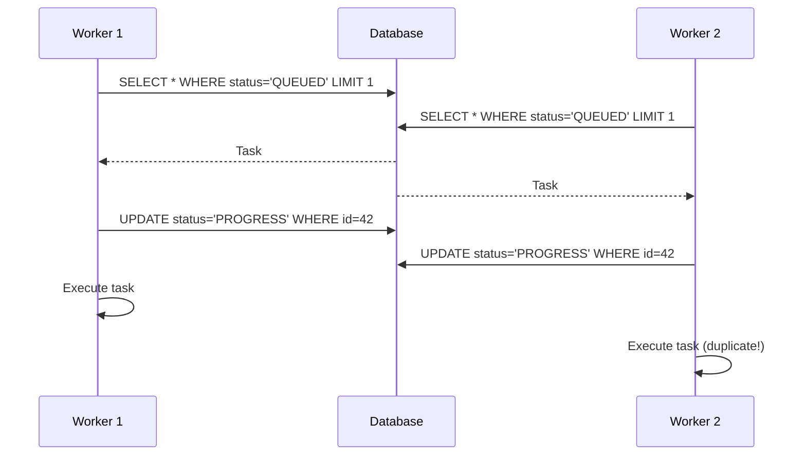
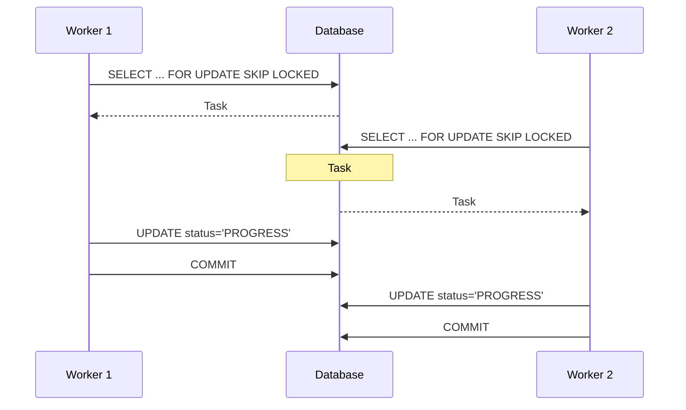
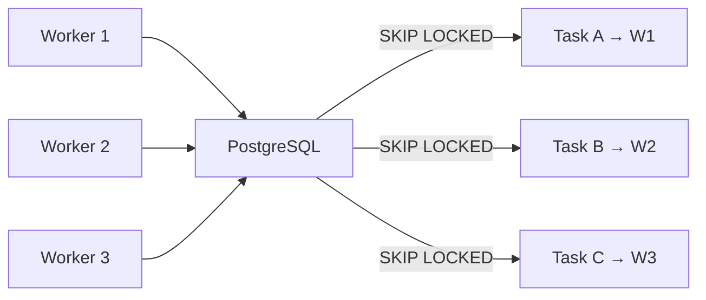

## The Race Condition

With one worker, task claiming is simple: query the oldest QUEUED task, set it to PROGRESS, execute. No competition possible.

With two or more workers, you have a **race condition** — a bug that happens when two pieces of code try to do the same thing at the same time, and the result depends on who gets there first:



Both workers see the same task. Both claim it. Both execute it. If the task sends an email, the user gets two. If it processes a payment, you've got a real problem.

## Application-Level Approaches (And Why They're Fragile)

The naive fix is application-level locking: add a `claimed_by` field, do an atomic update with a condition.

```python
# Attempt: atomic claim
updated = Task.objects.filter(
    status="QUEUED",
    id=task.id,
).update(
    status="PROGRESS",
    claimed_by=worker_id,
)
if updated == 0:
    # Someone else got it, skip
    continue
```

This works for the basic case. But it has problems:

1. **Lost updates** — The SELECT and UPDATE are separate operations. Between them, another worker can claim the task
2. **Polling waste** — Workers keep selecting tasks they can't claim, burning CPU and DB connections
3. **No skip behavior** — Each worker queries the same "first QUEUED task" and most get rejected

What we really want is the database itself preventing concurrent access to the same row.

## The Database Solution: SELECT FOR UPDATE SKIP LOCKED

The name "pessimistic locking" means we assume the worst — we assume another worker *will* try to grab the same task, so we lock the row *before* reading it. (The opposite approach, "optimistic locking," assumes conflicts are rare and only checks for them at write time.)

PostgreSQL (and MySQL 8+) support row-level locking with skip behavior:

```sql
SELECT * FROM tasks
WHERE status = 'QUEUED'
ORDER BY created_at
LIMIT 1
FOR UPDATE SKIP LOCKED;
```

This does three things as a single, indivisible operation (the database guarantees no other query can interfere halfway through):

1. **SELECT** — find the first queued task
2. **FOR UPDATE** — lock that row so no other transaction can touch it while we're working
3. **SKIP LOCKED** — if the row is already locked by another worker's transaction, don't wait — just skip it and try the next one



No duplicates. No wasted queries. No application-level coordination. The database handles everything.

## The Django Implementation

Django's ORM supports `select_for_update()` with the `skip_locked` parameter:

```python
from django.db import transaction

def claim_task():
    """Claim the next available task using pessimistic locking."""
    with transaction.atomic():
        task = (
            Task.objects
            .select_for_update(skip_locked=True)
            .filter(status="QUEUED")
            .order_by("created_at")
            .first()
        )

        if task is None:
            return None  # nothing available

        task.status = "PROGRESS"
        task.started_at = timezone.now()
        task.save()

        return task
```

**The key detail:** The `select_for_update` lock is held until the transaction commits. By wrapping the SELECT and the status UPDATE in the same `transaction.atomic()` block, we guarantee that no other worker can see this task as QUEUED between the read and the write.

Once the transaction commits, the lock is released — but the status is now PROGRESS, so no other worker will pick it up.

<details>
<summary>Full worker loop with pessimistic locking</summary>

```python
from django.core.management.base import BaseCommand
from django.db import transaction
from django.utils import timezone
from django_simple_queue.models import Task
import multiprocessing
import time
import logging

logger = logging.getLogger(__name__)


class Command(BaseCommand):
    help = "Run the task worker"

    def handle(self, *args, **options):
        logger.info("Worker started")

        while True:
            task = self.claim_task()

            if task is None:
                time.sleep(1)
                continue

            logger.info(f"Executing task {task.id}: {task.task_name}")
            self.execute_in_subprocess(task)

    def claim_task(self):
        """
        Atomically claim the next available task.
        Uses SELECT FOR UPDATE SKIP LOCKED to prevent
        multiple workers from claiming the same task.
        """
        with transaction.atomic():
            task = (
                Task.objects
                .select_for_update(skip_locked=True)
                .filter(status="QUEUED")
                .order_by("created_at")
                .first()
            )

            if task is None:
                return None

            task.status = "PROGRESS"
            task.started_at = timezone.now()
            task.save()

            return task

    def execute_in_subprocess(self, task):
        """Fork a child to run the task."""
        from django.db import connections

        process = multiprocessing.Process(
            target=self._child_worker,
            args=(task.task_name, task.task_params),
        )
        process.start()
        process.join()

        task.refresh_from_db()
        if process.exitcode == 0:
            task.status = "COMPLETED"
            task.completed_at = timezone.now()
        else:
            task.status = "FAILED"
            task.error = f"Child exited with code {process.exitcode}"
            task.completed_at = timezone.now()
        task.save()

    @staticmethod
    def _child_worker(task_name, task_params):
        """Runs in child process."""
        from django.db import connections
        import importlib

        connections.close_all()

        module_path, func_name = task_name.rsplit(".", 1)
        module = importlib.import_module(module_path)
        func = getattr(module, func_name)
        func(**task_params)
```

</details>

## Database Backend Considerations

Not all databases support `SKIP LOCKED`:

| Database | FOR UPDATE | SKIP LOCKED | Since |
|----------|-----------|-------------|-------|
| PostgreSQL | Yes | Yes | 9.5 (2016) |
| MySQL | Yes | Yes | 8.0 (2018) |
| MariaDB | Yes | Yes | 10.6 (2021) |
| SQLite | No | No | N/A |
| Oracle | Yes | Yes | 11g (2007) |

**SQLite:** No row-level locking at all. SQLite locks the entire database file for any write operation, so `SELECT FOR UPDATE` (which locks individual rows) is meaningless. If you're using SQLite (development, small deployments), you need a different strategy.

### Fallback for SQLite

For databases without `SKIP LOCKED`, fall back to the atomic update pattern:

```python
def claim_task_fallback():
    """Fallback for databases without SKIP LOCKED (e.g., SQLite)."""
    task = (
        Task.objects
        .filter(status="QUEUED")
        .order_by("created_at")
        .first()
    )

    if task is None:
        return None

    # Atomic conditional update
    updated = Task.objects.filter(
        id=task.id,
        status="QUEUED",  # only if still QUEUED
    ).update(
        status="PROGRESS",
        started_at=timezone.now(),
    )

    if updated == 0:
        return None  # someone else claimed it

    task.refresh_from_db()
    return task
```

This is less efficient — workers sometimes query tasks they can't claim — but it's correct. For a system with 2-3 workers, the waste is negligible.

### Automatic Backend Detection

```python
def claim_task():
    """Pick the right locking strategy based on database backend."""
    engine = settings.DATABASES["default"]["ENGINE"]

    if "sqlite" in engine:
        return claim_task_fallback()
    else:
        return claim_task_pessimistic()
```

## Tradeoffs vs. Application-Level Locking

| Approach | Correctness | Performance | Complexity | DB Support |
|----------|------------|-------------|------------|------------|
| SELECT FOR UPDATE SKIP LOCKED | Guaranteed | Best (no wasted queries) | Low | PostgreSQL, MySQL 8+ |
| Atomic conditional UPDATE | Guaranteed | Good (some wasted queries) | Low | All |
| Redis distributed lock | Guaranteed | Good | High (extra infra) | N/A |
| File-based locking | Fragile | Poor | Medium | N/A |

**My recommendation:** Use `SELECT FOR UPDATE SKIP LOCKED` if your database supports it. Fall back to atomic updates otherwise. Don't add Redis just for locking — that defeats the purpose of a database-backed queue.

## Scaling Behavior

With pessimistic locking, adding workers scales cleanly — each additional worker processes tasks in parallel without interfering with the others:



For 2-5 workers — the typical range for this kind of system — there's essentially no overhead from the locking. Each worker gets a unique task on every poll cycle because `SKIP LOCKED` efficiently jumps past rows that other workers already claimed.

At 50+ workers, you'd start hitting a ceiling. The database has to do more bookkeeping: each query needs to scan through all the already-locked rows to find the next available one, and coordinating locks across dozens of simultaneous transactions adds overhead. When workers start spending more time waiting for the database to find them a task than actually executing tasks, you've outgrown a database-backed queue and should be using Celery with a dedicated broker like Redis.

## Key Takeaways

1. **SELECT FOR UPDATE SKIP LOCKED** solves the race condition at the database level — no application coordination needed
2. **Transaction boundaries matter** — the lock must cover both the SELECT and the status UPDATE
3. **Django's ORM supports it** — `select_for_update(skip_locked=True)` is a one-line change
4. **Have a fallback** — SQLite doesn't support row-level locks; use atomic conditional updates
5. **Know your scaling ceiling** — this approach works well for a handful of workers; dozens of workers need a dedicated broker

---

*This is part 4 of the **Production Django Task Queue** series. Previous: [The Fork, the File Descriptor, and the Deployment](/blog/2025-04-12-django-queue-fork-pitfalls). Next: [From Bug Fix to Production Hardening](/blog/2026-02-01-django-queue-production-hardening)*
