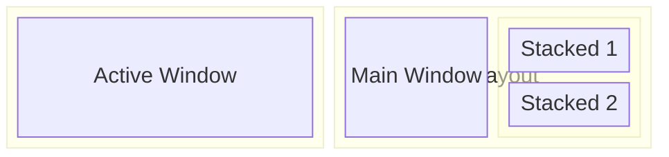

## The Core Insight

Every terminal emulator makes a fundamental choice: **where does rendering happen?**

Traditional terminals (xterm, gnome-terminal, konsole) render on the CPU. This made sense when GPUs were expensive and specialized. But today, your GPU sits idle while your CPU struggles to render a 50MB log file.

Kitty flips this. Text rendering moves to the GPU via OpenGL. The result isn't just faster—it's a different experience. Scrolling becomes butter-smooth. Font rendering stays crisp at any size. And your CPU is free to run your actual programs.

## The Tradeoff

GPU rendering requires OpenGL support. This means:
- No SSH without forwarding (use the `kitten ssh` wrapper instead)
- Slightly higher memory footprint
- Won't work in pure framebuffer consoles

For my use case (local development, modern hardware), these tradeoffs are invisible. For a sysadmin SSH'ing into headless servers all day, they matter more.

## Design Philosophy: Modifier Consistency

Kitty's keybindings follow a single pattern: `Ctrl+Shift+<key>`. This isn't arbitrary—it's a deliberate choice to avoid conflicts.

**The problem:** Terminals pass most key combinations to the shell. `Ctrl+C` is SIGINT. `Ctrl+Z` is SIGTSTP. `Ctrl+R` is reverse search. Any keybinding the terminal claims is one the shell can't use.

**The solution:** `Ctrl+Shift` combinations are rarely used by CLI programs. By claiming this modifier space, Kitty gets rich keybindings without breaking shell functionality.

| Action | Kitty | Why This Key |
|--------|-------|--------------|
| New tab | `Ctrl+Shift+T` | T for Tab (matches browsers) |
| Close | `Ctrl+Shift+Q` | Q for Quit (matches browsers) |
| Copy | `Ctrl+Shift+C` | C for Copy (Ctrl+C is SIGINT) |
| Paste | `Ctrl+Shift+V` | V for paste (matches everywhere) |

The browser-like shortcuts reduce cognitive load. You already know `Ctrl+T` opens tabs—adding Shift is the only new thing to learn.

## Layouts: Solving the Split Problem

Terminal multiplexers like tmux solve splits with complex nested containers. Kitty takes a simpler approach: **predefined layouts you cycle through**.



Press `Ctrl+Shift+L` to cycle. No need to remember split commands or resize syntax.

**The compromise:** Less flexibility than tmux's arbitrary splits. But for 90% of use cases, cycling through 6 predefined layouts is faster than manually constructing the perfect split.

<details>
<summary>All available layouts</summary>

| Layout | Description | Best For |
|--------|-------------|----------|
| `tall` | One main + stacked right | Editor + terminals |
| `fat` | One main + stacked bottom | Wide content + helpers |
| `stack` | Only active visible | Focus mode |
| `grid` | Equal grid | Monitoring multiple things |
| `horizontal` | Side by side | Comparing files |
| `vertical` | Stacked vertically | Logs + commands |
| `splits` | Arbitrary splits | tmux-like flexibility |

</details>

## Configuration: The Essential Decisions

Kitty's config lives at `~/.config/kitty/kitty.conf`. Rather than dump the whole file, here are the decisions that matter:

### Decision 1: New tabs should inherit directory

By default, new tabs open in `$HOME`. This breaks flow—you open a tab to run a quick command *here*, not start over from home.

```conf
map ctrl+shift+t launch --cwd=current --type=tab
map ctrl+shift+enter launch --cwd=current
```

This requires shell integration (covered in post 3) to work reliably.

### Decision 2: Disable the audio bell

It's 2025. No one wants terminal beeps.

```conf
enable_audio_bell no
```

### Decision 3: Font choice affects everything

Kitty supports ligatures natively. If you use a ligature font (JetBrains Mono, Fira Code), `!=` becomes `≠` and `->` becomes `→`.

```conf
font_family JetBrains Mono
font_size 12.0
```

**The tradeoff:** Ligatures look beautiful but can confuse beginners who see `≠` in code but must type `!=`. I keep them on because I'm past that confusion.

<details>
<summary>Full recommended configuration</summary>

```conf
# Font
font_family      JetBrains Mono
font_size        12.0

# Cursor
cursor_shape     beam
cursor_blink_interval 0

# Scrollback
scrollback_lines 10000

# Bell
enable_audio_bell no

# Tab bar
tab_bar_style    powerline
tab_powerline_style slanted

# Window
background_opacity 0.95

# Shell integration
shell_integration enabled

# Directory inheritance
map ctrl+shift+t launch --cwd=current --type=tab
map ctrl+shift+enter launch --cwd=current
```

</details>

## Compared to Alternatives

| Terminal | Rendering | Multiplexing | Config Format |
|----------|-----------|--------------|---------------|
| Kitty | GPU (OpenGL) | Built-in | Plain text |
| Alacritty | GPU (OpenGL) | None (use tmux) | YAML |
| WezTerm | GPU (WebGPU) | Built-in | Lua |
| gnome-terminal | CPU | Tabs only | GUI |

**Kitty vs Alacritty:** Both GPU-accelerated, but Kitty has built-in splits/tabs. Alacritty is lighter but requires tmux for multiplexing.

**Kitty vs WezTerm:** WezTerm's Lua config is more powerful but more complex. Kitty's plain text config is simpler. WezTerm uses WebGPU (newer, less tested). Both are excellent.

**My choice:** Kitty's balance of power and simplicity fits my workflow. The kitten extension system (next post) seals the deal.

## Key Takeaways

1. **GPU rendering** eliminates the terminal as a bottleneck
2. **`Ctrl+Shift` modifier** avoids shell conflicts by design
3. **Layout cycling** is simpler than arbitrary splits for most use cases
4. **Directory inheritance** requires explicit configuration but transforms workflow

---
