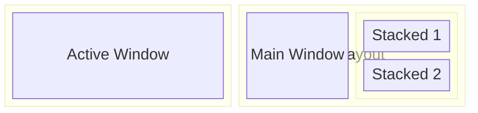

## The Core Insight

Every terminal emulator makes a fundamental choice: **where does rendering happen?**

Traditional terminals (xterm, gnome-terminal, konsole) render on the CPU. This made sense when GPUs were expensive and specialized. But today, your GPU sits idle while your CPU struggles to render a 50MB log file.

Kitty flips this. Text rendering moves to the GPU via OpenGL. The result isn't just faster—it's a different experience. Scrolling becomes butter-smooth. Font rendering stays crisp at any size. And your CPU is free to run your actual programs.

## The Tradeoff

GPU rendering requires OpenGL support. This means:
- No SSH without forwarding (use the `kitten ssh` wrapper instead)
- Slightly higher memory footprint
- Won't work in pure framebuffer consoles

For my use case (local development, modern hardware), these tradeoffs are invisible. For a sysadmin SSH'ing into headless servers all day, they matter more.

## Design Philosophy: Modifier Consistency

Kitty's keybindings follow a single pattern: `Ctrl+Shift+<key>`. This isn't arbitrary. Terminals pass most key combinations to the shell—`Ctrl+C` is SIGINT, `Ctrl+Z` is SIGTSTP, `Ctrl+R` is reverse search—so any keybinding the terminal claims is one the shell can't use. `Ctrl+Shift` combinations are rarely used by CLI programs, so Kitty claims that space: `Ctrl+Shift+T` for a new tab, `Ctrl+Shift+C` for copy, and so on. (I write more about designing modifier schemes in [the Niri shortcuts post](/blog/2025-12-21-niri-shortcuts-navigation), where the same logic applies at the compositor level.)

## Layouts: Solving the Split Problem

Terminal multiplexers like tmux solve splits with complex nested containers. Kitty takes a simpler approach: **predefined layouts you cycle through**.


```mermaid
block-beta
  columns 2
  block:stack["stack (only one visible)"]:1
    a["Active Window"]
  end
  block:tall["tall layout"]:1
    columns 2
    main["Main Window"]:1
    block:others:1
      columns 1
      w1["Stacked 1"]
      w2["Stacked 2"]
    end
  end
```

Press `Ctrl+Shift+L` to cycle. No need to remember split commands or resize syntax.

**The compromise:** Less flexibility than tmux's arbitrary splits. But for 90% of use cases, cycling through 6 predefined layouts is faster than manually constructing the perfect split.

<details>
<summary>All available layouts</summary>

| Layout | Description | Best For |
|--------|-------------|----------|
| `tall` | One main + stacked right | Editor + terminals |
| `fat` | One main + stacked bottom | Wide content + helpers |
| `stack` | Only active visible | Focus mode |
| `grid` | Equal grid | Monitoring multiple things |
| `horizontal` | Side by side | Comparing files |
| `vertical` | Stacked vertically | Logs + commands |
| `splits` | Arbitrary splits | tmux-like flexibility |

</details>

## Configuration: The Essential Decisions

Kitty's config lives at `~/.config/kitty/kitty.conf`. Rather than dump the whole file, here are the decisions that matter:

### Decision 1: New tabs should inherit directory

By default, new tabs open in `$HOME`. This breaks flow—you open a tab to run a quick command *here*, not start over from home.

```conf
map ctrl+shift+t launch --cwd=current --type=tab
map ctrl+shift+enter launch --cwd=current
```

This requires shell integration (covered in [post 3](/blog/2025-11-02-bash-starship-history-tools)) to work reliably.

### Decision 2: Disable the audio bell

It's 2025. No one wants terminal beeps.

```conf
enable_audio_bell no
```

### Decision 3: Font choice affects everything

Kitty supports ligatures natively. If you use a ligature font (JetBrains Mono, Fira Code), `!=` becomes `≠` and `->` becomes `→`.

```conf
font_family JetBrains Mono
font_size 12.0
```

**The tradeoff:** Ligatures look beautiful but can confuse beginners who see `≠` in code but must type `!=`. I keep them on because I'm past that confusion.

Everything else in my config is cosmetic. If you only change three things, change these.

## Compared to Alternatives

The serious competition is other GPU terminals. Alacritty is lighter but has no multiplexing—you need tmux. WezTerm has built-in multiplexing like Kitty, but configures in Lua (more powerful, more complex) and renders via WebGPU (newer, less tested).

Kitty's balance of power and simplicity fits my workflow. The kitten extension system ([next post](/blog/2025-10-19-kitty-kittens-remote-control)) seals the deal.
