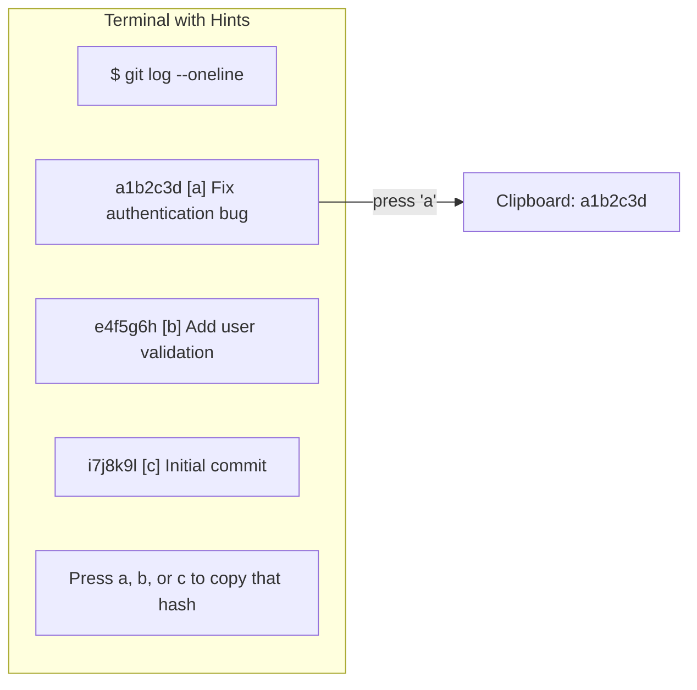

## The Extension Philosophy

Most terminals are closed systems. Want a feature? Wait for the developers to add it, or switch terminals.

Kitty takes a different approach: **kittens**. These are small Python programs that run inside Kitty with full access to terminal state. Think of them as plugins with superpowers—they can read the screen, inject text, open windows, and more.

This design means Kitty can stay focused on core rendering while the community extends functionality.

## Hints: Rethinking Selection

**The problem:** Selecting text in terminals is painful. URLs wrap across lines. File paths have weird characters. Git hashes look like random noise. You end up carefully dragging your mouse, often missing a character.

**The insight:** The terminal *knows* what's on screen. It can identify patterns (URLs, paths, hashes) and let you select them by type rather than by pixel.

**The solution:** The hints kitten highlights all matches of a pattern and assigns each a key. Press the key, get the text.



The mental model shifts from "select this text" to "I want a git hash" or "I want that URL."

<details>
<summary>Hints for different content types</summary>

```bash
# URLs - opens in browser
kitty +kitten hints

# File paths - copies to clipboard
kitty +kitten hints --type path

# Git hashes - copies to clipboard
kitty +kitten hints --type hash

# Line numbers (from compiler errors) - copies
kitty +kitten hints --type line

# Arbitrary words
kitty +kitten hints --type word
```

I bind `Ctrl+Shift+O` to basic hints for quick URL opening:

```conf
map ctrl+shift+o kitten hints
```

</details>

## SSH: Solving the Remote Terminal Problem

**The problem:** SSH into a server and everything breaks. Colors are wrong. Keybindings fail. The remote doesn't know what `xterm-kitty` means.

**Why it happens:** Terminals identify themselves via `$TERM`. Servers need terminfo entries to understand capabilities. Kitty is newer than most server terminfo databases.

**The standard fix:** Set `TERM=xterm-256color` and lose Kitty features. Or manually copy terminfo files. Neither is good.

**The kitten solution:** `kitten ssh` automatically copies Kitty's terminfo to the server on first connection, then SSH's normally.

```bash
kitten ssh user@host
# First connection: copies terminfo, then connects
# Later connections: just connects (terminfo already there)
```

The mental model: "ssh but it just works."

**The tradeoff:** First connection takes slightly longer. But you never think about terminfo again.

## Remote Control: Terminal as API

**The insight:** If a terminal can be controlled externally, it becomes programmable.

Kitty exposes an IPC interface. Enable it:

```conf
allow_remote_control yes
```

Now `kitty @` commands control the running terminal from outside:

```bash
# Send text to a specific window
kitty @ send-text --match title:tests "npm test\n"

# Change colors on the fly
kitty @ set-colors background=#1a1b26

# Create a new window in a specific directory
kitty @ new-window --cwd ~/projects/myapp
```

**The mental model:** Your terminal is a server. Scripts are clients.

### Real-World Use: Test Runner

I have an editor keybinding that runs tests without leaving my editor:

```bash
#!/bin/bash
# run-tests.sh
kitty @ send-text --match title:dev "npm test\n"
```

The `--match` flag targets windows by title, ID, or environment variable. My dev tab always has title "dev", so this sends the test command there.

<details>
<summary>More remote control patterns</summary>

```bash
# List all windows (JSON output)
kitty @ ls

# Set tab title
kitty @ set-tab-title "Building..."

# Focus a window by title
kitty @ focus-window --match title:logs

# Close a window
kitty @ close-window --match id:3

# Notify when command finishes
long_command; kitty @ set-tab-title "✅ Done"
```

Match patterns:
- `--match id:N` — by window ID
- `--match title:substring` — by title
- `--match env:VAR=value` — by environment variable
- `--match recent:0` — most recent window

</details>

## Session Files: Reproducible Workspaces

**The problem:** Every morning, you open a terminal, create tabs, cd to directories, arrange splits. Tedious and error-prone.

**The solution:** Session files define layouts declaratively.

```conf
# ~/.config/kitty/work.conf

new_tab project
cd ~/projects/myapp
launch bash

new_tab dev
cd ~/projects/myapp
launch bash
launch --location=vsplit bash

new_tab logs
cd /var/log
launch tail -f syslog
```

Start with: `kitty --session ~/.config/kitty/work.conf`

**The mental model:** Workspaces are code. Version control them. Share them. Modify them.

**The tradeoff:** Session files are static. They don't adapt to context (which branch you're on, whether a service is running). For dynamic workspaces, combine with remote control scripts.

<details>
<summary>Session file syntax</summary>

```conf
# Create a new tab with title
new_tab title_here

# Change directory before launching
cd /path/to/directory

# Launch a shell or command
launch bash
launch zsh
launch python script.py

# Create splits
launch --location=vsplit bash  # vertical split
launch --location=hsplit bash  # horizontal split

# Set layout
layout tall

# Focus a specific window
focus

# Set environment variables
env MY_VAR=value
```

</details>

## Design Patterns Across Features

Notice the consistency:

| Feature | Pattern | Result |
|---------|---------|--------|
| Hints | Identify content by type, not position | Faster, more accurate selection |
| SSH kitten | Automate the tedious setup | Seamless remote sessions |
| Remote control | Expose terminal as API | Scriptable workflows |
| Sessions | Declare workspace as code | Reproducible environments |

Each feature follows the same philosophy: **automate the tedious, expose the powerful**.

## Combining Everything

My morning workflow:

1. `kitty --session ~/.config/kitty/work.conf` — workspace appears
2. In the editor tab, I code
3. `Ctrl+Shift+O` highlights URLs in error messages — click to open docs
4. Editor keybinding runs `run-tests.sh` — tests run in the dev tab
5. `kitten ssh staging` — deploy to staging with full Kitty features

All in the terminal. No context switching. No mouse except when I want it.

## Key Takeaways

1. **Hints** shift selection from positional to semantic — "get the URL" not "drag from here to there"
2. **SSH kitten** solves terminfo automatically — zero ongoing maintenance
3. **Remote control** makes terminals scriptable — automation becomes possible
4. **Session files** make workspaces reproducible — morning setup becomes one command

---
