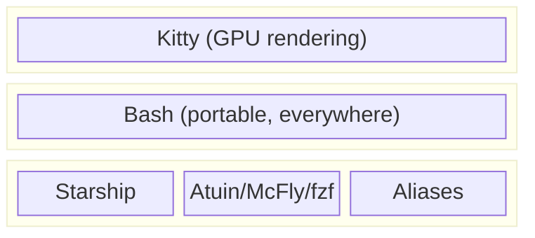

## The Portability Question

Every shell choice involves a tradeoff: **features vs ubiquity**.

Fish has amazing defaults—syntax highlighting, autosuggestions, sane scripting. But it's not POSIX-compatible, so scripts break. And it's not installed by default anywhere.

Zsh has plugins for everything. But plugin managers add complexity, and "everything" includes a lot you don't need.

Bash is everywhere. Every server, every container, every CI runner. No installation, no compatibility issues. The skills transfer.

**My choice:** Stay on Bash, but layer modern tools on top. I get portability *and* power.

## Starship: One Prompt Everywhere

**The problem:** Shell prompts are shell-specific. A Zsh prompt config doesn't work in Bash. If you switch shells, you reconfigure everything.

**The solution:** Starship is a standalone binary. It works with Bash, Zsh, Fish, PowerShell, even Nushell. One config, every shell.

```bash
# In .bashrc, .zshrc, or config.fish
eval "$(starship init bash)"  # or zsh, fish, etc.
```

**The mental model:** The prompt is a separate concern from the shell.

### What Starship Shows

Starship auto-detects context:

```
~/projects/myapp on  main via  v20.10.0 via 🐍 v3.11.0
❯
```

- Directory path
- Git branch and status (only in git repos)
- Node version (only in Node projects)
- Python version (only in Python projects)

Enter a different directory, the prompt adapts. No configuration per project.

<details>
<summary>My starship.toml customizations</summary>

```toml
# ~/.config/starship.toml

# Compact - no extra newline
add_newline = false

# Only show slow command duration
[cmd_duration]
min_time = 2000  # 2 seconds

# Clear success/failure indicator
[character]
success_symbol = "[➜](bold green)"
error_symbol = "[✗](bold red)"

# Only detect languages I actually use
[nodejs]
detect_files = ["package.json"]

[python]
detect_files = ["requirements.txt", "pyproject.toml"]

[rust]
detect_files = ["Cargo.toml"]
```

The defaults are sensible. I only customize what matters to me.

</details>

## History: Three Tools, One Interface

**The problem:** Bash's built-in history is primitive. `Ctrl+R` does substring search. No fuzzy matching, no context awareness, no sync across machines.

**The insight:** History search is a separate concern. Replace it without replacing the shell.

I use three tools interchangeably, all bound to `Ctrl+R`:

### Atuin (Default)

Stores history in SQLite. Fuzzy search. Filters by directory, exit code, time. Optional cloud sync.

**Key insight:** Directory-aware search. In project A, `Ctrl+R` prioritizes commands *from project A*. Your global history doesn't pollute project context.

### McFly

Neural network predicts which command you want based on:
- Current directory
- Recent commands
- Exit codes (successful commands rank higher)
- Frequency

**Tradeoff:** Smarter but heavier. Better for long sessions where context matters.

### fzf

General-purpose fuzzy finder. Less smart than the others, but starts instantly and works everywhere.

**Tradeoff:** No context awareness, but zero startup overhead.

### Switching Between Them

```bash
# In .bashrc
case "${HISTORY_TOOL:-atuin}" in
    atuin) eval "$(atuin init bash)" ;;
    mcfly) eval "$(mcfly init bash)" ;;
    fzf)   eval "$(fzf --bash)" ;;
esac
```

Start a shell with a specific tool:

```bash
HISTORY_TOOL=mcfly bash
```

**The mental model:** History backend is pluggable. The interface (`Ctrl+R`) stays consistent.

<details>
<summary>Installing each tool</summary>

```bash
# Atuin
curl --proto '=https' --tlsv1.2 -LsSf https://setup.atuin.sh | sh

# McFly (Arch)
paru -S mcfly

# fzf (most package managers)
sudo pacman -S fzf  # Arch
brew install fzf    # macOS
```

</details>

## Shell Integration: The Glue

For Kitty to open new tabs in your current directory, it needs to know where you are. Terminals and shells don't share this information by default.

**The mechanism:** OSC 7. An escape sequence that reports the current directory.

```bash
# In .bashrc
if [[ -n "$KITTY_WINDOW_ID" ]]; then
    _kitty_report_pwd() {
        printf '\e]7;file://%s%s\e\\' "$HOSTNAME" "$PWD"
    }
    PROMPT_COMMAND="_kitty_report_pwd${PROMPT_COMMAND:+;$PROMPT_COMMAND}"
fi
```

This runs after every command and tells Kitty where you are. Now `Ctrl+Shift+T` opens a tab *here*, not in `$HOME`.

**The pattern:** Terminal and shell cooperate via escape sequences. Same mechanism powers Starship's timing, Atuin's history capture, and more.

## Aliases: Consistent Behavior Across Machines

Aliases ensure commands behave consistently regardless of which machine I'm on.

**Philosophy:** Make dangerous things safer, make common things shorter.

```bash
# Safer defaults (confirm before overwriting)
alias cp='cp -i'
alias mv='mv -i'
alias rm='rm -I'  # -I prompts once for >3 files

# Human-readable output
alias df='df -h'
alias free='free -m'
alias du='du -h'

# Quick access
alias '?'='claude -p'  # Quick Claude queries
```

The `?` alias is my favorite. Quick questions without a full session:

```bash
? "how do I revert the last git commit"
```

<details>
<summary>Universal archive extraction function</summary>

Different archives need different commands. I never remember which.

```bash
ex() {
    if [ -f "$1" ]; then
        case "$1" in
            *.tar.bz2) tar xjf "$1" ;;
            *.tar.gz)  tar xzf "$1" ;;
            *.tar.xz)  tar xJf "$1" ;;
            *.tar)     tar xf "$1" ;;
            *.tbz2)    tar xjf "$1" ;;
            *.tgz)     tar xzf "$1" ;;
            *.zip)     unzip "$1" ;;
            *.rar)     unrar x "$1" ;;
            *.7z)      7z x "$1" ;;
            *.gz)      gunzip "$1" ;;
            *.bz2)     bunzip2 "$1" ;;
            *.xz)      unxz "$1" ;;
            *)         echo "'$1' cannot be extracted" ;;
        esac
    else
        echo "'$1' is not a valid file"
    fi
}
```

Now: `ex whatever.tar.gz` — no thinking about syntax.

</details>

## The Complete Stack



Each layer is independently replaceable:
- Don't like Bash? Starship works with Zsh
- Don't like Atuin? Swap in fzf
- Don't like Kitty? Everything else still works

**The mental model:** Unix philosophy applied to shell setup. Small tools, clear interfaces, compose freely.

## Design Decisions Summary

| Decision | Tradeoff | Why I Chose It |
|----------|----------|----------------|
| Bash over Fish/Zsh | Fewer features | Portability to any server |
| Starship | Extra binary | One config across shells |
| Atuin default | Heavier than fzf | Directory-aware search |
| Switchable history | Complexity | Different tools for different contexts |
| OSC 7 integration | Shell modification | Directory inheritance in tabs |

---
