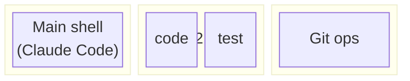

## The Integration Mindset

Individual tools are useful. But the real power comes from how they combine. This post shows how Kitty, shell configuration, and Claude Code become a complete development environment.

**The goal:** Minimize context switching. Maximize flow.

## Workspace as Code

My workday starts with one command:

```bash
kitty --session ~/.config/kitty/work.conf
```

This opens a complete workspace:



<details>
<summary>Session file: ~/.config/kitty/work.conf</summary>

```conf
# Tab 1: Main development (Claude Code lives here)
new_tab project
cd ~/projects/current
launch bash

# Tab 2: Split for code and tests
new_tab dev
cd ~/projects/current
launch bash
launch --location=vsplit bash

# Tab 3: Git operations
new_tab git
cd ~/projects/current
launch bash -c "git status; exec bash"
```

</details>

**The key insight:** Session files are version-controlled. Different projects get different sessions. The "how do I set up my environment" question has a code answer.

## Claude Code in the Workflow

Claude Code runs in the terminal, which means it inherits all of Kitty's features:

1. **Hints work on Claude's output** — URLs and file paths are selectable
2. **Splits keep context visible** — Claude in one pane, code in another
3. **Remote control enables automation** — scripts can interact with Claude's tab

### Status Line: Ambient Awareness

Claude Code supports custom status lines. I display:

```
[Opus] $0.42 | 67% | main | myproject
  ↑      ↑      ↑     ↑        ↑
model  cost  context branch  directory
```

At a glance: which model, session cost, context usage, where I am.

<details>
<summary>Status line script: ~/.claude/statusline.sh</summary>

```bash
#!/bin/bash
input=$(cat)

MODEL=$(echo "$input" | jq -r '.model.display_name // "Claude"')
COST=$(echo "$input" | jq -r '.cost.total_cost_usd // 0')
GIT_BRANCH=$(git branch --show-current 2>/dev/null)
DIR=$(echo "$input" | jq -r '.workspace.current_dir // empty' | xargs basename)

# Context percentage (if available)
CONTEXT_SIZE=$(echo "$input" | jq -r '.context_window.context_window_size // 200000')
USAGE=$(echo "$input" | jq '.context_window.current_usage // null')
if [ "$USAGE" != "null" ]; then
    TOKENS=$(echo "$USAGE" | jq -r '.input_tokens // 0')
    PCT=$((TOKENS * 100 / CONTEXT_SIZE))
    CTX="${PCT}%"
else
    CTX="--"
fi

# Colors
G='\033[32m'; Y='\033[33m'; C='\033[36m'; M='\033[35m'; R='\033[0m'

COST_FMT=$(LC_NUMERIC=C printf "%.2f" "$COST")
echo -e "${G}[${MODEL}]${R} ${Y}\$${COST_FMT}${R} | ${C}${CTX}${R} | ${M}${GIT_BRANCH:-no-git}${R} | ${DIR}"
```

Enable in `~/.claude/settings.json`:
```json
{"statusLine": {"type": "command", "command": "~/.claude/statusline.sh"}}
```

</details>

## Git Worktrees: Parallel Development

**The problem:** You're deep in a feature. An urgent bug comes in. You have to stash, switch branches, fix, switch back, unstash. Context is destroyed.

**The insight:** Git worktrees let you check out multiple branches in separate directories, sharing the same history.

```bash
# Create a worktree for the hotfix
git worktree add ../myapp-hotfix hotfix/urgent

# Now you have:
# ~/projects/myapp/        → feature branch (your work intact)
# ~/projects/myapp-hotfix/ → hotfix branch (separate directory)
```

Each directory can have its own Claude Code session. Parallel development becomes possible.

### The Pattern

```bash
# Terminal 1: Feature work
cd ~/projects/myapp && claude

# Terminal 2: Hotfix (separate Kitty tab)
cd ~/projects/myapp-hotfix && claude
```

Two Claude sessions. Two branches. No stashing. No context loss.

<details>
<summary>Worktree management commands</summary>

```bash
# Create for existing branch
git worktree add <path> <branch>

# Create with new branch
git worktree add -b <new-branch> <path> <base>

# List all worktrees
git worktree list

# Remove when done
git worktree remove <path>

# Clean up stale references
git worktree prune
```

**Key constraint:** A branch can only be checked out in one worktree. This prevents conflicts.

</details>

### Kitty + Worktree Helper

```bash
worktree-claude() {
    local path="$1"
    kitty @ launch --type=tab --cwd="$path" --title="$(basename $path)" \
        bash -c "claude; exec bash"
}

# Usage: Opens new Kitty tab, cd's to worktree, starts Claude
worktree-claude ~/projects/myapp-hotfix
```

## Remote Control for Automation

Kitty's remote control connects everything. Example: run tests from any tab.

```bash
#!/bin/bash
# run-tests.sh - sends test command to dev tab
kitty @ send-text --match title:dev "npm test\n"
```

Bind this in your editor. Tests run in the correct pane without switching.

### Notification When Done

```bash
#!/bin/bash
# notify.sh - wraps any long command
"$@"
EXIT=$?
kitty @ set-tab-title "$([ $EXIT -eq 0 ] && echo '✅' || echo '❌') Done"
notify-send "Command finished" "Exit: $EXIT"
```

Usage: `./notify.sh npm run build`

Tab title changes when done. Desktop notification too.

## Cross-Cutting Patterns

Looking across all the tools, patterns emerge:

### 1. Declarative over Imperative

| Tool | Declarative Approach |
|------|---------------------|
| Kitty sessions | Workspace layout as config file |
| Starship | Prompt as TOML, not shell script |
| Git worktrees | Branches as directories |

### 2. Consistent Interfaces

| Interface | Same Across |
|-----------|-------------|
| `Ctrl+Shift+*` | All Kitty operations |
| `Ctrl+R` | All history tools (Atuin/McFly/fzf) |
| `kitty @` | All remote control |

### 3. Context Awareness

| Tool | Knows About |
|------|-------------|
| Starship | Current language/project |
| Atuin | Current directory history |
| Hints | Content type on screen |
| Worktrees | Current branch |

## My Daily Workflow

**Morning:**
```bash
kitty --session ~/.config/kitty/work.conf
```

**Starting a feature:**
```bash
git checkout -b feature/thing
cd ~/projects/myapp && claude
```

**Urgent interrupt:**
```bash
git worktree add ../myapp-hotfix hotfix/urgent
worktree-claude ~/projects/myapp-hotfix
# Fix, commit, push
git worktree remove ../myapp-hotfix
```

**Testing:**
- Editor keybinding → `run-tests.sh` → tests in dev tab

**Navigation:**
- `Ctrl+Shift+Right/Left` between tabs
- `Ctrl+Shift+]` between splits
- `Ctrl+Shift+O` to click URLs in output

**End of day:**
- Commits done
- Worktrees cleaned up
- Tomorrow: `kitty --session` and I'm back

## What This Enables

1. **No IDE required** — Terminal handles everything
2. **Multiple Claude sessions** — Different contexts, parallel work
3. **Reproducible environment** — Session files, version-controlled configs
4. **Zero context switch cost** — Everything in one interface
5. **Scriptable workflow** — Automate the repetitive parts

## Key Files

| File | Purpose |
|------|---------|
| `~/.config/kitty/kitty.conf` | Terminal config |
| `~/.config/kitty/work.conf` | Workspace session |
| `~/.bashrc` | Shell config, Starship init, OSC 7 |
| `~/.config/starship.toml` | Prompt config |
| `~/.claude/settings.json` | Status line config |
| `~/.claude/statusline.sh` | Status line script |

---
