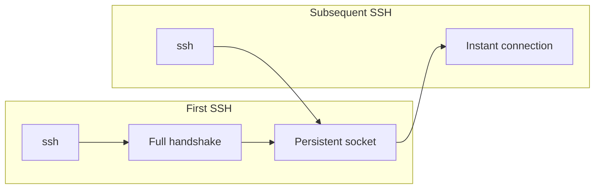
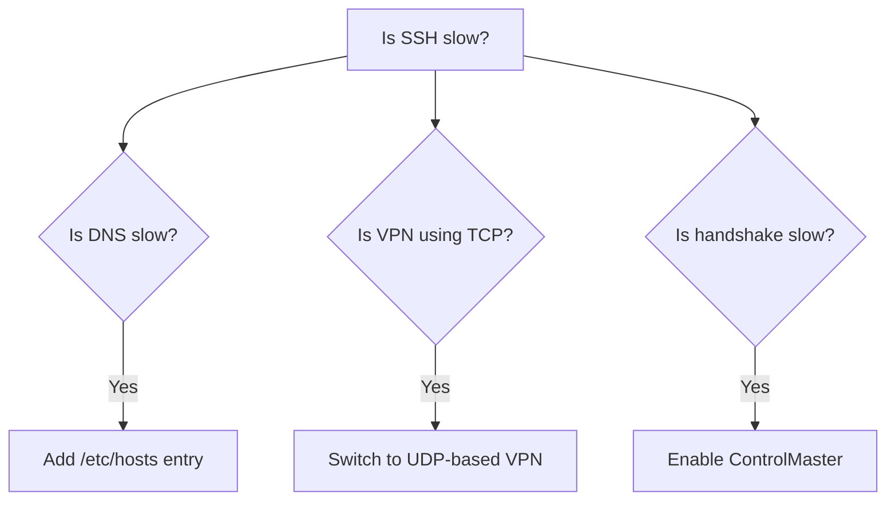
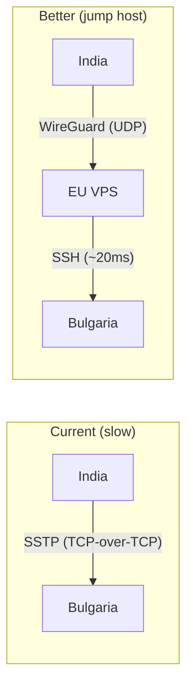

## The Symptom

SSH to `dev-server.example.com` takes **9+ minutes**. Sometimes it times out entirely.

The server is in Bulgaria. I'm in India. There's a VPN in between.

After optimization: **33 seconds** with SSTP, **2.6 seconds** with OpenVPN.

This post explains why, and how to fix it.

## Understanding the Layers

Every SSH connection goes through multiple layers:


Each layer can add latency. The trick is identifying which layer is the problem.

## Diagnosis: Where's the Time Going?

### Layer 1: DNS (60+ seconds)

```bash
time host dev-server.example.com
# 62.3 seconds!
```

The VPN's DNS servers were timing out. Every SSH attempt waited for DNS resolution that never came.

**Fix:** Add static hosts entry:

```bash
echo "192.168.20.32 dev-server.example.com dev-server" | sudo tee -a /etc/hosts
```

This bypasses DNS entirely for this host. Saved 60 seconds per connection.

### Layer 2: VPN Protocol (Biggest Factor)

My VPN used SSTP (Secure Socket Tunneling Protocol). SSTP wraps everything in TCP:


This is **TCP-over-TCP**. It's a known anti-pattern.

**Why TCP-over-TCP is bad:** Both TCP layers try to handle reliability. When a packet drops:
1. Outer TCP (SSTP) retransmits
2. Inner TCP (your SSH) also retransmits
3. They fight each other, causing retransmission storms

On high-latency links (India to Bulgaria = 200+ ms), this compounds catastrophically.

**The comparison:**

| Metric | SSTP (TCP) | OpenVPN (UDP) |
|--------|------------|---------------|
| First SSH | 33s | **2.6s** (12× faster) |
| Multiplexed | 1s | **0.6s** |
| Mosh support | No | **Yes** |

**Fix:** Switch to UDP-based VPN:

```bash
nmcli connection down "work-vpn-sstp"
nmcli connection up "work-vpn-ovpn"
```

OpenVPN with UDP mode avoids TCP-over-TCP entirely.

### Layer 3: SSH Handshake (Per-Connection)

Even with good VPN, every SSH connection does:
1. TCP three-way handshake
2. SSH key exchange
3. Authentication

On high latency, this takes multiple round trips (seconds each).

**The insight:** Most SSH sessions are followed by more SSH sessions (running multiple commands, git operations, etc.). Why repeat the handshake?

**Solution:** ControlMaster multiplexing.



<details>
<summary>SSH config with ControlMaster</summary>

```ssh-config
Host dev-server
    User root
    HostName dev-server.example.com
    IdentityFile ~/.ssh/id_ed25519

    # Multiplexing (the key optimization)
    ControlMaster auto
    ControlPath ~/.ssh/sockets/%r@%h-%p
    ControlPersist 600

    # Compression helps on slow links
    Compression yes

    # Keep connection alive
    ServerAliveInterval 30
    ServerAliveCountMax 6

    # Faster ciphers
    Ciphers chacha20-poly1305@openssh.com,aes128-gcm@openssh.com

    # Faster key exchange
    KexAlgorithms curve25519-sha256

    # Reduce handshake overhead
    AddressFamily inet
    ConnectTimeout 30
```

Create sockets directory:
```bash
mkdir -p ~/.ssh/sockets && chmod 700 ~/.ssh/sockets
```

</details>

**Result:**

| Connection | Without | With ControlMaster |
|------------|---------|-------------------|
| First | 33s | 33s (same) |
| Second | 33s | **1s** |
| Third | 33s | **1s** |

The first connection pays the full price. All subsequent connections are nearly instant.

## The Decision Tree



Each fix addresses a different layer. Apply all three for maximum improvement.

## Mosh: A Different Tradeoff

For very high latency (>300ms) or unreliable connections, consider [Mosh](https://mosh.org/).

**How Mosh differs:**

| Feature | SSH | Mosh |
|---------|-----|------|
| Protocol | TCP | UDP |
| Local echo | No | Yes (instant typing) |
| Survives IP change | No | Yes |
| Survives sleep | No | Yes |

Mosh uses UDP for state synchronization and predicts keystrokes locally. Typing feels instant even on 500ms links.

**The tradeoff:**
- Requires UDP (won't work with SSTP VPN)
- Requires mosh-server installed remotely
- Requires open UDP ports (60000-61000)

```bash
# Install
sudo pacman -S mosh

# Connect
mosh dev-server
```

If your VPN blocks UDP, Mosh won't work. This is another reason to prefer OpenVPN over SSTP.

## Advanced: The Jump Host Pattern

If you're stuck with SSTP (some corporate environments require it), consider a jump host:



**Why this helps:**
- WireGuard uses UDP: no TCP-over-TCP
- EU → Bulgaria latency is low (~20ms)
- India → EU latency is moderate (~100ms)
- Total: better than India → Bulgaria over SSTP

<details>
<summary>Budget EU VPS options</summary>

| Provider | Location | Price |
|----------|----------|-------|
| Hetzner | Germany | €3/month |
| Oracle Cloud | Frankfurt | **Free tier** |
| Contabo | Germany | €5/month |

Set up WireGuard between your machine and the VPS. SSH through the VPS to your destination.

</details>

## Debugging Checklist

When SSH is slow, check in order:

```bash
# 1. Is DNS slow?
time host dev-server.example.com

# 2. Is the VPN connected?
nmcli connection show --active | grep vpn

# 3. Is the port reachable?
nc -zv 192.168.20.32 22

# 4. What's SSH doing?
ssh -v dev-server

# 5. Is ControlMaster active?
ssh -O check dev-server
```

## Design Decisions Summary

| Layer | Problem | Solution | Tradeoff |
|-------|---------|----------|----------|
| DNS | VPN DNS timeout | Static hosts entry | Manual maintenance |
| VPN | TCP-over-TCP | UDP-based VPN | May need IT approval |
| SSH | Repeated handshakes | ControlMaster | First connection still slow |
| Interactive | High latency typing | Mosh | Requires UDP, extra setup |

The fixes are additive. Each addresses a different bottleneck.

## My Final Config

After all optimizations:

| Scenario | Latency |
|----------|---------|
| First SSH (OpenVPN) | 2.6s |
| Subsequent SSH | 0.6s |
| Mosh session | Instant typing feel |

From 9+ minutes to 2.6 seconds. Layer by layer.

---

*For terminal optimization, see the [Terminal Power User series](/blog/2025-10-05-kitty-terminal-fundamentals).*
