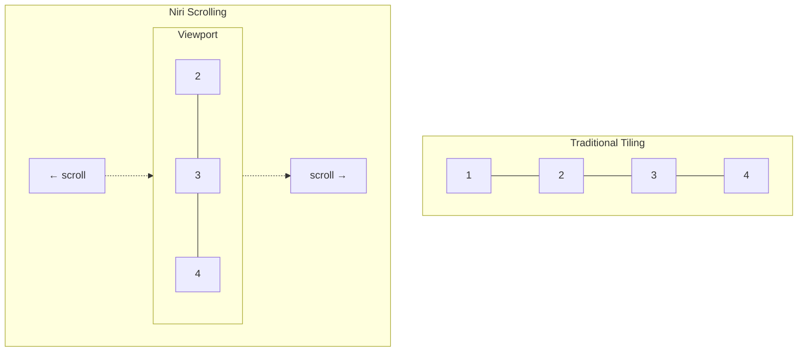
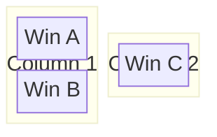

## The Mental Model Shift

Every tiling compositor makes an assumption: **windows must fit the screen**.

Open four windows, each gets 25%. Open eight, each gets 12.5%. Eventually, windows become unusable.

Niri makes a different assumption: **the screen is a viewport into an infinite canvas**.



Windows stay at your preferred size. You scroll through them like a document.

## Why This Matters for Wide Monitors

I have a 3440×1440 ultrawide. Traditional tiling works until I open "too many" windows. Then each window becomes a narrow sliver.

With Niri, I set a preferred column width (50% of screen). Every window gets that width. Open 10 windows? Scroll to see them. Each remains usable.

**The tradeoff:** You can't see all windows simultaneously. You must scroll.

**Why I accept this:** I rarely *need* to see 6+ windows at once. When I do, I use the overview (`Super+W`). Most of the time, I work with 2-3 visible windows and scroll to others.

## Columns: The Core Abstraction

Niri organizes windows into **columns**. A column is a vertical stack of windows:



- `Super+H/L` moves between columns (horizontal)
- `Super+J/K` moves between windows in a column (vertical)

**The insight:** This maps to how I think about tasks. Related windows stack in a column. Unrelated tasks are separate columns. Navigation reflects the mental organization.

## Hyprland vs Niri: Design Differences

I used Hyprland for years. It's excellent. But the design assumptions differ:

| Aspect | Hyprland | Niri |
|--------|----------|------|
| Core metaphor | Windows fill space | Canvas with viewport |
| Navigation | 4-directional (HJKL) | Column-based + within-column |
| Multi-monitor | First-class | Single-monitor focus |
| Config format | INI-like | KDL |
| Reload | Manual (`hyprctl reload`) | Automatic hot-reload |

**Why I switched:**
1. Hyprland's dwindle/master layouts required mental overhead about where the next window would appear
2. My ultrawide felt like fighting the compositor at high window counts
3. Niri's scrolling matched my "document-like" mental model

**What I miss:**
- Hyprland's special workspace (overlay scratchpad)
- Hyprland's `movetoworkspacesilent` (Niri always follows moved windows)
- Hyprland's mature window rules

## KDL Configuration

Niri uses [KDL](https://kdl.dev/) for configuration. It's a document language like JSON but designed for config files.

```kdl
// ~/.config/niri/config.kdl

// Keybindings
binds {
    Mod+Q { spawn "kitty"; }
    Mod+C { close-window; }
    Mod+H { focus-column-left; }
    Mod+L { focus-column-right; }
}

// Layout
layout {
    gaps 16
    default-column-width { proportion 0.5; }
}
```

**The advantage:** Niri hot-reloads config changes. Save the file, see the result. No restart, no reload command.

## Designing for Consistency

When I migrated from Hyprland, I wanted to preserve muscle memory. The strategy:

**Keep navigation patterns:**
- `Super+HJKL` for directional focus (same as Hyprland)
- `Super+1-9` for workspace switching (same as Hyprland)

**Adapt to new model:**
- `Super+H/L` now moves between columns (was windows)
- `Super+J/K` moves within column (was also windows)

**Accept differences:**
- Niri always follows moved windows (can't preserve Hyprland's silent move)
- Niri's overview replaces Hyprland's window switcher

The compromise: 90% of shortcuts feel identical. 10% changed to match Niri's model.

<details>
<summary>Key navigation bindings</summary>

```kdl
binds {
    // Column navigation (replaces window left/right)
    Mod+H { focus-column-left; }
    Mod+L { focus-column-right; }
    Mod+Left { focus-column-left; }
    Mod+Right { focus-column-right; }

    // Within-column navigation
    Mod+J { focus-window-down; }
    Mod+K { focus-window-up; }
    Mod+Down { focus-window-down; }
    Mod+Up { focus-window-up; }

    // Workspaces (identical to Hyprland)
    Mod+1 { focus-workspace 1; }
    Mod+2 { focus-workspace 2; }
    // ... etc
    Mod+Tab { focus-workspace-previous; }
}
```

</details>

## Column Operations: The Power Features

Niri has unique column operations that make the scrolling model powerful:

### Consume and Expel

Move windows between columns without drag-and-drop:

```kdl
Mod+Comma { consume-window-into-column; }   // Pull from right
Mod+Period { expel-window-from-column; }    // Push to right
```

**Consume:** Takes the top window from the column to your right and adds it to your column.

**Expel:** Pushes the bottom window of your column out to become its own column.

This is faster than drag-and-drop. Entirely keyboard-driven.

### Centering

Keep your focus centered on screen:

```kdl
Mod+Shift+C { center-column; }
```

Scrolls the viewport to center the focused column. Essential for the scrolling model.

### Tabbed Display

Stack windows as tabs within a column:

```kdl
Mod+T { toggle-column-tabbed-display; }
```

Useful when you have many related windows but want to save horizontal space.

## The Scratchpad Compromise

Hyprland has a "special workspace" — an overlay that appears above everything. Toggle it on, use the window, toggle it off.

Niri doesn't have this. My workaround: use workspace 9 as a pseudo-scratchpad:

```kdl
Mod+S { focus-workspace 9; }
Mod+Shift+S { move-column-to-workspace 9; }
```

**The tradeoff:** It's not an overlay. I actually switch workspaces. Less elegant, but functional.

## Getting Started

Install Niri and create a minimal config:

```kdl
// ~/.config/niri/config.kdl

binds {
    Mod+Q { spawn "kitty"; }
    Mod+C { close-window; }

    Mod+H { focus-column-left; }
    Mod+L { focus-column-right; }
    Mod+J { focus-window-down; }
    Mod+K { focus-window-up; }

    Mod+1 { focus-workspace 1; }
    Mod+2 { focus-workspace 2; }
    Mod+3 { focus-workspace 3; }
}

layout {
    gaps 16
}
```

Start Niri from your display manager or TTY. Edit the config, and changes apply immediately.

## Is Niri Right for You?

**Good fit if:**
- You have an ultrawide monitor
- You work with many windows
- You think in "tasks" rather than "window arrangements"
- You want simpler mental model

**Maybe not if:**
- You need all windows visible simultaneously
- You heavily use multi-monitor
- You rely on special workspace overlays
- You need mature, battle-tested window rules

---
