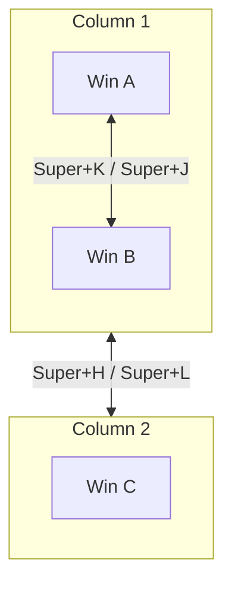

## The Consistency Principle

When I switched from Hyprland to Niri, I refused to relearn shortcuts. Instead, I designed a system that:

1. **Preserves existing muscle memory** — Same keys do similar things
2. **Follows logical modifier patterns** — The modifier tells you the action type
3. **Works across compositors** — Can port back to Hyprland if needed

## The Modifier System

Every shortcut follows a pattern:

| Modifier | Action Type | Example |
|----------|-------------|---------|
| `Super` | Primary action | `Super+C` = close window |
| `Super+Shift` | Move (stay here) | `Super+Shift+3` = send to workspace 3 |
| `Super+Alt` | Move (follow) | `Super+Alt+3` = go with window to workspace 3 |
| `Super+Ctrl` | Alternate/modify | `Super+Ctrl+R` = cycle column widths |

**The insight:** The modifier tells you "what kind of operation" before you press the key. This reduces cognitive load.

## Application Launchers: Matching Expectations

Desktop users expect certain shortcuts. I matched them where possible:

| Shortcut | Action | Reasoning |
|----------|--------|-----------|
| `Super+Q` | Terminal | Q is easy to reach; traditional `Super+Enter` feels clunky |
| `Super+R` | Run/launcher | R for Run (matches Windows' `Win+R`) |
| `Super+E` | File manager | E for Explorer (matches Windows) |
| `Super+N` | Notifications | N for Notifications |
| `Super+W` | Overview | W for Windows (matches GNOME) |

**The compromise:** `Super+Q` for terminal differs from most setups (`Super+Enter`). I chose ergonomics over convention—Q is easier to hit than Enter.

<details>
<summary>Full launcher bindings</summary>

```kdl
binds {
    Mod+Q hotkey-overlay-title="Terminal" { spawn "kitty"; }
    F12 { spawn "dropdown-toggle"; }  // Quake-style dropdown
    Mod+R hotkey-overlay-title="Apps" { spawn "rofi" "-show" "drun"; }
    Mod+E hotkey-overlay-title="Files" { spawn "kitty" "-e" "yazi"; }
    Mod+W { toggle-overview; }
    Mod+N { spawn-sh "swaync-client -t -sw"; }
    Mod+X { spawn-sh "dms ipc call powermenu toggle"; }
    Super+Alt+L { spawn "swaylock"; }
}
```

</details>

## Window Management: The Close/Float/Fullscreen Trio

Three operations I use constantly:

| Shortcut | Action | Hyprland Equivalent |
|----------|--------|---------------------|
| `Super+C` | Close | `$mainMod+Q` |
| `Super+V` | Toggle float | `$mainMod+V` |
| `Super+F` | Fullscreen | `$mainMod+F` |

**The migration:** Hyprland used `Q` for close, but I wanted `Q` for terminal. `C` for Close is mnemonic and available.

```kdl
binds {
    Mod+C repeat=false { close-window; }
    Mod+V { toggle-window-floating; }
    Mod+F { fullscreen-window; }
}
```

The `repeat=false` prevents accidentally closing multiple windows when holding the key.

## Navigation: Column-Aware HJKL

Niri's column model requires adapting vim-style navigation:

**Traditional tiling:** HJKL moves between windows in 4 directions
**Niri:** H/L moves between columns, J/K moves within columns



**The insight:** This actually matches the mental model better. H/L is "switch context" (different column). J/K is "switch within context" (same column).

<details>
<summary>Navigation bindings</summary>

```kdl
binds {
    // Vim-style
    Mod+H { focus-column-left; }
    Mod+L { focus-column-right; }
    Mod+K { focus-window-up; }
    Mod+J { focus-window-down; }

    // Arrow keys (same behavior)
    Mod+Left { focus-column-left; }
    Mod+Right { focus-column-right; }
    Mod+Up { focus-window-up; }
    Mod+Down { focus-window-down; }

    // Move windows (add Shift)
    Mod+Shift+H { move-column-left; }
    Mod+Shift+L { move-column-right; }
    Mod+Shift+K { move-window-up; }
    Mod+Shift+J { move-window-down; }
}
```

</details>

## Workspaces: The Hardest Migration

Workspace shortcuts must be identical across compositors. Any change breaks muscle memory built over years.

**Kept identical:**
- `Super+1-9,0` → Focus workspace 1-10
- `Super+Tab` → Previous workspace
- `Super+Shift+1-9` → Move window to workspace

**The Niri difference:** Niri's `move-column-to-workspace` always makes you follow the window. Hyprland has `movetoworkspacesilent` for "send without following."

**My compromise:** I bound both `Super+Shift+N` and `Super+Alt+N` to the same action. The distinction is lost, but the muscle memory works.

```kdl
binds {
    // Workspace focus (identical to Hyprland)
    Mod+1 { focus-workspace 1; }
    Mod+2 { focus-workspace 2; }
    // ... etc
    Mod+Tab { focus-workspace-previous; }

    // Move to workspace (both patterns do the same thing in Niri)
    Mod+Shift+1 { move-column-to-workspace 1; }
    Mod+Alt+1 { move-column-to-workspace 1; }
    // ... etc
}
```

## Niri-Specific Features

Some features exist only in Niri. I chose shortcuts that don't conflict:

| Shortcut | Action | Why This Key |
|----------|--------|--------------|
| `Super+Shift+C` | Center column | C for Center, Shift avoids Close |
| `Super+Ctrl+R` | Cycle column widths | R for Resize, Ctrl for alternate |
| `Super+T` | Tabbed display | T for Tabs |
| `Super+,` / `Super+.` | Consume/expel | Adjacent keys, mnemonic (<pull, >push) |
| `Super+[` / `Super+]` | Bidirectional consume/expel | Bracket keys suggest movement |

```kdl
binds {
    Mod+Shift+C { center-column; }
    Mod+Ctrl+R { switch-preset-column-width; }
    Mod+T { toggle-column-tabbed-display; }
    Mod+Comma { consume-window-into-column; }
    Mod+Period { expel-window-from-column; }
    Mod+BracketLeft { consume-or-expel-window-left; }
    Mod+BracketRight { consume-or-expel-window-right; }
}
```

## Media Keys: Consistent Everywhere

Media keys should work the same regardless of compositor:

```kdl
binds {
    XF86AudioRaiseVolume allow-when-locked=true {
        spawn-sh "wpctl set-volume @DEFAULT_AUDIO_SINK@ 0.05+ -l 1.0";
    }
    XF86AudioLowerVolume allow-when-locked=true {
        spawn-sh "wpctl set-volume @DEFAULT_AUDIO_SINK@ 0.05-";
    }
    XF86AudioMute allow-when-locked=true {
        spawn-sh "wpctl set-mute @DEFAULT_AUDIO_SINK@ toggle";
    }
    XF86MonBrightnessUp allow-when-locked=true {
        spawn "brightnessctl" "set" "+5%";
    }
    XF86MonBrightnessDown allow-when-locked=true {
        spawn "brightnessctl" "set" "5%-";
    }
}
```

The `allow-when-locked=true` ensures they work on the lock screen. This matches expected behavior.

<details>
<summary>Screenshot bindings</summary>

```kdl
binds {
    Print { screenshot; }                    // Full screen
    Ctrl+Print { screenshot-screen; }        // Current output
    Alt+Print { screenshot-window; }         // Current window
    Shift+Print {                            // Area (grim + slurp)
        spawn-sh "grim -g \"$(slurp)\" ~/Pictures/Screenshots/$(date +%Y%m%d_%H%M%S).png";
    }
    Ctrl+Shift+Print {                       // Area to clipboard
        spawn-sh "grim -g \"$(slurp)\" - | wl-copy";
    }
}
```

</details>

## Migration Cheatsheet

If coming from Hyprland:

| Hyprland | Niri | Notes |
|----------|------|-------|
| `$mainMod+T` | `Mod+Q` | Terminal (I moved it) |
| `$mainMod+Q` | `Mod+C` | Close (Q→C) |
| `$mainMod+D` | `Mod+R` | Launcher (D→R for Run) |
| `movetoworkspacesilent` | N/A | Niri always follows |
| `focuswindow l/r/u/d` | `focus-column-left/right` + `focus-window-up/down` | Split into column/window |
| Special workspace | `focus-workspace 9` | No overlay, just workspace |

## Design Summary

| Principle | Implementation |
|-----------|----------------|
| Modifier = action type | Super (do), Shift (move stay), Alt (move follow), Ctrl (alternate) |
| Match conventions | Super+E for files, Super+R for run |
| Preserve muscle memory | Same workspace shortcuts as Hyprland |
| Adapt to model | Column-aware HJKL |
| Accept losses | No silent move, no special workspace |

The result: 80% of my shortcuts are identical to Hyprland. 20% adapted to Niri's model. The mental overhead of switching is minimal.

---
