## Part 1: Custom Status Lines

### The Ambient Information Problem

When working with Claude Code, I want certain information always visible:
- Which model is running (Opus vs Sonnet vs Haiku)
- Session cost (am I burning through credits?)
- Context usage (how full is the context window?)
- Where am I (git branch, directory)

Constantly checking these interrupts flow. The solution: **ambient information via status line**.

### The Architecture

Claude Code sends JSON to your status line script via stdin. Your script processes it and outputs formatted text.


This is the same pattern as Kitty's remote control and DMS's IPC: expose data, let users decide presentation.

### What I Display

```
[Opus] $0.42 | 67% | main | myproject
```

At a glance: model, cost, context usage, git branch, directory.

<details>
<summary>Status line script: ~/.claude/statusline.sh</summary>

```bash
#!/bin/bash
input=$(cat)

# Extract data
MODEL=$(echo "$input" | jq -r '.model.display_name // "Claude"')
COST=$(echo "$input" | jq -r '.cost.total_cost_usd // 0')
DIR=$(echo "$input" | jq -r '.workspace.current_dir // empty' | xargs basename)

# Context calculation
CONTEXT_SIZE=$(echo "$input" | jq -r '.context_window.context_window_size // 200000')
USAGE=$(echo "$input" | jq '.context_window.current_usage // null')
if [ "$USAGE" != "null" ]; then
    TOKENS=$(echo "$USAGE" | jq -r '.input_tokens // 0')
    PCT=$((TOKENS * 100 / CONTEXT_SIZE))
    CTX="${PCT}%"
else
    # Fallback: cumulative tokens (can exceed context due to auto-compact)
    TOTAL=$(echo "$input" | jq -r '.context_window.total_input_tokens // 0')
    CTX="$((TOTAL / 1000))k"
fi

# Git branch
GIT_BRANCH=$(git branch --show-current 2>/dev/null)

# Colors
G='\033[32m'; Y='\033[33m'; C='\033[36m'; M='\033[35m'; R='\033[0m'

# Output
COST_FMT=$(LC_NUMERIC=C printf "%.2f" "$COST")
echo -e "${G}[${MODEL}]${R} ${Y}\$${COST_FMT}${R} | ${C}${CTX}${R} | ${M}${GIT_BRANCH:-no-git}${R} | ${DIR}"
```

</details>

### Configuration

Enable in `~/.claude/settings.json`:

```json
{
  "statusLine": {
    "type": "command",
    "command": "~/.claude/statusline.sh"
  }
}
```

Make the script executable:

```bash
chmod +x ~/.claude/statusline.sh
```

### Available Data

Claude Code provides rich JSON:

| Field | Example | Use |
|-------|---------|-----|
| `model.display_name` | "Opus 4.5" | Know which model |
| `cost.total_cost_usd` | 5.66 | Track spending |
| `cost.total_lines_added` | 1757 | Productivity metric |
| `context_window.context_window_size` | 200000 | Calculate % |
| `workspace.current_dir` | "/home/user/project" | Location |

**The insight:** You choose what matters. I care about cost and context. You might care about lines changed or session duration.

## Part 2: Git Worktrees for Parallel Development

### The Context Destruction Problem

You're deep in a feature. An urgent bug appears. Traditional workflow:

1. Stash changes
2. Switch branches
3. Fix bug
4. Switch back
5. Unstash
6. Try to remember where you were

Context is destroyed. Both your mental context and Claude's.

### The Worktree Solution

Git worktrees let you check out multiple branches in **separate directories**, sharing the same history.

```bash
# Create worktree for urgent fix
git worktree add ../myapp-hotfix hotfix/urgent

# Now you have:
# ~/projects/myapp/        → your feature (intact)
# ~/projects/myapp-hotfix/ → hotfix branch (new directory)
```

Each directory can run its own Claude Code session. **Parallel AI-assisted development**.

### The Mental Model

```mermaid
gantt
  title Context Switching Comparison
  dateFormat X
  axisFormat %s

  section Traditional
  feature    :0, 2
  bug        :2, 3
  feature    :3, 5
  bug        :5, 6
  feature    :6, 8

  section Worktrees
  feature (dir 1)   :0, 8
  bug fix (dir 2)   :2, 4
```



### Directory Structure

```
~/projects/
├── myapp/                 # Main worktree
│   ├── .git/              # The actual database
│   └── src/
├── myapp-feature/         # Linked worktree
│   ├── .git               # File, not directory (points to main)
│   └── src/
└── myapp-hotfix/          # Linked worktree
    ├── .git               # File pointing to main
    └── src/
```

**Key insight:** All worktrees share the same git history. Commits in any worktree are visible everywhere. But working directories are isolated.

### Practical Workflow

```bash
# Terminal 1: Feature development
cd ~/projects/myapp
claude

# [Interrupt: urgent bug]

# Terminal 2: Bug fix (separate tab)
git worktree add ../myapp-hotfix hotfix/urgent
cd ~/projects/myapp-hotfix
claude

# Fix, commit, push in Terminal 2
# Terminal 1 is completely untouched

# Cleanup
git worktree remove ../myapp-hotfix
```

Two Claude sessions. Two branches. Zero context loss.

<details>
<summary>Worktree commands reference</summary>

```bash
# Create for existing branch
git worktree add <path> <branch>

# Create with new branch
git worktree add -b <new-branch> <path> <base>

# List all worktrees
git worktree list

# Remove worktree
git worktree remove <path>

# Force remove (has changes)
git worktree remove --force <path>

# Clean stale references
git worktree prune
```

**Constraint:** A branch can only be in one worktree. Git prevents conflicts.

</details>

### PR Review Workflow

Someone opens a PR. Review without disturbing your work:

```bash
# Fetch the PR
git fetch origin pull/123/head:pr-123

# Create review worktree
git worktree add ../myapp-pr123 pr-123

# Review in new Claude session
cd ../myapp-pr123 && claude
```

Your feature work stays exactly where you left it.

### Kitty Integration

Since I use Kitty, I have a helper:

```bash
worktree-claude() {
    local path="$1"
    kitty @ launch --type=tab --cwd="$path" --title="$(basename $path)" \
        bash -c "claude; exec bash"
}

# Usage
worktree-claude ~/projects/myapp-hotfix
```

Opens new Kitty tab → changes to worktree → starts Claude → keeps shell alive after.

## The Pattern: Separation of Concerns

Both features follow the same principle:

| Feature | Separates | Benefit |
|---------|-----------|---------|
| Status line | Data from presentation | You control what you see |
| Worktrees | Branches from directories | Parallel work without conflicts |

Claude Code provides the data and the AI. You control the environment.

## Combining Both

My workflow with both features:

1. Status line shows me context usage approaching limit
2. I'm mid-feature but need to start a fresh context for a separate task
3. Create worktree → new tab → new Claude session
4. Status lines in both tabs show independent costs/contexts
5. Switch tabs to switch tasks
6. Cleanup worktree when done

No single Claude session has to do everything. Parallel sessions, parallel contexts, parallel costs tracked separately.

## Tradeoffs

| Feature | Tradeoff |
|---------|----------|
| Custom status line | Requires jq, bash scripting knowledge |
| Worktrees | Extra directories, need to remember cleanup |

Both are opt-in power features. Skip them if you don't need them. But once you try parallel Claude sessions via worktrees, switching branches feels primitive.

---

*These features work independently. Start with one, add the other when ready.*
