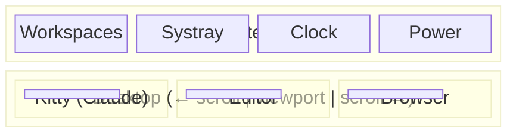

## The Integration Thesis

Individual tools are commodities. The value is in **how they integrate**.

This series has been about integration: consistent shortcuts across compositors, unified colors across applications, shared patterns across tools (IPC, config files, status lines).

This final post shows the complete picture.

## The Stack

| Layer | Tool | Role |
|-------|------|------|
| Compositor | Niri | Window management, scrolling tiling |
| Shell | DankMaterialShell | Panel, power menu, system tray |
| Terminal | Kitty | GPU rendering, sessions, remote control |
| Launcher | Rofi | Application search |
| Notifications | SwayNC | Notification center |
| Lock | Swaylock | Screen locker |
| Screenshots | grim + slurp | Screen capture |

## The Integration Points

### 1. Unified Color Palette

All components use coordinated colors:

| Token | Color | Used In |
|-------|-------|---------|
| Focus/Selection | `#7fc8ff` | Niri focus ring, Rofi selection |
| Background | `#1a1a1a` | Rofi, terminal transparency |
| Text | `#cdd6f4` | Rofi, Kitty |
| Surface | `#45475a` | Borders, panels |

**The principle:** Extract colors from one source (Niri's focus ring, Catppuccin), apply everywhere.

### 2. Unified Shortcut Philosophy

| Modifier | Meaning | Example |
|----------|---------|---------|
| `Super` | Do action | `Super+C` = close |
| `Super+Shift` | Move (stay) | `Super+Shift+3` = send to ws 3 |
| `Super+Alt` | Move (follow) | `Super+Alt+3` = go with window |
| `Super+Ctrl` | Alternate | `Super+Ctrl+R` = cycle widths |

**The principle:** Modifier encodes action type. Works in Niri, would work in Hyprland.

### 3. IPC Everywhere

Each component exposes its features via IPC:

```bash
# Compositor
niri msg action focus-workspace 1

# Shell
dms ipc call powermenu toggle

# Terminal
kitty @ send-text "command\n"
```

**The principle:** Components are servers. Keybindings are clients. Decoupled.

## Visual Layout



Windows live in columns. The monitor scrolls through them. Each column can stack multiple windows.

## Configuration Files

All config lives in predictable locations:

```
~/.config/
├── niri/config.kdl           # Compositor
├── DankMaterialShell/        # Shell
│   └── settings.json
├── kitty/
│   ├── kitty.conf            # Terminal
│   └── work.conf             # Session
├── rofi/themes/
│   └── launchpad.rasi        # Launcher theme
├── swaync/config.json        # Notifications
└── starship.toml             # Prompt
~/.claude/
├── settings.json             # Claude Code config
└── statusline.sh             # Status line script
~/.bashrc                     # Shell, OSC 7, aliases
```

## Daily Workflow

**Morning:**
```bash
kitty --session ~/.config/kitty/work.conf
```

Three tabs appear: project, dev (split), git.

**Navigation:**
- `Super+H/L` — between columns
- `Super+J/K` — within column
- `Super+1-9` — workspaces
- `Super+Tab` — previous workspace

**Common Actions:**
- `Super+Q` — new terminal
- `Super+R` — app launcher (Rofi)
- `Super+C` — close window
- `Super+W` — overview
- `Super+S` — scratchpad (workspace 9)

**Context Switching:**
```bash
# New feature in parallel
git worktree add ../myapp-feature feature-branch
worktree-claude ~/projects/myapp-feature
```

Two Claude sessions, two branches, zero conflict.

**End of Day:**
- `Super+X` — power menu → shutdown

## The Consistency Payoff

After four months on this setup:

1. **Zero muscle memory conflicts** — Same shortcuts work across compositors
2. **Visual cohesion** — Everything feels like one system
3. **Scriptable everything** — Automation via IPC
4. **Parallel development** — Worktrees + multiple Claude sessions
5. **Ambient awareness** — Status lines show what matters

## What I Would Change

**Niri's missing special workspace:** Hyprland's overlay scratchpad is more elegant than my workspace-9 workaround.

**Config synchronization:** Colors are manually kept in sync. A single source of truth would be better.

**DMS maturity:** Fewer plugins than mature shells. But improving fast.

These are acceptable tradeoffs for the benefits of the scrolling paradigm and consistent integration.

## Dependencies

```bash
# Core
niri quickshell dankmaterialshell kitty rofi swaync swaylock

# Screenshots
grim slurp wl-clipboard

# Audio/brightness
wireplumber brightnessctl playerctl

# Shell tools
starship atuin jq

# Fonts
ttf-hack-nerd
```

## The Meta-Pattern

Looking across everything—terminal, shell, compositor, AI assistant—the same patterns repeat:

| Pattern | Examples |
|---------|----------|
| **IPC for control** | `kitty @`, `dms ipc`, `niri msg` |
| **Config as code** | `.kdl`, `.toml`, `.json`, session files |
| **Declarative layouts** | Kitty sessions, Niri workspaces |
| **Separation of concerns** | Compositor vs shell vs launcher |
| **Hot reload** | Niri, Starship, DMS |

These aren't just Linux patterns. They're good software patterns. The desktop is a distributed system where the user is the integrator.

## Getting Started

Don't adopt everything at once. Start here:

1. **Niri basics** — Install, minimal config, try scrolling
2. **Keep your shortcuts** — Port from current compositor
3. **Add Kitty** — GPU terminal, basic config
4. **Session files** — Reproducible workspace
5. **Status line** — If using Claude Code
6. **DMS + Rofi** — When you want polish
7. **Worktrees** — When you need parallel work

Each step is independent. Add what helps, skip what doesn't.

## Resources

- [Niri](https://github.com/YaLTeR/niri) — The compositor
- [DankMaterialShell](https://github.com/danknil/DankMaterialShell) — The shell
- [Kitty](https://sw.kovidgoyal.net/kitty/) — The terminal
- [Starship](https://starship.rs) — The prompt
- [Catppuccin](https://catppuccin.com) — The color palette

---

*This concludes the **Wayland Desktop Mastery** series. The terminal series starts at [Kitty Terminal Fundamentals](/blog/2025-10-05-kitty-terminal-fundamentals).*
