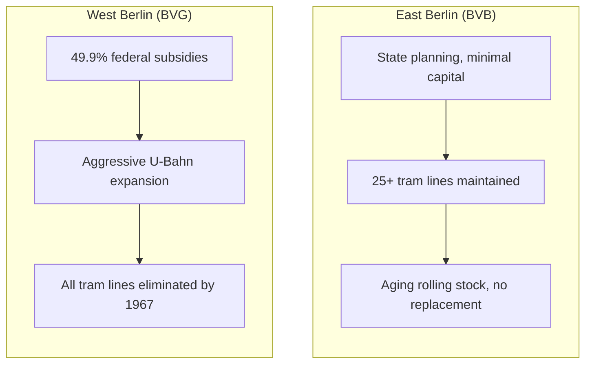

import BarChart from '../../components/charts/BarChart.svelte';
import LineChart from '../../components/charts/LineChart.svelte';

## Two Cities, Two Transit Philosophies

Before the Wall fell in November 1989, Berlin had two completely separate public transit systems running on opposite sides of the same city. Understanding how they differed — and why — is the starting point for understanding BVG's crisis today.

**West Berlin's BVG** operated under a unique financial arrangement. The **Berlinfoerderungsgesetz** (Berlin Subsidy Law) — a federal law designed to keep West Berlin economically viable as an island inside East Germany — channeled massive subsidies from the federal government. By 1985, federal transfers constituted **49.9% of West Berlin's total revenue**. Nearly half the city's money came directly from Bonn.

This created a paradox. West Berlin was flush with cash for infrastructure projects, but its isolation meant those projects had no regional connections to justify. The result: aggressive U-Bahn (underground railway) expansion coupled with the deliberate elimination of all tram lines by 1967. Trams were seen as "outdated" — a Cold War-era aesthetic choice dressed up as modernization. Buses and underground rail were the future.

**East Berlin's BVB** (Berliner Verkehrsbetriebe, the eastern counterpart) took the opposite approach. Under state planning, the BVB maintained an extensive tram network — **25+ lines by 1990** — because trams were cheap to operate and didn't require expensive tunnel construction. The tradeoff was rolling stock. Trams and buses aged without replacement. Investment went to maintaining coverage, not modernizing equipment.

| | BVG (West) | BVB (East) |
|---|---|---|
| Primary mode | U-Bahn + bus | Tram + bus |
| Tram lines | 0 (eliminated 1967) | 25+ |
| Funding model | Federal subsidies (49.9%) | State planning |
| Investment priority | New tunnel construction | Maintaining coverage |
| Rolling stock | Modern but limited network | Extensive but aging |

This matters because when the Wall fell, Berlin didn't just need to merge two transit agencies. It needed to merge two fundamentally incompatible visions of what urban transit should be.

## The Merger Shock

On **January 1, 1992**, BVG formally absorbed BVB. On paper, this was administrative consolidation. In practice, it was an engineering and financial disaster.

The two systems used different signaling. Eastern infrastructure had degraded after decades of minimal investment. The workforce cultures were incompatible — West Berlin's unionized workers operating under collective bargaining agreements (Tarifvertraege, contracts negotiated between employers and unions that set wages and conditions for an entire sector) faced integration with eastern workers accustomed to state employment.

The financial shock was immediate. **BVG posted nearly 1 billion Deutsche Marks in losses in 1991** — before the formal merger was even complete. The combined system now had to maintain western U-Bahn tunnels, eastern tram tracks, two bus networks, and a workforce nearly double what either agency had operated alone.

Berlin's Senate (the city-state's governing body, equivalent to both a city council and state parliament) responded with what would become the template for the next three decades: a service contract. The first **Verkehrsvertrag** (service contract — the agreement between Berlin and BVG specifying what service BVG must provide and how much the city will pay) allocated approximately **986 million USD in 1993**.

That number — 986 million — is important not because of what it was, but because of what it would become. Over the following two decades, service contract funding would decline by over **60% in real terms**. The merger gave BVG a massive system to maintain; Berlin's funding trajectory ensured it could never maintain it properly.

## The Bahnreform: A National Decision with Local Consequences

Two years after the BVG-BVB merger, the federal government made a decision that would shape German transit for a generation.

The **Bahnreform** (Railway Reform) of 1994 restructured Deutsche Bahn (German Rail) from a state agency into a corporation. The stated goals were efficiency, competition, and eventual privatization. The immediate consequences were workforce devastation and infrastructure pruning.

Deutsche Bahn's workforce fell from **331,000 in 1994 to 214,000 by 2001** — a 35% reduction in seven years. This wasn't just a DB problem. The railway schools (**Eisenbahnerschulen**) that had historically trained transit workers — including those who went on to work at local operators like BVG — were consolidated or eliminated. Apprenticeship programs (**Ausbildungsprogramme**, the structured training pathways that are central to German vocational education) were cut across the board. Half of all railway workers lost their positions.

<BarChart
	client:visible
	title="Bahnreform 1994: The Scale of Cuts"
	horizontal={true}
	data={[
		{ label: "Workforce (thousands)", value: 331, color: "#2da87e" },
		{ label: "Workforce after (thousands)", value: 214, color: "#e07c39" },
		{ label: "Rail network cut (%)", value: 20, color: "#c44dbb" },
		{ label: "Stations closed (%)", value: 40, color: "#c44dbb" },
		{ label: "Freight connections cut (%)", value: 80, color: "#c44dbb" },
	]}
	format="number"
/>

Meanwhile, the physical network shrank. **20% of Germany's rail network was cut**, **40% of stations closed**, and **80% of direct freight rail connections eliminated**. These cuts didn't only affect long-distance rail. Local transit systems — which shared infrastructure, training programs, and workforce pipelines with Deutsche Bahn — lost their support ecosystem.

For BVG, the Bahnreform created a slow-motion crisis. The agency could no longer rely on a national pipeline of trained drivers, signal technicians, and maintenance workers. It would need to recruit and train its own workforce — but the service contract funding to do so was already declining.

## The Long Decline: 1993-2013

The twenty years between the first service contract and the beginning of the "Black Zero" austerity period tell a story of steady erosion.

Berlin itself was in financial crisis. The city had accumulated massive debt from reunification-era construction projects (including the infamous **Bankenskandal**, the banking scandal of 2001 that cost Berlin an estimated 21 billion euros when its state-owned bank collapsed). The Berlin Senate repeatedly cut BVG's service contract to balance its own books.

By 2013, BVG's service contract funding had **declined over 60% from its 1993 level in real terms**. Adjusted for inflation, the agency was receiving less than 40 cents for every dollar it had started with.

<LineChart
	client:visible
	title="BVG Service Contract Funding (Real Terms, Indexed)"
	areaFill={true}
	series={[
		{
			label: "Funding (millions USD, inflation-adjusted)",
			data: [
				{ x: 1993, y: 986 },
				{ x: 1997, y: 850 },
				{ x: 2001, y: 720 },
				{ x: 2005, y: 600 },
				{ x: 2009, y: 490 },
				{ x: 2013, y: 394 },
			],
			color: "#e07c39",
		},
	]}
	xLabel="Year"
	yLabel="Millions USD"
	formatYKey="dollarM"
/>

The effects accumulated invisibly. Maintenance schedules stretched. Rolling stock replacement was deferred. Training programs were minimized. None of this produced immediate visible crises — transit systems have enormous inertia, and deferred maintenance doesn't cause failures for years or decades. But each year of underfunding added to a growing backlog of work that would eventually need to be done.

By the time the federal government achieved its "Black Zero" in 2014, BVG was already carrying decades of accumulated underinvestment. What happened next would push that backlog past the point of manageable recovery.

## What Reunification Actually Cost

The standard narrative frames German reunification as a political triumph with economic costs. For Berlin's transit, the costs were structural and ongoing.

The merger didn't just combine two transit systems. It created a single entity responsible for maintaining Cold War-era U-Bahn tunnels, a tram network that West Berlin had deliberately eliminated and East Berlin had deliberately preserved, rolling stock spanning multiple decades and technologies, and a workforce whose training pipeline was about to be gutted by national policy.

Every subsequent crisis at BVG — the maintenance backlog, the driver shortage, the strikes, the service failures — traces back to decisions made between 1992 and 1994. The merger set the scope. The Bahnreform cut the training pipeline. The declining service contract removed the funding.

Understanding this history is necessary because BVG's current crisis is not a management failure or a sudden shock. It's the compounding result of structural decisions made thirty years ago, amplified by policy choices that will be the subject of the next post.

## Key Takeaways

1. **West and East Berlin built incompatible transit systems** — the 1992 merger combined U-Bahn-focused (West) and tram-focused (East) networks that couldn't simply be plugged together
2. **The merger's 1 billion DM loss set the financial tone** — BVG started unified operations in deficit and never fully recovered
3. **The Bahnreform destroyed the training pipeline** — a 35% workforce reduction at Deutsche Bahn rippled through local transit operators who depended on the same apprenticeship programs
4. **Service contract funding declined 60% over twenty years** — Berlin systematically defunded BVG to manage its own debt
5. **Deferred maintenance compounds silently** — the costs of underfunding don't appear immediately, but they accumulate into a backlog that eventually becomes unmanageable

---
