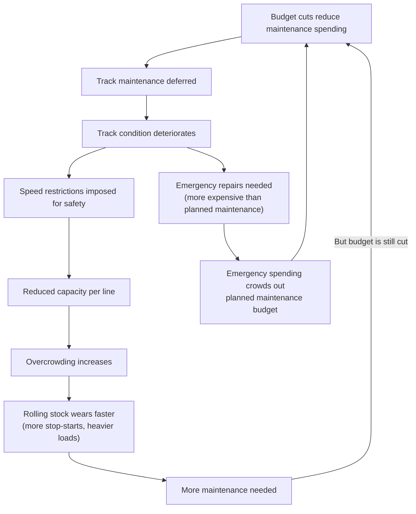

import StackedBar from '../../components/charts/StackedBar.svelte';
import TimelineChart from '../../components/charts/TimelineChart.svelte';
import BarChart from '../../components/charts/BarChart.svelte';

## The Schwarze Null Explained

In 2014, German Finance Minister Wolfgang Schaeuble achieved something he'd been pursuing for years: a **Schwarze Null** (Black Zero) — a balanced federal budget with no new net borrowing. He hit this target a year ahead of schedule, and Germany maintained it through 2019, when COVID emergency spending finally suspended it.

To understand why this matters for transit, you need to understand how German fiscal policy works.

Germany's constitution includes a **Schuldenbremse** (debt brake), adopted in 2009, that limits federal structural deficits to 0.35% of GDP and prohibits German states (**Laender**) from running any structural deficit at all. The Black Zero went further — not just limiting borrowing, but eliminating it entirely.

This was popular. Germany's post-war economic identity is built on fiscal discipline, and the 2008 financial crisis — when southern European countries buckled under sovereign debt — reinforced the cultural consensus that borrowing was irresponsible. Schaeuble's balanced budget was presented as proof that Germany could maintain a strong economy without deficit spending.

The problem was where the savings came from.

## What Austerity Looks Like Underground

Municipal infrastructure bore a disproportionate share of Black Zero austerity. Cities like Berlin, which depend on federal and state transfers for much of their revenue, couldn't simply raise local taxes to compensate. When federal transfers stagnated and state budgets tightened, transit was one of the first things squeezed.

BVG's own 2020 annual report explicitly acknowledged the damage: **"between 2010 and 2020, investment was insufficient."** This is a state-owned company admitting in its own financial filings that it was underfunded for a decade.

The evidence is visible throughout the network:

- The **U-Bahn fleet averages 28 years old**. Some vehicles from 1964 are still in service — over 60 years old
- The **Waisentunnel**, which connects U5 maintenance facilities, has been **closed since 2018** due to "significant damage and safety risks"
- The entire **F79 U-Bahn series** had to be scrapped because of irreparable cracks in aluminum car bodies
- In November 2024, a **fire at Schlossstrasse station** destroyed approximately 100 cables, illustrating how aging infrastructure creates cascading failure risks

BVG's CEO Henrik Falk has acknowledged that tram maintenance investment — which fell from **41.8 million euros in 2022 to just 34.8 million in 2023** — "puts the system at risk of a damaging backlog."

## The Maintenance Death Spiral

Deferred maintenance doesn't just add up linearly. It compounds, creating what transit engineers call a **death spiral** — each deferred repair creates additional failures that require additional repairs.

Here's how it works in practice:

1. **Skipped track maintenance** leads to rail defects — cracks, gauge widening, uneven surfaces
2. **Speed restrictions** are imposed for safety — trains slow from 60 km/h to 30 km/h through degraded sections
3. **Capacity drops** — slower trains mean fewer trains per hour on the same track
4. **Overcrowding** increases — same passenger demand, fewer train-kilometers of capacity
5. **Rolling stock degrades faster** — heavier loads, more frequent acceleration/braking cycles, vibration damage from rough track
6. **Emergency repairs** become necessary, consuming budget that was meant for planned maintenance
7. The cycle repeats, each iteration worse than the last

The total **Sanierungsstau** (maintenance backlog — literally "renovation jam," the accumulated deficit of deferred maintenance and renewal) for BVG now exceeds **3 billion euros**. For U-Bahn infrastructure alone, the estimate is **2.8 billion euros through 2035**, roughly 280 million per year.

Service failures now affect **3.7% of U-Bahn trips**. Standby train reserves have been eliminated entirely — there are no spare trains to deploy when vehicles break down. Some lines have had to reduce train lengths from 8 to 6 cars because there aren't enough working vehicles.

## Beton statt Menschen: The Concrete-vs-People Trap

Perhaps the most damaging structural problem is how Germany funds transit at the federal level.

The **GVFG** (Gemeindeverkehrsfinanzierungsgesetz — Municipal Transport Financing Act) is the primary federal funding mechanism for local transit. From 2025, it provides **2 billion euros annually**. But it comes with a critical restriction: **GVFG money can only be used for capital projects**. New U-Bahn extensions. New tram lines. New stations.

It cannot be used for:
- **Operating costs** (running trains, paying drivers)
- **Driver wages** (the single largest operating expense)
- **Ongoing maintenance** (keeping existing infrastructure functional)

German transit experts call this the **"Beton statt Menschen"** (concrete instead of people) trap. The federal government will happily fund a new U-Bahn extension that a politician can announce at a press conference. But the driver who operates the train, the technician who maintains the track, and the replacement parts for the existing fleet — those must come entirely from municipal budgets and fare revenue.

Berlin's 15-year service contract with BVG (2020-2035) reflects this bias directly:

<StackedBar
	client:visible
	title="BVG Service Contract: Allocation vs Actual Need (Billions EUR)"
	data={[
		{
			label: "Contract allocation",
			segments: [
				{ label: "New construction", value: 2.0, color: "#c44dbb" },
				{ label: "Maintenance", value: 1.7, color: "#2da87e" },
			],
		},
		{
			label: "Actual maintenance need",
			segments: [
				{ label: "U-Bahn alone", value: 2.8, color: "#2da87e" },
				{ label: "Rest of network (est.)", value: 0.5, color: "#d4a843" },
			],
		},
	]}
	references={[{ label: "Maintenance need: €3B+", value: 3.0 }]}
	format="euroB"
/>

The system that needs 2.8 billion euros just for U-Bahn maintenance gets 1.7 billion for *all* maintenance — and 2 billion for new lines that will create even more infrastructure to maintain.

To make matters worse, planned investment for 2026-2027 has already been cut from **645 million euros to just 320 million** — a 50% reduction before the money is even spent.

<BarChart
	client:visible
	title="Investment Cuts: Planned vs Actual (2026-2027)"
	horizontal={false}
	data={[
		{ label: "Planned", value: 645, color: "#2da87e" },
		{ label: "Actual", value: 320, color: "#e07c39" },
	]}
	format="euroM"
	valueLabel="Millions EUR"
/>

Energy costs compound the squeeze. BVG's 2024 energy expenditure reached **140.2 million euros** (up 7.9 million from 2023). The 2022-2023 energy crisis — when German electricity prices rose **29.7% in a single year** — exposed the company's vulnerability to external shocks. The push toward electrification (targeting 500 e-buses by 2027) requires massive capital investment: a single new depot at Treptow costs **120 million euros**, and the federal government has committed **196 million euros** in e-bus subsidies.

## The J/JK Train Procurement: A Case Study

If you want to understand why German infrastructure projects take so long and cost so much, the procurement of new U-Bahn trains for BVG is a useful case study.

Germany's **Vergaberecht** (public procurement law) governs how public entities purchase goods and services. It exists for good reasons — preventing corruption, ensuring fair competition, and getting value for taxpayer money. But in practice, it creates procurement timelines that would be comical if the consequences weren't so serious.

<TimelineChart
	client:visible
	title="J/JK U-Bahn Train Procurement Timeline"
	minYear={2016}
	maxYear={2027}
	events={[
		{ label: "Tender published", start: 2016, end: 2017, type: "period", row: 0 },
		{ label: "Evaluation", start: 2017, end: 2019, type: "period", row: 0 },
		{ label: "Stadler selected", start: 2019, type: "milestone", detail: "May 2019: Stadler beats Alstom", row: 0 },
		{ label: "Alstom appeal", start: 2019, end: 2020, type: "critical", detail: "Legal challenge escalates to Court of Appeals", row: 1 },
		{ label: "Court rules for BVG", start: 2020, type: "milestone", detail: "March 2020: 4 years after tender", row: 1 },
		{ label: "Contract + manufacturing", start: 2020, end: 2024, type: "period", row: 0 },
		{ label: "First test vehicle", start: 2024, type: "milestone", detail: "Jan 2024: 3+ years late", row: 0 },
		{ label: "Serial production", start: 2025, end: 2027, type: "period", row: 0 },
	]}
/>

Here's the timeline:

- **October 2016**: BVG publishes its tender for new U-Bahn trains
- **May 2019**: Stadler is selected as the winner, beating Alstom and a Siemens/Bombardier consortium
- **May 2019 (immediately)**: Alstom files an appeal with the **Vergabekammer** (procurement review board, a quasi-judicial body that adjudicates challenges to public procurement decisions)
- **2019-2020**: The appeal escalates to Berlin's **Kammergericht** (Court of Appeals)
- **March 2020**: The court rules in BVG's favor — **four years** after the tender was published, just to get permission to sign the contract
- **Original delivery target**: Autumn 2022
- **Actual first test vehicle**: **January 2024** — over three years late
- **Serial production**: 2025-2026

The total framework contract reaches up to **3 billion euros** for 1,500 cars, with a confirmed order of 1,018 cars for **2 billion euros**. Per-car costs run approximately **2 to 2.7 million euros**.

Two details illustrate the dysfunction:

**The guarantee problem.** BVG's tender required a **30-year reliability guarantee** from the manufacturer — even though BVG, not the manufacturer, would maintain the trains. This unusual requirement was a significant factor in the **Siemens/Bombardier consortium withdrawing from bidding entirely**, reducing competition and likely increasing the final price.

**The family entanglement.** During the tender process, BVG's then-CEO Sigrid Nikutta's brother was Alstom's Germany CEO. While no wrongdoing was established, the conflict of interest added fuel to Alstom's legal challenge and cast a shadow over the entire procurement.

The net result: from tender to trains-in-service, the process will have taken approximately **10 years**. For context, BVG's existing fleet was aging throughout this entire period, with some trains from the 1960s still running because their replacements were stuck in procurement.

## The Infrastructure Trap

The pattern that emerges from this analysis is not one of incompetence but of structural incentives pointing in the wrong direction.

Federal funding rewards new construction. Municipal funding can't keep pace with maintenance. Procurement law adds years to every purchase. Austerity ideology starved the system for a decade. And each of these problems reinforces the others — new construction creates more infrastructure to maintain, but the funding to maintain it doesn't follow.

BVG now operates a system where:
- The **maintenance backlog exceeds 3 billion euros** and grows annually
- **Investment has been cut** from 645 million to 320 million for 2026-2027
- **Energy costs consume 140 million euros per year** and rising
- **New train deliveries** are a decade behind the original timeline
- **Service failures affect 3.7%** of U-Bahn trips with no standby reserves

This is the system that the workers who operate it must deal with daily — the subject of the next post.

## Key Takeaways

1. **The Black Zero starved municipal infrastructure** — a decade of zero federal borrowing meant transit investment was deferred, creating a compounding maintenance backlog
2. **Deferred maintenance creates a death spiral** — each skipped repair increases the cost and urgency of future repairs, while reducing system capacity
3. **Federal funding can only build new things** — the GVFG funds new construction but not the drivers, maintenance, or operations that keep existing systems running
4. **Berlin allocated more for new tram lines than maintaining existing infrastructure** — 2 billion euros vs 1.7 billion in the 15-year service contract
5. **Procurement law adds years to every purchase** — the J/JK train order took 10 years from tender to trains in service, while the existing fleet aged past 60 years
6. **The 3+ billion euro maintenance backlog grows every year** — current funding levels cannot close the gap

---
