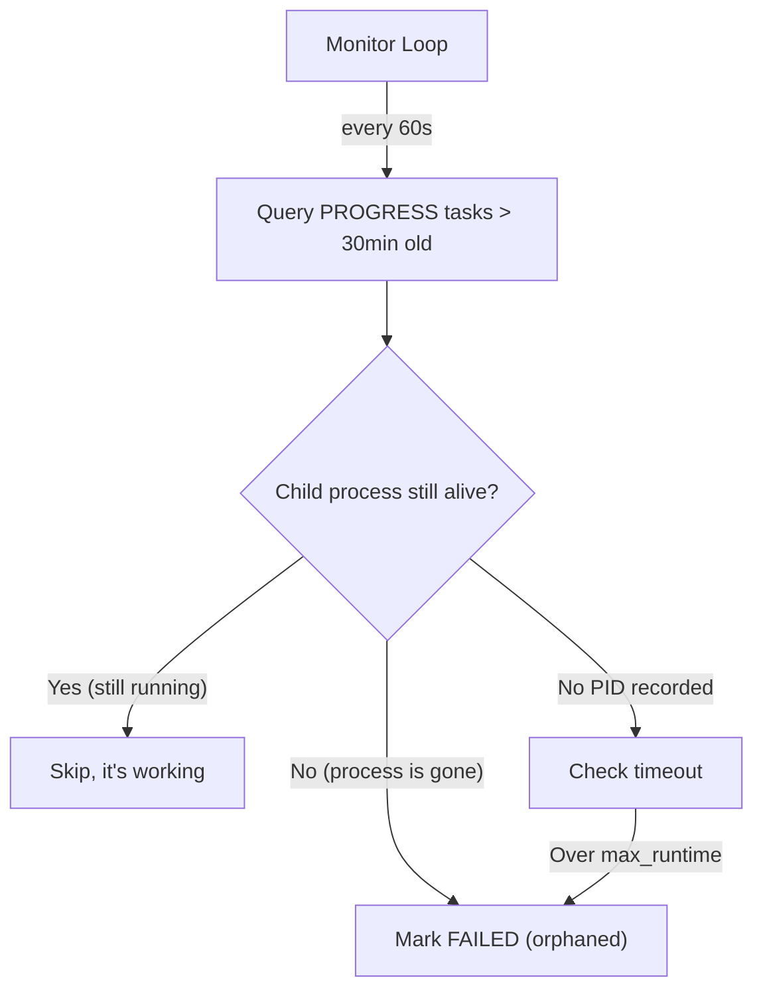
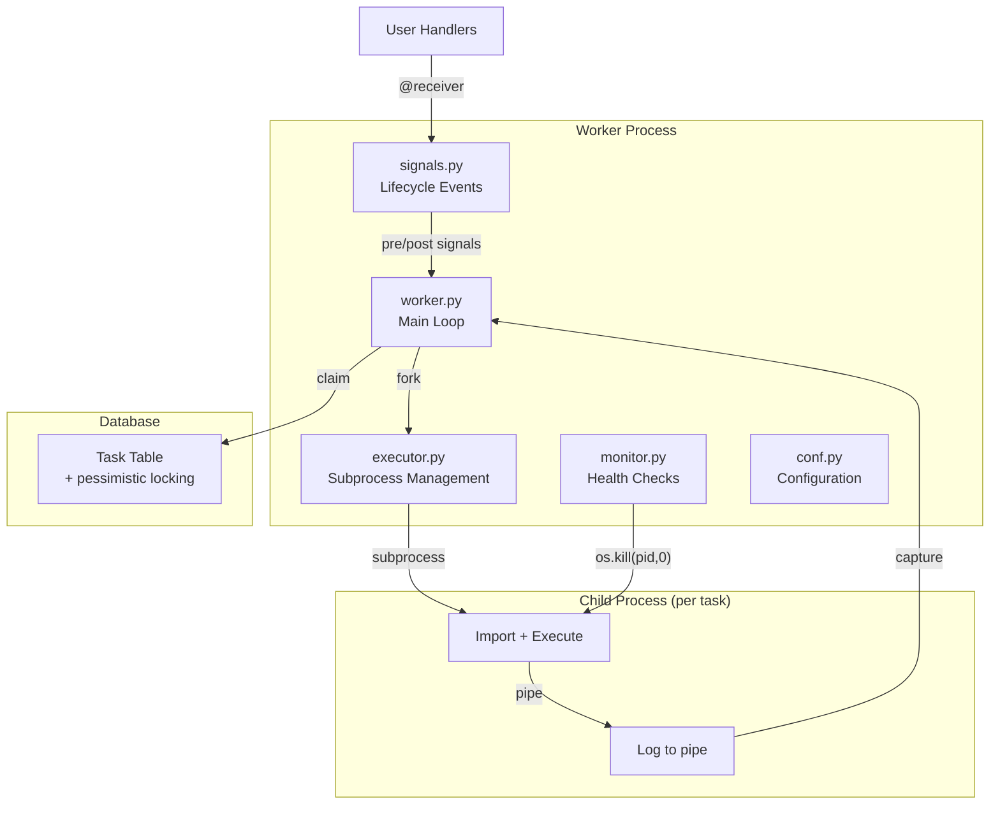

## The Starting Point

Over the past year, django-simple-queue evolved from a 300-line prototype to a subprocess-based, pessimistic-locking task worker. It handled production load reliably — until we noticed tasks that appeared stuck in PROGRESS forever.

This post covers the final push: finding and fixing the stalled-task bug, then using that momentum to refactor, harden security, add signals, and build proper testing infrastructure.

## The None += str Bug

### The symptom

Tasks occasionally got stuck in PROGRESS status permanently. No error in the database. No error in logs. The task just... stopped existing from the worker's perspective.

### The root cause

Deep in the error handling path:

```python
# The bug
task.error = None  # default value
try:
    execute(task)
except Exception as e:
    task.error += str(e)  # TypeError: unsupported operand type(s) for +=: 'NoneType' and 'str'
    task.status = "FAILED"
    task.save()
```

When a task failed, the error handler tried to append the error message to `task.error`. But `task.error` was `None` (the default). `None += "some error"` raises a `TypeError` — **inside the exception handler**. The original error was swallowed, the TypeError was unhandled, and the task stayed in PROGRESS forever.

A bug in the error handler is the worst kind of bug. It hides the actual problem and makes the system appear to hang for no reason.

### The fix

```python
task.error = str(e)  # assign, don't append
```

Simple. But finding it required tracing through production logs for tasks with no error message and no completion timestamp.

## Orphan Detection: Finding Stalled Tasks

Even with the `None += str` bug fixed, tasks can still get stuck. A child process might be killed by the operating system for using too much memory (the "OOM killer"), crash due to a bug in a C extension, or hit an infinite loop. The parent needs a way to detect these orphaned tasks — tasks that are marked as "in progress" but whose worker process is already dead.

### PID Tracking

Every running process on your system has a unique number called a **PID** (Process ID). You see these in `ps aux` or `htop`. By recording the PID of the child process that runs each task, we can later check if that process is still alive.

First, record which process is running each task:

```python
task.worker_pid = os.getpid()
task.save()

# In child process
task.child_pid = os.getpid()
task.save()
```

### Checking If a Process Is Still Alive

Python's `os.kill(pid, 0)` is a handy trick: despite the name, sending signal `0` doesn't actually kill or affect the process at all. It just asks the operating system "does this process exist?" If it does, the call succeeds. If it doesn't, you get an error.

```python
import os
import errno

def is_process_alive(pid):
    """Check if a process exists without affecting it."""
    try:
        os.kill(pid, 0)  # signal 0 = just check, don't do anything
        return True
    except OSError as e:
        if e.errno == errno.ESRCH:
            return False  # "No such process" — it's gone
        if e.errno == errno.EPERM:
            return True   # Process exists, but we don't have permission to signal it
        raise
```

### The Monitor Loop

A monitor periodically checks for tasks stuck in PROGRESS whose child process no longer exists:

```python
def detect_stalled_tasks():
    """Find tasks whose worker process has died."""
    stalled = Task.objects.filter(
        status="PROGRESS",
        started_at__lt=timezone.now() - timedelta(minutes=30),
    )

    for task in stalled:
        if task.child_pid and not is_process_alive(task.child_pid):
            task.status = "FAILED"
            task.error = f"Child process {task.child_pid} no longer exists (orphaned)"
            task.completed_at = timezone.now()
            task.save()
            logger.warning(f"Marked orphaned task {task.id}")
```



## The Refactor: From Monolith to Modules

At this point, the management command was ~600 lines. Task claiming, subprocess execution, memory monitoring, orphan detection, error handling — all in one file. Time to split it up.

### Before

```
management/commands/worker.py  (600+ lines, does everything)
```

### After

```
django_simple_queue/
├── worker.py      # Main worker loop, task claiming
├── executor.py    # Subprocess execution, child process management
├── monitor.py     # Orphan detection, memory monitoring
├── signals.py     # Lifecycle signals (pre_task, post_task, etc.)
├── conf.py        # Configuration with sensible defaults
└── management/
    └── commands/
        └── worker.py  # Thin wrapper calling worker.run()
```

**The design principle:** Each module has one reason to change. Adding a new signal doesn't touch the executor. Changing the monitoring interval doesn't touch the worker loop.

<details>
<summary>Module responsibilities</summary>

**worker.py** — The main loop:
```python
class Worker:
    def __init__(self, config):
        self.config = config
        self.executor = Executor(config)
        self.monitor = Monitor(config)

    def run(self):
        self.monitor.start()
        while self.running:
            task = self.claim_task()
            if task:
                self.executor.execute(task)
            else:
                time.sleep(self.config.poll_interval)
```

**executor.py** — Subprocess management:
```python
class Executor:
    def execute(self, task):
        signals.pre_task_execute.send(sender=self, task=task)
        process = self.fork_child(task)
        self.wait_with_timeout(process, task)
        signals.post_task_execute.send(sender=self, task=task)
```

**monitor.py** — Health checks:
```python
class Monitor:
    def check_stalled_tasks(self):
        # PID-based orphan detection
        ...

    def log_memory(self):
        # psutil-based memory reporting
        ...
```

**conf.py** — Configuration:
```python
class QueueConfig:
    poll_interval: float = 1.0
    max_task_runtime: int = 3600
    memory_limit_mb: int = 500
    allowed_tasks: list[str] | None = None
```

</details>

## Security Hardening

### Problem 1: XSS via mark_safe

The Django admin displayed task error messages using `mark_safe()` to preserve formatting. If a task's error contained user-controlled data, this was an XSS vector:

```python
# BEFORE (vulnerable)
def error_display(self, obj):
    return mark_safe(f"<pre>{obj.error}</pre>")

# AFTER (safe)
from django.utils.html import escape

def error_display(self, obj):
    return mark_safe(f"<pre>{escape(obj.error)}</pre>")
```

### Problem 2: Arbitrary Code Execution via Task Names

The original design executed any dotted Python path. If an attacker could write to the task table (SQL injection elsewhere, compromised admin account), they could execute arbitrary code:

```python
Task.objects.create(
    task_name="os.system",
    task_params={"command": "rm -rf /"},
)
```

The fix: an explicit allowlist of permitted task callables.

```python
# settings.py
SIMPLE_QUEUE = {
    "ALLOWED_TASKS": [
        "myapp.tasks.send_email",
        "myapp.tasks.generate_report",
        "myapp.tasks.sync_inventory",
    ],
}
```

```python
# In the executor
def validate_task(task_name):
    allowed = getattr(settings, "SIMPLE_QUEUE", {}).get("ALLOWED_TASKS")
    if allowed is not None and task_name not in allowed:
        raise SecurityError(
            f"Task '{task_name}' is not in ALLOWED_TASKS"
        )
```

**The tradeoff:** Allowlists require updating when you add new tasks. But the alternative — executing any importable function — is a privilege escalation waiting to happen. The explicit list is worth the maintenance cost.

### Problem 3: No Timeout Enforcement

A task stuck in an infinite loop blocks its worker slot forever. The subprocess model helps (the parent can kill the child), but only if timeouts are actually enforced.

Linux gives you two ways to stop a process: a polite request (**SIGTERM** — "please shut down") and a forceful kill (**SIGKILL** — "you're done, no choice"). SIGTERM lets the process clean up (close files, commit transactions, etc.) before exiting. SIGKILL terminates it immediately with no chance to clean up.

```python
def wait_with_timeout(self, process, task):
    """Wait for child process with escalating termination."""
    process.join(timeout=self.config.max_task_runtime)

    if process.is_alive():
        # Polite request: please shut down
        logger.warning(f"Task {task.id} exceeded timeout, sending SIGTERM")
        os.kill(process.pid, signal.SIGTERM)
        process.join(timeout=10)  # give it 10 seconds to clean up

        if process.is_alive():
            # Force kill: no more waiting
            logger.error(f"Task {task.id} did not exit after SIGTERM, sending SIGKILL")
            os.kill(process.pid, signal.SIGKILL)
            process.join()

        task.status = "FAILED"
        task.error = f"Task exceeded maximum runtime of {self.config.max_task_runtime}s"
```

The escalation pattern — ask politely first, then force-kill after a grace period — gives well-behaved tasks a chance to clean up database transactions or close files. Tasks that ignore the polite request get terminated unconditionally.

## Lifecycle Signals

Django's signal system provides extensibility without modifying core code:

```python
# signals.py
from django.dispatch import Signal

pre_task_execute = Signal()    # before subprocess fork
post_task_execute = Signal()   # after subprocess completes
task_failed = Signal()         # on task failure
task_stalled = Signal()        # when orphan detected
worker_heartbeat = Signal()    # periodic health check
```

Users can hook into any lifecycle event:

```python
# In your app
from django_simple_queue.signals import task_failed

@receiver(task_failed)
def notify_on_failure(sender, task, **kwargs):
    slack_notify(f"Task {task.task_name} failed: {task.error}")
```

**The design principle:** The queue library shouldn't know about Slack, email, or Sentry. Signals let consumers add integrations without forking the library.

## Capturing Logs from Child Processes

Subprocess workers run in a separate process — their `print()` output and log messages don't appear in the parent's log stream by default. They go nowhere, making debugging impossible.

The fix is a **pipe** — a one-way communication channel between two processes. Think of it like a Unix pipeline (`ls | grep foo`): one process writes, the other reads. We create a pipe before forking, give the write end to the child, and read from the other end in the parent:

```python
def execute_with_log_capture(self, task):
    """Fork child and capture its output via pipe."""
    read_fd, write_fd = os.pipe()

    process = multiprocessing.Process(
        target=self._child_with_logging,
        args=(task.task_name, task.task_params, write_fd),
    )
    process.start()
    os.close(write_fd)  # parent doesn't write

    # Read child output in parent
    with os.fdopen(read_fd, 'r') as pipe:
        child_output = pipe.read()

    process.join()

    if child_output:
        logger.info(f"Task {task.id} output:\n{child_output}")
```

This means task logs appear in the main worker log stream, making debugging possible without hunting through child process output.

<details>
<summary>Child process logging setup</summary>

```python
@staticmethod
def _child_with_logging(task_name, task_params, write_fd):
    """Child process: redirect logging to the write end of the pipe."""
    from django.db import connections
    import importlib
    import sys

    connections.close_all()

    # Redirect stdout/stderr to pipe
    pipe_writer = os.fdopen(write_fd, 'w')
    sys.stdout = pipe_writer
    sys.stderr = pipe_writer

    # Also redirect Python logging
    handler = logging.StreamHandler(pipe_writer)
    handler.setLevel(logging.DEBUG)
    logging.root.addHandler(handler)

    try:
        module_path, func_name = task_name.rsplit(".", 1)
        module = importlib.import_module(module_path)
        func = getattr(module, func_name)
        func(**task_params)
    except Exception as e:
        logging.exception(f"Task failed: {e}")
        os._exit(1)
    finally:
        pipe_writer.flush()
        pipe_writer.close()
```

</details>

## Testing Infrastructure

Testing a subprocess-based task worker is tricky. You need to verify:

1. Task claiming under concurrency
2. Subprocess lifecycle (fork, execute, exit)
3. Timeout enforcement
4. Orphan detection
5. Signal dispatch

```python
class TestPessimisticLocking(TransactionTestCase):
    """Must use TransactionTestCase for SELECT FOR UPDATE tests."""

    def test_concurrent_claim(self):
        """Two threads claiming simultaneously get different tasks."""
        Task.objects.create(task_name="test.noop", status="QUEUED")
        Task.objects.create(task_name="test.noop", status="QUEUED")

        results = []
        def claim():
            task = claim_task()
            if task:
                results.append(task.id)

        t1 = threading.Thread(target=claim)
        t2 = threading.Thread(target=claim)
        t1.start()
        t2.start()
        t1.join()
        t2.join()

        # Both threads should get different tasks
        self.assertEqual(len(results), 2)
        self.assertNotEqual(results[0], results[1])
```

**Key insight:** Locking tests require `TransactionTestCase`, not `TestCase`. Django's `TestCase` wraps each test in a transaction, which interferes with `SELECT FOR UPDATE` behavior.

## The Architecture Now



From 300 lines in one file to a modular system with:

- **Pessimistic locking** for safe concurrency
- **Subprocess isolation** for memory management
- **Orphan detection** for resilience
- **Task allowlisting** for security
- **Timeout enforcement** with SIGTERM/SIGKILL escalation
- **Lifecycle signals** for extensibility
- **Pipe-based logging** for observability

## What I'd Do Differently

**Start with the allowlist.** Adding it after the fact required auditing every task in production. Starting with an allowlist from day one costs nothing extra.

**Add PID tracking from the beginning.** Debugging stalled tasks without PID information meant guessing which process was stuck. The instrumentation should have been in the initial subprocess implementation.

**Write the monitor before needing it.** The orphan detection code took an hour to write. The production incident that motivated it took a day to debug.

## The Series Arc

Looking back across all five posts:

| Post | Problem | Solution | New Constraint |
|------|---------|----------|----------------|
| 1 | Celery overhead | Database as broker | Single-threaded, no concurrency |
| 2 | Memory leaks | Subprocess isolation | Shared file descriptors |
| 3 | Shared connections + broken directory | connections.close_all + rsync | None (deployment solved) |
| 4 | Race conditions | Pessimistic locking | DB backend requirements |
| 5 | Silent failures | Monitoring + hardening | Maintenance complexity |

Each fix created new constraints. Each constraint led to the next fix. The ~300 LOC library is now ~1500 LOC — still small enough to understand completely, still zero external infrastructure beyond the database.

That's the thesis of this series: **you can go surprisingly far with simple tools, if you're willing to understand the problems they create.**

## Key Takeaways

1. **Bugs in error handlers are invisible** — they swallow the real problem and make the system appear hung
2. **Check if processes are still alive** — `os.kill(pid, 0)` asks the OS "does this process exist?" without affecting it
3. **Refactor when the file fights you** — 600 lines in one module is a sign, not a goal
4. **Allowlists over denylists** — explicitly permit known tasks rather than trying to block bad ones
5. **Ask politely, then force-kill** — SIGTERM gives tasks a chance to clean up; SIGKILL is the unconditional fallback
6. **Signals for extensibility** — let consumers hook in without forking your library

---

*This concludes the **Production Django Task Queue** series. The series starts at [django-simple-queue: 300 Lines to Replace Celery](/blog/2024-12-21-django-simple-queue-intro).*
