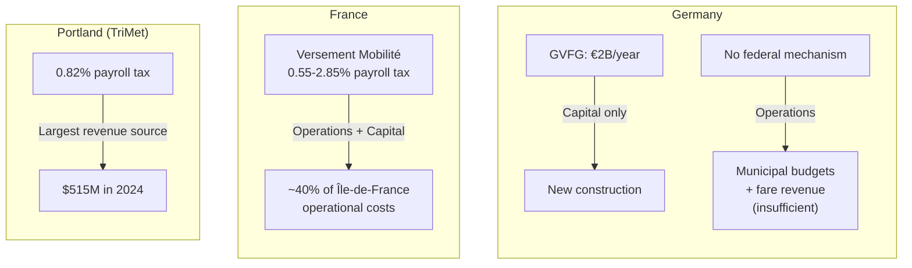

import SliderSimulation from '../../components/charts/SliderSimulation.svelte';
import ComparisonTable from '../../components/charts/ComparisonTable.svelte';

## The Solutions Are Not Unknown

Over the previous four posts, a pattern has emerged: BVG's crisis stems not from technical limitations or unavoidable constraints, but from structural policy choices. Reunification created an impossible inheritance. Austerity starved the system. The funding model rewards construction over maintenance. Wages fell behind every comparable city.

Every one of these problems has been solved elsewhere. This post examines the specific reform pathways — and confronts the tension between automation and the workers who just fought for fair compensation.

## Federal Operations Funding: The Most Important Reform

Germany's current transit funding structure has a hole at its center. The **GVFG** (Gemeindeverkehrsfinanzierungsgesetz) provides 2 billion euros annually for capital projects — new lines, new stations, new vehicles. But there is **no federal mechanism for funding transit operations**: running trains, paying drivers, maintaining infrastructure.

This isn't how other countries work.

**France's Versement Mobilite** (mobility contribution) is a payroll tax levied on employers with 11+ employees. The rate varies by region, ranging from 0.55% in smaller cities to **2.85% in Paris** (Ile-de-France). This generates billions annually and funds approximately **40% of Ile-de-France's operational transit costs**. The Versement Mobilite has been credited with enabling France's **tram renaissance** — over 30 French cities have built new tram systems since 2000, funded in part by this dedicated revenue stream.

**Portland, Oregon's TriMet** levies a 0.82% payroll tax on employers within its service district, generating **515 million USD in 2024**. This is TriMet's single largest revenue source — larger than fares.

Germany has no equivalent. The political barriers are significant — any new federal tax requires Bundestag approval, and Germany's federal structure (**Foederalismus**) means transit is constitutionally a state and municipal responsibility. But the GVFG itself was a federal intervention in local transit; the principle of federal transit funding is already established. What's missing is extending it from capital to operations.

The impact of this reform would be transformative. If Germany implemented a Versement Mobilite-style levy at even 1% — well below France's Paris rate — it could generate tens of billions annually across the country. For BVG specifically, federal operations funding would break the "concrete instead of people" trap that forces Berlin to choose between building new lines and paying the workers who run existing ones.

## Employer Levies: Vienna's Model Scaled to Berlin

Vienna's **Dienstgeberabgabe** (employer transit tax) — 2 euros per employee per week — has generated stable transit funding since 1970. At approximately **60 million euros annually**, it's not the largest revenue source, but its stability and earmarking make it uniquely valuable.

Scaling this to Berlin is straightforward arithmetic. Berlin has approximately 2 million employed persons (compared to Vienna's ~900,000). A Vienna-style levy of 2 euros per employee per week could generate **80 to 100 million euros annually** — enough to cover a significant portion of the 140 million euro wage settlement cost.

<SliderSimulation
	client:load
	title="Employer Transit Levy: What Could Berlin Generate?"
	sliderLabel="Levy per employee per week"
	min={0}
	max={5}
	step={0.5}
	initialValue={2}
	unit=" EUR"
	references={[{ label: "Vienna: \u20AC2/wk", value: 2 }]}
	outputs={[
		{ label: "Annual revenue", multiply: 104, prefix: "\u20AC", suffix: "M" },
		{ label: "% of \u20AC140M settlement", multiply: 74.3, suffix: "%" },
		{ label: "Per employer/year (10 staff)", multiply: 520, prefix: "\u20AC" },
	]}
/>

**The political framing matters.** Vienna's tax has survived 55 years because it's positioned as infrastructure investment by employers who benefit from worker mobility — not as a tax burden. Employers need their workers to get to work. Transit enables that. An employer levy makes the implicit subsidy explicit.

Berlin's governing coalition would need to pass this through the **Abgeordnetenhaus** (Berlin's state parliament). Given the current political composition, this would require cross-party support — achievable if the alternative (continued transit deterioration) is framed clearly.

## Congestion Charging: The Policy Germany Won't Implement

Every few years, a German politician or think tank proposes congestion charging for Berlin. Every few years, the proposal dies.

Studies suggest a **6 euro per day charge** for driving into Berlin's S-Bahn ring (the central city area bounded by the circular S-Bahn line) could:

- **Reduce car traffic by approximately 23%**
- **Generate approximately 600 million euros annually**
- Fund transit improvements that make the car-free alternative viable

For context, 600 million euros annually is roughly:
- 4x BVG's 2024 deficit
- 4x the annual cost of the wage settlement
- 20% of the total U-Bahn maintenance backlog

<SliderSimulation
	client:load
	title="Congestion Charge: Revenue & Impact Projections"
	sliderLabel="Daily charge within S-Bahn ring"
	min={0}
	max={12}
	step={1}
	initialValue={6}
	unit=" EUR/day"
	references={[{ label: "Studied rate: \u20AC6", value: 6 }]}
	outputs={[
		{ label: "Annual revenue", multiply: 100, prefix: "\u20AC", suffix: "M" },
		{ label: "Traffic reduction", multiply: 3.8, prefix: "~", suffix: "%" },
		{ label: "BVG deficits covered", multiply: 1.75, suffix: "x", fixed: 1 },
		{ label: "Maintenance backlog years", multiply: 100, dividend: 3000, suffix: " years", fixed: 1, zeroText: "\u221E" },
	]}
/>

Three international cities demonstrate the model works:

**London** introduced its congestion charge in 2003 at 5 GBP (now 15 GBP). Traffic in the charging zone fell by 30% initially. Annual net revenue exceeds 200 million GBP, reinvested in transit. The political controversy lasted roughly two years before public acceptance.

**Stockholm** introduced congestion pricing as a trial in 2006, then made it permanent after a **public referendum approved it** (with 51.3% support). Traffic fell 20%, air quality improved measurably, and the system generates approximately 1 billion SEK annually.

**Singapore** has operated electronic road pricing since 1998 (replacing a manual system from 1975). Charges vary by time, location, and congestion level. The system is credited with keeping Singapore's traffic manageable despite high population density.

**Why Germany hasn't done it**: German political culture treats car access as a quasi-right. The automotive industry's political influence (**Automobilindustrie**) — BMW, Mercedes, Volkswagen, and their supply chains employ over 800,000 people — creates lobbying pressure against any policy that discourages driving. Additionally, Germany's federal structure means Berlin would need state-level legislation, which requires coalition agreement.

The irony is that congestion charging would actually improve driving conditions for those who continue to drive (fewer cars means less congestion). But the political messaging challenge — "we're charging you to drive in your own city" — has defeated every German attempt so far.

## The Automation Question

Here the series takes a turn. Everything discussed so far — funding reform, employer levies, congestion charging, competitive wages — addresses BVG's crisis within the current operational model: human drivers operating vehicles on public infrastructure. But automation is already changing that model elsewhere.

### Nuremberg: 16 Years of Driverless U-Bahn

Nuremberg's **VAG** (Verkehrs-Aktiengesellschaft Nuernberg) has operated **driverless U-Bahn service since June 2008** — over 16 years of continuous automated operation on the U2 and U3 lines.

The results directly address the reliability and cost concerns that dominate BVG's crisis:

<ComparisonTable
	client:visible
	title="Automated vs Conventional U-Bahn Performance"
	columns={[
		{ key: "metric", label: "Metric", sortable: true },
		{ key: "automated", label: "Nuremberg Automated (U2/U3)", highlight: true, sortable: true },
		{ key: "conventional", label: "Nuremberg Conventional (U1)", sortable: true },
		{ key: "bvg", label: "BVG Berlin", sortable: true },
	]}
	rows={[
		{ metric: "Punctuality", automated: "99.6-99.8%", conventional: "97-98%", bvg: "~96%" },
		{ metric: "Min. headway", automated: "100 sec", conventional: "200 sec", bvg: "~300 sec" },
		{ metric: "Passengers/year", automated: "70M", conventional: "-", bvg: "~600M total" },
		{ metric: "Safety incidents", automated: "0 (16+ yrs)", conventional: "Rare", bvg: "3.7% trip failures" },
		{ metric: "Staffing model", automated: "GoA4 (unattended)", conventional: "Driver in cab", bvg: "Driver in cab" },
	]}
	highlightRow={-1}
/>

**100-second headways** mean a train every 1 minute 40 seconds during peak hours — roughly double the capacity of driver-operated lines. And 99.6% punctuality means that out of 1,000 trips, only 4 are late.

Nuremberg operates at **GoA4** (Grade of Automation 4) — the highest level, meaning fully unattended operation with no staff on the train. The system handles all normal operations, emergency responses, and passenger communication automatically.

### Hamburg U5: Germany's Biggest Automation Bet

Hamburg's under-construction **U5** is Germany's largest current urban transit project: **16.5 billion euros** for 25 km of new line and 23 stations. It will operate at **GoA4** (fully unattended) from opening.

The scale of this project dwarfs anything BVG has planned. Expected timeline:

- First section opening: **2029**
- Full line completion: **Late 2030s to 2040**

The U5 represents Hamburg's bet that automation's higher construction costs are offset by permanently lower operating costs. No driver wages, no driver shortages, no shift scheduling constraints. The trade is: spend more upfront, save continuously.

### Copenhagen Metro: 24/7 Automation Since 2002

Copenhagen opened its driverless Metro in 2002 and has operated continuously since — **24 hours a day, 7 days a week, 365 days a year**. Try running a 24/7 service with human drivers; the shift scheduling alone makes it prohibitively expensive.

Copenhagen's Metro achieves **>99% punctuality** and demonstrates a funding model that Germany has barely explored: **value capture**.

The metro was funded largely through the **Orestad development** — a massive urban redevelopment project on former industrial land. The principle: building a metro line increases property values along the route. If you own the land before the metro is built, you capture that value increase and use it to fund the metro.

Copenhagen's North Harbor project generated **15 billion USD in new property value**, of which **5.8 billion USD was redirected to transit investment**. The transit infrastructure paid for itself through the economic value it created.

Germany uses value capture minimally. Berlin's property tax system and land-use planning don't capture transit-induced property value increases in any systematic way. This represents an enormous untapped funding source.

### BVG's Cautious Approach

BVG's own automation plans are modest by comparison.

The company plans **partial automation (GoA2)** for the U5 and U8 lines starting 2025-2026. GoA2 means **automated train operation with a driver remaining in the cab** — the system drives the train, but a human supervises and handles emergencies. This is enabled by **CBTC** (Communications-Based Train Control), a signaling system that tracks train positions in real-time rather than using fixed block signals.

GoA2 can achieve **30% capacity increases** through more precise train spacing — a meaningful improvement for overcrowded lines.

Full automation on existing BVG lines faces significant barriers:

- **Infrastructure age**: Some tunnel sections are **100+ years old**, built before automation was conceivable
- **Heritage protection**: Many stations have **Denkmalschutz** (heritage protection) status, limiting modifications
- **Platform screen doors**: Full automation typically requires barriers between the platform and tracks, estimated at **200+ million euros** for BVG's network
- **Mixed operation**: BVG would need to run automated and driver-operated trains on shared infrastructure during any transition period

BVG has stated it has **"no concrete plans for fully driverless operation on existing lines."**

### The Labor Tension

This is the uncomfortable question at the intersection of automation and the 2025 strike.

BVG drivers just fought — through five warning strikes and high-profile arbitration — for a 20% wage increase. The settlement costs BVG 140 million euros annually. The drivers' argument was fundamentally about dignity and fairness: they perform essential, demanding work and deserve competitive compensation.

Automation proponents argue that driverless operation eliminates the driver shortage (BVG needs 800+ drivers), removes the largest operating cost category (personnel), and improves reliability (machines don't call in sick, don't need shift scheduling, and achieve 99.6% punctuality).

Both arguments are correct — and they're in direct tension.

The resolution likely plays out over decades rather than years. Full automation of BVG's existing network is technically and financially impractical in the near term (the 200+ million for platform doors alone, plus the heritage constraints). Any new lines built from scratch could be automated from the start (as Hamburg is doing with U5). The existing workforce will be needed for at least 15-20 years on current lines, during which time competitive wages remain essential for recruitment and retention.

The honest answer is that automation will eventually reduce the number of transit driver positions — not eliminate them entirely (stations still need staff, maintenance requires humans, emergency response needs trained personnel), but reduce them. The question is whether that transition is managed through attrition and retraining (as Nuremberg did, redeploying drivers to station management and customer service roles) or through displacement.

## The Political Will Problem

Every reform described in this post has been implemented successfully somewhere:

| Reform | Proven in | Revenue/impact |
|---|---|---|
| Federal operations funding (payroll tax) | France, Portland | 40% of operations costs / $515M annually |
| Employer transit levy | Vienna | 60M euros/year (stable since 1970) |
| Congestion charging | London, Stockholm, Singapore | 200M+ GBP / 23% traffic reduction |
| Value capture | Copenhagen | $5.8B redirected to transit |
| Full automation | Nuremberg, Copenhagen | 99.6% punctuality, 100-sec headways |

Germany possesses the technical knowledge, administrative capacity, and economic resources to implement any or all of these. The country that builds Porsche, operates the Autobahn, and engineered the Energiewende (energy transition) is not incapable of running reliable transit.

The obstacles are political:

- **The Black Zero ideology** still commands significant support, making new federal spending programs politically difficult
- **The automotive lobby** opposes congestion charging and anything that might reduce car usage
- **Federal structure** distributes authority across federal, state, and municipal levels, requiring consensus at each
- **Executive compensation has decoupled from outcomes** — Henrik Falk's 454,000 euro salary remains unchanged whether BVG improves or deteriorates
- **Short electoral cycles** (Berlin's state elections every 5 years) incentivize visible projects over maintenance and wages

## The Series Arc

Looking across all five posts:

| Post | Problem | Structural Cause | Proven Solution |
|---|---|---|---|
| 1 | Impossible inheritance | Reunification merged incompatible systems | (Historical — no remedy) |
| 2 | €3B+ maintenance backlog | Black Zero austerity + GVFG capital-only bias | Federal operations funding |
| 3 | Driver shortage + low wages | Declining service contracts | Employer levy + competitive wages |
| 4 | No stable funding model | Absence of dedicated transit revenue | Vienna employer tax + Zurich fare mandate |
| 5 | Political paralysis | Automotive lobby + fiscal ideology | Congestion charging + democratic legitimacy |

The thesis is simple: **BVG's crisis is a choice, not an inevitability.**

Vienna chose to tax employers 2 euros per week and make transit passes cost 1 euro per day. Zurich chose to pay drivers 77,000 euros and measure punctuality in seconds. Nuremberg chose to automate in 2008 and has run 99.6% punctual service ever since. Copenhagen chose to capture property value increases and fund transit from the wealth it created.

Berlin has chosen — through decades of policy decisions — to underfund, underpay, and defer. The infrastructure exists to change course. The models are proven. The solutions are known. Only the political will to implement them is absent.

## Key Takeaways

1. **Germany has no federal mechanism for transit operating costs** — unlike France's Versement Mobilite or Portland's payroll tax, which fund 40%+ of operations
2. **A Vienna-style employer levy could generate 80-100 million euros annually for Berlin** — enough to cover most of the wage settlement cost
3. **Congestion charging could generate 600 million euros annually** — but Germany's automotive lobby and political culture have blocked every attempt
4. **Nuremberg has run driverless U-Bahn for 16+ years at 99.6% punctuality** — proving the technology works, but BVG's existing infrastructure makes full automation impractical near-term
5. **Value capture is an untapped funding source** — Copenhagen redirected 5.8 billion USD from property value increases to transit, a model Germany barely uses
6. **Every solution in this post has been proven elsewhere** — the question is not technical feasibility but political will

---
