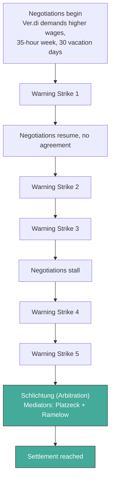

## The Pay Gap, by the Numbers

BVG CEO Henrik Falk earns **454,000 euros annually** — not including bonuses. An entry-level BVG bus or tram driver earns approximately **36,000 to 38,000 euros per year**. That's a **9.8:1 ratio** — the highest executive-to-worker pay gap among all of Berlin's **Landeseigene Unternehmen** (state-owned enterprises, companies fully or majority owned by the Berlin city-state).

To put this ratio in context: Berlin owns companies across housing (degewo, HOWOGE), water (Berliner Wasserbetriebe), energy (BEW), and hospitals (Vivantes). None of them pay their CEO nearly ten times what their frontline workers earn.

This isn't about whether Falk's salary is unreasonable in absolute terms — CEOs of transit agencies running 15,000+ employees in European capitals can earn this much. The issue is the gap at the bottom.

## What a BVG Driver's Day Looks Like

For readers unfamiliar with the role, a public transit driver's job is demanding in ways that aren't obvious.

A BVG bus driver typically works **split shifts** (**Schichtdienst**) — you might start at 5:00 AM, work until 10:00 AM, then return for a 3:00 PM to 8:00 PM shift. The break in between isn't paid, but it's not long enough to do much besides go home and come back. Weekend and holiday work is standard; transit doesn't stop for Christmas.

U-Bahn drivers spend their shifts underground, alone in a cab, responsible for hundreds of passengers with limited ability to leave the train even for bathroom breaks. Tram drivers navigate mixed traffic, sharing lanes with cars, cyclists, and pedestrians in all weather.

All drivers deal with:
- **Passenger confrontations** — fare disputes, intoxicated riders, verbal and sometimes physical abuse
- **Strict schedule pressure** — regulators penalize operators for missed departure times
- **Health impacts** — sedentary work, irregular sleep from shift rotations, vibration exposure
- **Minimal autonomy** — routes, stops, and timings are fixed; the driver executes a predetermined plan

In exchange for this, Berlin has historically paid less than any other major German transit operator.

## Berlin vs Germany: The Wage Comparison

The gap between BVG wages and those at comparable German operators is stark.

| | BVG Berlin | MVG Munich | Hochbahn Hamburg |
|---|---|---|---|
| Entry monthly salary | ~2,807 euros | ~3,435 euros | ~3,277 euros |
| Gap vs Berlin | — | +628 euros/month | +470 euros/month |
| Annual gap vs Berlin | — | ~+7,500 euros | ~+5,600 euros |
| Weekly hours | 39 | 39 | 38 |
| Special allowances | Fahrdienstzulage 225 euros | Muenchenzulage 270 euros | Attendance bonuses |
| Vacation days (pre-2025) | 28 | 30 | 30 |

Munich's **Muenchenzulage** (Munich supplement) is a local cost-of-living bonus of **270 euros per month** paid to all city employees. Hamburg Hochbahn offers attendance bonuses — financial incentives for maintaining low sick-day counts. BVG Berlin has a **Fahrdienstzulage** (driver service allowance) of 225 euros — the lowest special allowance among the three cities.

The monthly gap — **400 to 628 euros less** than comparable positions in Munich or Hamburg — adds up to **5,000 to 7,500 euros per year**. For a driver earning 36,000 euros, that's a 14-20% pay penalty for choosing Berlin over Munich or Hamburg.

This matters because Berlin's cost of living has risen sharply. Between 2015 and 2024, average rents in Berlin increased approximately 40%. Grocery and energy costs have followed national trends (29.7% electricity price increase in 2022-2023 alone). Drivers who could afford Berlin on BVG wages a decade ago increasingly cannot.

## Why Berlin Pays Less

The pay gap isn't accidental. It reflects Berlin's structural financial weakness compared to Munich and Hamburg.

Munich is Germany's wealthiest major city, with high corporate tax revenue from BMW, Siemens, Allianz, and the broader Bavarian industrial base. Hamburg is Germany's second-largest city and a major port economy. Both can afford to subsidize their transit operators more generously.

Berlin, despite being the capital, has historically been one of Germany's poorer city-states. The Bankenskandal of 2001 left it with massive debts. Reunification costs were disproportionately borne by Berlin. The city's economic base — government, universities, startups, tourism — generates less corporate tax revenue than Munich's or Hamburg's industrial giants.

The result: Berlin's transit service contract has been systematically less generous than what Munich or Hamburg provide. And when contract funding is tight, worker compensation is the easiest line item to suppress — unlike infrastructure costs, which create visible failures, low wages only create invisible attrition as experienced drivers leave for other employers or other cities.

## The 2025 Ver.di Strikes

**Ver.di** (Vereinte Dienstleistungsgewerkschaft — United Services Union) is Germany's second-largest union, representing approximately 1.9 million workers across public services, healthcare, transport, and retail. BVG workers are organized under Ver.di's transportation division.

German labor law distinguishes between two types of strikes:

- **Warnstreiks** (warning strikes) — short work stoppages (usually a few hours to a day) that unions can call without extensive legal prerequisites. These are used to demonstrate worker resolve during ongoing negotiations
- **Erzwingungsstreiks** (enforcement strikes) — open-ended strikes that can only be called after negotiations formally break down and a ballot of union members approves the action

The 2025 BVG dispute followed a pattern of escalation:

**Five warning strikes** hit Berlin's transit system. Each one shut down buses, trams, and parts of the U-Bahn network, forcing millions of commuters to find alternative transportation. The strikes were strategically timed — targeting weekday mornings when disruption was maximum — and escalated in duration from a few hours to full-day stoppages.

When direct negotiations failed to produce agreement, both sides agreed to **Schlichtung** (arbitration — a formal mediation process where both parties agree to accept the mediator's recommendation, or at least use it as the basis for a final agreement). The mediators were:

- **Matthias Platzeck** — former Minister-President (head of state government) of Brandenburg, SPD politician with deep experience in eastern German labor relations
- **Bodo Ramelow** — former Minister-President of Thuringia, Die Linke politician and one of Germany's most experienced labor negotiators

The choice of two former state leaders as mediators signaled the political significance of the dispute. This wasn't just a wage negotiation — it was a test of whether Berlin could retain its transit workforce.

## The Settlement

The arbitrated settlement, reached after weeks of mediation, provided:

| Component | Details |
|---|---|
| Base wage increase | **380 euros/month** from June 2025 |
| Additional increase | **+50 euros/month** from January 2026 |
| One-time payment | **1,500 euros** |
| Fahrdienstzulage (driver allowance) | **225 euros → 255 euros** |
| Working hours | **37.5 hours/week** (Ver.di demanded 35) |
| Vacation days | **Increased to 30** |

The total package represents approximately **15.4% average wage increase** across all BVG employees, with drivers specifically receiving approximately **20.1%** — reflecting the deeper gap in their compensation.

### What the Settlement Means in Practice

For an entry-level driver previously earning approximately 2,807 euros monthly:

- **June 2025**: 2,807 + 380 = **3,187 euros/month** (+ 30 euros more from Fahrdienstzulage increase)
- **January 2026**: 3,187 + 50 = **3,237 euros/month**

This closes much of the gap with Hamburg (3,277 euros) but still trails Munich (3,435 euros) — even before Munich's Muenchenzulage is factored in. Berlin drivers gained 2 vacation days (reaching the Munich and Hamburg standard of 30) but did not achieve the 35-hour week Ver.di demanded.

### The Cost

BVG estimates the settlement will cost approximately **140 million euros annually** in additional personnel costs. For a company that reported a **57 million euro loss in 2024** and projects **100+ million in losses for 2025**, this is a massive new expense with no corresponding revenue increase.

The money has to come from somewhere. The options are:
- **Higher fare revenue** — but fare increases are politically toxic, and the Deutschlandticket (Germany's 49-euro national transit pass) limits pricing power
- **Increased service contract funding** from Berlin — but the city's budget is already strained
- **Reduced investment elsewhere** — which means the maintenance backlog grows even faster
- **Federal assistance** — which the current funding structure doesn't allow for operating costs

## The Driver Shortage That Won't Go Away

Even with the wage settlement, BVG faces a structural driver shortage.

The company needs **800+ additional drivers immediately**. This isn't a number that salary increases alone can fix. Training a new bus driver takes approximately 6 months; a U-Bahn driver takes longer. Even if BVG could recruit 800 candidates tomorrow, it would take until late 2025 or 2026 to get them operational.

The shortage shows up in daily operations:

- **3.7% of U-Bahn trips** are affected by service failures
- **Standby train reserves have been eliminated** — when a train breaks down, there's no replacement
- **Some lines run 6-car trains instead of 8** because there aren't enough operational vehicles (or drivers to operate them)
- **Overtime dependence** — remaining drivers work extra shifts to cover gaps, accelerating burnout and further attrition

The competitive wage problem extends beyond Germany. Vienna pays drivers **42,000 to 48,000 euros annually** — 15-25% more than BVG even after the 2025 settlement. Zurich pays the equivalent of approximately **77,000 euros**. For drivers willing to relocate, Berlin is not an attractive option.

## The Fundamental Question

The 2025 strikes exposed a contradiction at the heart of BVG's model. The company is expected to provide comprehensive transit service across a city of 3.7 million people. It's expected to do this while:

- Carrying **3+ billion euros in deferred maintenance**
- Operating vehicles **averaging 28 years old**
- Paying drivers **less than any comparable German city**
- Receiving service contract funding that has **declined 60% in real terms over two decades**

The workers who keep this system running have now demanded — and won — closer-to-competitive wages. But the money to pay those wages doesn't exist within BVG's current funding model. Something has to change: either the funding model adapts, or the service deteriorates further.

Other European cities have found ways to resolve this tension. The next two posts examine what those solutions look like.

## Key Takeaways

1. **BVG has the highest executive-to-worker pay ratio among Berlin state-owned enterprises** — CEO earns 454,000 euros while drivers start at 36,000-38,000
2. **Berlin drivers earn 400-628 euros less per month than Munich or Hamburg** — a 14-20% annual penalty for the same work
3. **Five warning strikes escalated to arbitration** — mediated by two former state Minister-Presidents, signaling the dispute's political significance
4. **The settlement provides ~20% increases for drivers** — closing much of the Hamburg gap but still trailing Munich
5. **The 140 million euro annual cost has no funding source** — BVG already lost 57 million in 2024 with 100+ million projected for 2025
6. **800+ additional drivers are needed immediately** — wage increases are necessary but not sufficient to fix a structural shortage

---
