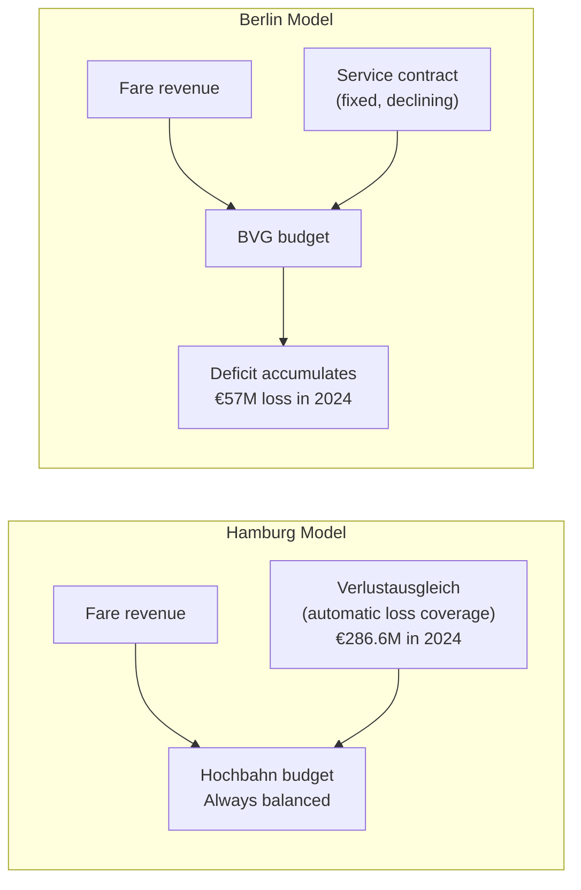
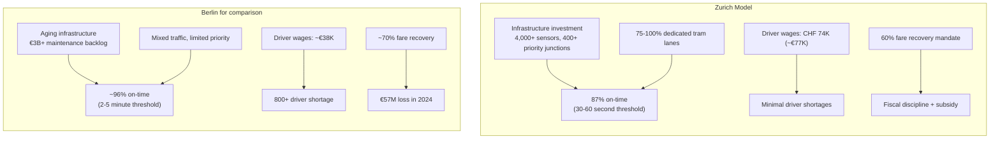

import BarChart from '../../components/charts/BarChart.svelte';
import LineChart from '../../components/charts/LineChart.svelte';
import RadarChart from '../../components/charts/RadarChart.svelte';

## Why Comparisons Matter

BVG's defenders sometimes argue that Berlin's transit problems are unique — that reunification history, structural poverty, and German procurement law make comparisons unfair. There's a grain of truth here. No two cities face identical constraints.

But the argument collapses when you look at what other European cities have achieved under their own constraints. Hamburg deals with the same German procurement law. Munich faces the same GVFG restrictions. Vienna and Zurich demonstrate that fundamentally different funding models produce fundamentally different outcomes.

This post examines four cities, ordered from closest to furthest from Berlin's current structure.

## Hamburg Hochbahn: What Falk Did Before Berlin

Henrik Falk didn't arrive at BVG as an outsider. He ran Hamburg's Hochbahn from 2016 to 2023, and his track record there makes his challenges in Berlin all the more revealing.

Under Falk's leadership, Hamburg Hochbahn achieved a **91.6% cost recovery ratio in 2016** — meaning fares covered 91.6% of operating costs. The German average hovers around 77%. This is among the highest in all of Europe.

Ridership hit a record **468 million passengers in 2023**. Falk advanced the U4 extension, broke ground on the fully automated U5 (more on this in the next post), and issued Germany's first transit **Green Bond** — a 500 million euro bond whose proceeds are earmarked exclusively for environmentally beneficial projects. The 2021 Green Bond signaled to investors that Hamburg's transit was a serious, financially managed operation.

**How Hamburg funds its transit** is the key difference. Hochbahn receives a **Verlustausgleich** (loss compensation — a mechanism where the city-state of Hamburg automatically covers operating losses, so the company's books balance to zero each year). In 2024, this totaled **286.6 million euros**.

The distinction matters enormously. Hamburg's model is **automatic and transparent** — if costs rise, the Verlustausgleich rises to match. BVG's model is **fixed and political** — the service contract is negotiated years in advance and doesn't automatically adjust for inflation, energy shocks, or wage settlements. When BVG's costs exceed its contract, the company simply runs a deficit.

Hamburg also pays drivers better: **3,277 euros monthly** at entry level, working 38 hours per week (decreasing to 37 by 2027), plus attendance bonuses for low sick-day counts.

**The Falk paradox**: the same executive who achieved 91.6% cost recovery and record ridership in Hamburg inherited a system in Berlin where the structural funding model makes similar achievements nearly impossible. The tools available to him in Hamburg — automatic loss compensation, adequate investment funding, competitive wages — don't exist in Berlin.

## Munich MVG: The Cautionary Middle Ground

Munich is often cited as Germany's best-run city. Its transit tells a more complicated story.

The city provided **147.5 million euros in subsidies to MVG in 2024**, up from 104.9 million in 2022 — a 40% increase in just two years. This subsidy growth alarmed Munich's city council, which announced a controversial cap: **130 million euros maximum** for 2026 and beyond.

The cap requires **9.25 million euros in savings for 2026** and **15.8 million euros in additional cuts for 2027**. A proposed **2.7 billion euro investment freeze or delay** threatens to undermine service quality for years.

Munich's U-Bahn punctuality has held reasonably steady at **91.9% in 2024**. But bus punctuality tells a different story:

<LineChart
	client:visible
	title="Munich Bus Punctuality: A Steady Collapse"
	areaFill={true}
	series={[
		{
			label: "Munich bus punctuality (%)",
			data: [
				{ x: 2020, y: 79.5 },
				{ x: 2021, y: 76.2 },
				{ x: 2022, y: 73.1 },
				{ x: 2023, y: 71.3 },
				{ x: 2024, y: 69.5 },
			],
			color: "#e07c39",
		},
	]}
	xLabel="Year"
	yLabel="Punctuality %"
	formatYKey="percent"
/>

A collapse from nearly 80% to under 70% in four years, driven by driver shortages and deferred maintenance. If you ride Munich's buses, you now have a roughly 1-in-3 chance of your bus being late.

Munich's finances are further strained by the **U-Bahn extension to Pasing**. The city financed this extension independently, without federal GVFG subsidies, creating annual debt service of approximately **100 million euros** — nearly the entire subsidy budget — that now constrains operational spending.

**The Munich lesson**: even Germany's wealthiest city struggles to fund transit when it relies on capped municipal subsidies without structural revenue sources. Munich pays drivers well (3,435 euros entry level with the Muenchenzulage), but its funding model is hitting the same limits Berlin reached years ago.

## Vienna Wiener Linien: The Employer Tax Model

Vienna demonstrates what happens when a city builds dedicated, structural transit funding rather than relying on general budgets.

The foundation is the **Dienstgeberabgabe** (employer transit tax) — a levy of **2 euros per employee per week** charged to all employers in Vienna. This has operated continuously **since 1970**, generating approximately **60 million euros annually**, earmarked specifically for U-Bahn construction.

The tax's longevity is the point. Over 55 years, across multiple governing coalitions, the Dienstgeberabgabe has provided stable, predictable transit investment funding. It doesn't depend on annual budget negotiations. It doesn't fluctuate with political cycles. It simply generates revenue, year after year, from employers who benefit from their workers being able to get to work.

Vienna complemented this structural funding with a transformative fare policy. In 2012, the city introduced the **365 euro Jahreskarte** (annual pass) — exactly 1 euro per day.

The results were dramatic:

<BarChart
	client:visible
	title="Vienna: Annual Pass Holders vs Registered Cars"
	horizontal={false}
	data={[
		{ label: "Pass holders (2012)", value: 363, color: "#d4a843" },
		{ label: "Pass holders (2024)", value: 1290, color: "#2da87e" },
		{ label: "Registered cars", value: 736, color: "#e07c39" },
	]}
	format="K"
	references={[{ label: "Cars: 736K", value: 736 }]}
	valueLabel="Thousands"
/>

Annual pass holders more than **tripled** — from 363,000 to over 1.29 million by 2024. For the first time, the number of transit pass holders in Vienna **exceeded the number of registered cars** (1.29 million vs 736,000). Public transit's **modal share reached 34%**, compared to Berlin's approximately 27%.

**The tradeoff**: Vienna's fare recovery ratio is approximately **40%**, compared to Berlin's ~70%. Vienna intentionally made fares cheap and compensated through:

- The employer transit tax (60 million euros/year)
- Higher parking fees (increased 60% since 2012)
- General tax revenue
- Total investment of **636 million euros in 2024**, with 343 million for U-Bahn expansion

Vienna's driver wages tell part of the story too. Drivers earn **42,000 to 48,000 euros annually** — 15-25% more than BVG drivers even after the 2025 settlement. The city trained **337 tram drivers, 105 U-Bahn drivers, and 199 bus drivers in 2024 alone**. While Vienna faced personnel shortages in 2023, aggressive recruitment largely resolved them within a year.

## Zurich VBZ: The Gold Standard (With Caveats)

Zurich's VBZ (Verkehrsbetriebe Zuerich) operates at a level of reliability that German cities can barely conceptualize.

**Punctuality is measured within 30 to 60 seconds of schedule.** Not 2-5 minutes, which is the threshold German operators typically use. The actual measurement standard — "is the tram within one minute of its published time?" — produces approximately **87% on-time performance** across the network.

This precision is enabled by infrastructure investment:

- **4,000+ sensors** monitoring traffic across the city
- **400+ junctions** providing automated signal priority for transit — when a tram approaches an intersection, the traffic light system gives it priority automatically
- **75-100% dedicated tram lanes** — trams don't sit in car traffic

Driver wages reach **CHF 74,000 annually** — approximately **77,000 euros**. This is roughly **double BVG levels**. Even adjusted for Switzerland's higher cost of living (cost of living index 127 versus Berlin's 82), purchasing power remains significantly higher. Critically, Zurich reports **minimal driver shortages**, while BVG cannot fill 800 positions.

The **ZVV** (Zuercher Verkehrsverbund, Zurich's regional transit authority) mandates a minimum **60% fare recovery** from fares. This creates fiscal discipline — the operator can't simply raise subsidies without limit — while still allowing substantial public investment.

Zurich voters recently approved a plan to cut annual passes from CHF 809 to **CHF 365** (mirroring Vienna's model). The additional CHF 40 million annual cost will be funded directly by City of Zurich taxpayers, who approved the measure by referendum.

**The caveats**: Switzerland's direct democracy means transit investment decisions enjoy genuine democratic legitimacy — voters approved the regional S-Bahn in 1981 with 74% support, formalized the ZVV in 1988 with 75% approval. Swiss wealth and political culture are not directly replicable. But the principle — that transit reliability requires dedicated infrastructure, competitive wages, and stable funding — transfers to any context.

## The Comparison Table

| | BVG Berlin | Hochbahn Hamburg | MVG Munich | Wiener Linien Vienna | VBZ Zurich |
|---|---|---|---|---|---|
| **Driver entry wage** | ~38,000 euros | ~39,300 euros | ~41,200 euros | ~42,000-48,000 euros | ~77,000 euros |
| **CoL-adjusted wage** | Baseline | +3% | +5% | +12% | +40% |
| **Fare recovery** | ~70% | ~75-80% | ~65% | ~40% | ~60% |
| **Punctuality** | ~96% (3-5 min) | ~95% (3 min) | 91.9% (U), 69.5% (bus) | ~95% | 87% (30-60 sec!) |
| **Subsidy model** | Fixed service contract | Automatic Verlustausgleich | Capped municipal subsidy | Employer tax + general | Fare mandate + subsidy |
| **Driver shortage** | 800+ positions | Moderate | Moderate | Resolved (2024) | Minimal |
| **Annual pass price** | 49 euros (Deutschlandticket) | 49 euros | 49 euros | 365 euros | ~380 euros (soon 365 CHF) |
| **Dedicated transit funding** | None | None | None | Employer tax (60M euros/yr) | Fare recovery mandate |

<RadarChart
	client:visible
	title="Five-City Transit Comparison"
	axes={[
		{ key: "wages", label: "Driver Wages", max: 80000 },
		{ key: "col_premium", label: "CoL-Adjusted Premium", max: 50 },
		{ key: "fare_recovery", label: "Fare Recovery %", max: 100 },
		{ key: "punctuality", label: "Punctuality Score", max: 100 },
		{ key: "funding", label: "Funding Stability", max: 100 },
		{ key: "supply", label: "Driver Supply", max: 100 },
	]}
	entities={[
		{ label: "Berlin", values: { wages: 38000, col_premium: 0, fare_recovery: 70, punctuality: 60, funding: 20, supply: 20 }, color: "#e07c39" },
		{ label: "Hamburg", values: { wages: 39300, col_premium: 3, fare_recovery: 78, punctuality: 65, funding: 70, supply: 55 }, color: "#5b8def" },
		{ label: "Munich", values: { wages: 41200, col_premium: 5, fare_recovery: 65, punctuality: 55, funding: 40, supply: 55 }, color: "#d4a843" },
		{ label: "Vienna", values: { wages: 45000, col_premium: 12, fare_recovery: 40, punctuality: 70, funding: 85, supply: 80 }, color: "#2da87e" },
		{ label: "Zurich", values: { wages: 77000, col_premium: 40, fare_recovery: 60, punctuality: 87, funding: 90, supply: 95 }, color: "#c44dbb" },
	]}
/>

Several patterns emerge:

1. **Every city that pays drivers well has fewer shortages.** This isn't surprising, but it's worth stating plainly.
2. **Dedicated funding sources correlate with better outcomes.** Vienna's employer tax and Zurich's fare recovery mandate provide stability that annual budget negotiations cannot.
3. **Germany's three cities all lack structural transit funding.** Hamburg's Verlustausgleich is the closest, but it's still dependent on political will rather than an earmarked revenue stream.
4. **Low fare recovery isn't inherently a problem** — Vienna's 40% recovery works because other revenue sources compensate. High recovery isn't inherently good — Berlin's ~70% reflects underfunding, not efficiency.

## What Berlin Could Learn

Each city offers a specific lesson:

**From Hamburg**: Automatic loss compensation removes the political friction from annual budget fights. When the transit operator knows its costs will be covered, it can plan investments and make long-term commitments (like Hamburg's Green Bond) that attract private capital.

**From Munich**: Subsidies without structural reform eventually hit a ceiling. Munich is one of Germany's richest cities, and even it can't sustain open-ended transit subsidy growth. The 2.7 billion euro investment freeze is a preview of what happens when political will meets fiscal limits.

**From Vienna**: Earmarked employer contributions provide stable, depoliticized transit funding. The Dienstgeberabgabe has survived 55+ years and multiple changes of government because it's small enough per employer to avoid opposition but large enough in aggregate to fund infrastructure. The 365-euro annual pass shows that cheap fares can drive ridership growth that partially offsets the revenue loss.

**From Zurich**: Reliability requires dedicated infrastructure (signal priority, dedicated lanes) and competitive wages. Measuring punctuality in seconds rather than minutes reflects a fundamentally different expectation of what transit should deliver. And democratic legitimacy — letting voters approve transit investment directly — creates political durability that top-down decisions lack.

## The Missing Piece

None of these cities achieved their results by cutting costs or optimizing operations within a fixed budget. Every successful model involves either:

- **More public money** (Hamburg's Verlustausgleich, Munich's growing subsidies)
- **Dedicated revenue streams** (Vienna's employer tax, Zurich's fare recovery mandate)
- **Democratic investment decisions** (Zurich's referendums)

Berlin has none of these. Its service contract is fixed, declining, and politically negotiated. It has no employer transit levy. It has no congestion charge. It has no mechanism for voters to approve transit investment directly.

The final post in this series examines the specific reform pathways that could change this — and whether automation changes the calculus for transit workers who just fought for fair wages.

## Key Takeaways

1. **Hamburg's automatic loss compensation removes budget uncertainty** — Hochbahn's books always balance, enabling long-term planning and private capital attraction
2. **Munich shows that even rich cities hit subsidy ceilings** — the 2.7 billion euro investment freeze follows years of growing subsidies with no structural revenue source
3. **Vienna's employer tax has provided stable transit funding for 55+ years** — 2 euros per employee per week generates 60 million euros annually, surviving multiple changes of government
4. **Zurich measures punctuality in seconds, not minutes** — enabled by 4,000+ sensors, 400+ signal-priority junctions, and 75-100% dedicated tram lanes
5. **Every city that pays drivers well has fewer shortages** — Zurich's 77,000 euro wages and minimal shortages vs Berlin's 38,000 euros and 800+ unfilled positions
6. **Berlin lacks every structural funding mechanism that makes other cities work** — no automatic loss compensation, no employer levy, no congestion charge, no democratic transit investment process

---
