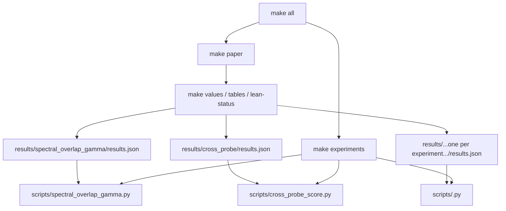

Research papers have a dependency problem. The numbers in the prose come from experiments. The experiments produce JSON. Someone reads the JSON, types a number into the LaTeX, and six weeks later a reviewer asks why Table 2 says 0.34 but Figure 3 implies 0.37.

The answer is always the same: the number was updated in the JSON after the prose was written, and nobody remembered to update the LaTeX.

This post is about the pattern we used to make that class of error impossible.

---

## The problem with copy-paste science

A normal academic writing workflow looks like this:

1. Run experiment, get result (a number, a ratio, a p-value)
2. Open the LaTeX file
3. Type the number in
4. Repeat for 40 numbers across 12 tables and 8 figures
5. Submit
6. Reviewer points out that the abstract says X but Table 3 says Y

This isn't a discipline problem. It's a tooling problem. You have two separate artifacts — code and prose — with no enforced connection between them. Any number that appears in both places will drift.

The fix is the same fix software engineering uses for configuration: **single source of truth, with a build step that propagates it everywhere**.

---

## The structure

```
lazy-rudder-paper/
├── Makefile                    ← top-level orchestrator
├── scripts/                    ← training + analysis drivers (one .py per job)
├── results/                    ← one results.json per experiment, committed
│   ├── spectral_overlap_gamma/results.json
│   ├── cross_probe/results.json
│   └── ...
├── lean/                       ← Lean 4 theorems consumed by the manuscript
└── manuscript/
    ├── Makefile                ← paper-side build (values, tables, lean-status, pdf)
    ├── main.tex
    ├── generate_values.py      ← reads ../results/*/results.json
    ├── generate_tables.py
    ├── generate_lean_status.py
    ├── values.tex              ← generated, never hand-edited
    ├── tables.tex              ← generated
    └── lean_status.tex         ← generated
```

The top-level Makefile orchestrates everything. The manuscript Makefile is at the bottom of the dependency chain: it can't build the PDF until `values.tex`, `tables.tex`, and `lean_status.tex` are current, and those generators refuse to run if their input JSONs are missing.

---

## The macro generator

`manuscript/generate_values.py` reads every experiment JSON under `results/` and writes a single `values.tex` full of `\newcommand` definitions. Sketch:

```python
import json
import pathlib
import statistics

HERE = pathlib.Path(__file__).resolve().parent
RESULTS = HERE.parent / "results"

def fmt(v) -> str:
    if isinstance(v, float):
        return f"{v:.3f}"
    return str(v)

def emit(cmd: str, value) -> str:
    return f"\\newcommand{{\\val{cmd}}}{{{fmt(value)}}}"

lines = []
petri = json.loads((RESULTS / "spectral_overlap_gamma_petri" / "results.json").read_text())
lines.append(emit("SrankSeventy", petri["pythia-70m"]["avg"]["srank"]))
lines.append(emit("SrankOneSixty", petri["pythia-160m"]["avg"]["srank"]))
# ... one line per number that the prose, tables, or figures reference
(HERE / "values.tex").write_text("\n".join(lines) + "\n")
```

The real generator is more verbose because each experiment JSON has its own schema (per-layer arrays, multi-run buckets, paired DPO/CLM runs). The pattern is the same: every number the manuscript shows has exactly one origin in `results/`.

The LaTeX then uses these exclusively:

```latex
% In main.tex
\input{values.tex}
\input{tables.tex}
\input{lean_status.tex}

% In the prose
The task-intrinsic stable rank at Pythia-70M was \valSrankSeventy{}
compared to \valSrankOneSixty{} at 160M --- effectively constant
across an order of magnitude in width.
```

There are zero hardcoded numerical values in the prose. If an experiment reruns and the number changes, `make values` regenerates `values.tex`, `make paper` recompiles the PDF, and every table, figure caption, and sentence updates automatically. Tables are built the same way through `generate_tables.py`, and the Lean theorem-status block (proven vs. `sorry`-stubbed) flows through `generate_lean_status.py`.

---

## The Makefile hierarchy



The top-level Makefile has one phony target per training/analysis driver in `scripts/`. The critical paper-side rule:

```makefile
# manuscript/Makefile
values.tex: $(wildcard ../results/*/results.json) generate_values.py
	uv run python generate_values.py

main.pdf: main.tex values.tex tables.tex lean_status.tex
	latexmk -pdf main.tex
```

`latexmk` handles the multi-pass LaTeX compilation. The dependency on `values.tex` means `make paper` will refuse to build a stale PDF — it will re-run macro generation first.

---

## The .gitignore question

A paper repository has a different profile from a code repository. You want:

- **Committed:** source LaTeX, Python scripts, Makefile, experiment scripts, result JSONs (these are small and reproducible)
- **Not committed:** generated PDFs (large, noisy diffs), intermediate LaTeX artifacts (`.aux`, `.log`, `.bbl`), raw model checkpoints (very large), cached HuggingFace downloads

```gitignore
# Generated manuscript artifacts
manuscript/*.pdf
manuscript/*.aux
manuscript/*.log
manuscript/*.bbl
manuscript/*.blg
manuscript/*.fls
manuscript/*.fdb_latexmk
manuscript/values.tex      # yes, exclude the generated file
manuscript/tables.tex
manuscript/lean_status.tex

# Model artifacts (large, cached, regeneratable)
checkpoints/
**/__pycache__/
*.pt
*.safetensors

# But keep results
!results/**/*.json
```

The interesting call is excluding `values.tex` (and the other generated `.tex` files) from git. This is intentional: they're generated, and committing generated files creates merge conflicts with no benefit. The Makefile always produces them from committed sources. `make paper` on a fresh clone runs the full pipeline.

---

## Why this caught real problems

Early in the project, before we had the macro system, we ran an adversarial review pass — treating the draft like a referee would, looking for inconsistencies between numbers.

We found several. The most embarrassing: a number in the abstract that described a percentage improvement had been updated in the table after the abstract was written. The abstract was wrong by several percentage points. Not because of fraud — because of a normal editing workflow where numbers get updated in one place and not another.

After switching to the macro system, this class of error became structurally impossible. Every number in every sentence comes from the same JSON as every number in every table. They cannot disagree.

The reviewer-caught inconsistencies that remained after this point were about *interpretation*, not arithmetic. That's the right kind of reviewer comment.

---

## What this costs

Build time. A full `make all` on a clean checkout runs every training job, every analysis job, and recompiles the paper. The Pythia training sweep across 70M, 160M, 410M, and 1B takes several GPU-hours serial if you rerun fine-tuning from scratch.

The mitigation: a public mirror of the trained adapters means `make analysis && make paper` can rebuild every JSON in `results/` and the final PDF without re-running training. The Make rules cache on JSON timestamps. You only pay GPU time once, then subsequent `make paper` calls are fast.

There's also a discipline cost: when you add a new experiment, you have to (1) define the `results/<job>/results.json` schema, (2) update `generate_values.py` (and `generate_tables.py` if it's tabular) to read it, and (3) use `\valNewThing{}` in the prose instead of typing the number. This takes five minutes and feels like overhead the first time. By the fifth experiment, it's muscle memory.

---

## Relation to the broader methodology

This pattern is the paper-side complement to the experimental pre-registration protocol. Pre-registration locks the decision rules before you run the experiment (see [How to Honestly Test if a Neural Network Can Be Compressed](/blog/2026-04-28-compression-falsification-ladder/)). The macro system locks the number-to-prose pipeline so the reporting is honest even if the writing happens weeks after the experiments.

They solve different failure modes. Pre-registration catches "I ran the experiment and quietly changed what success means." The macro system catches "I updated the experiment and quietly forgot to update the prose."

Both are cheap to implement. Both are embarrassing to skip.

---

Next in the series: [the two claims that died under adversarial review](/blog/2026-04-22-lora-adversarial-passes/).
