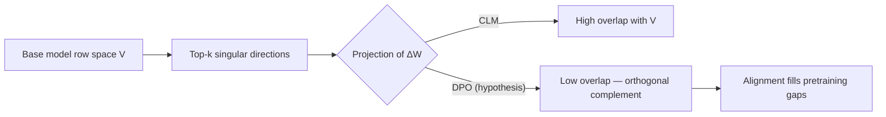
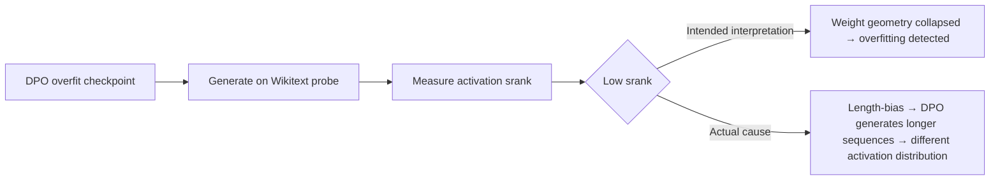

Two claims died during this project. One we were proud of — the orthogonal-complement hypothesis had a satisfying geometric story and clean code to test it. The other we were less proud of — it died because we hadn't thought carefully enough about what we were actually measuring.

Both are worth documenting. The cleaner the story of how a claim dies, the more useful it is for someone who runs into the same idea later.

---

## What "falsified" means here

Not p > 0.05. That phrasing gives you cover: *the result was merely non-significant*. We could have written "no statistically significant evidence for orthogonality" and quietly moved on, preserving the illusion that the hypothesis might still be true.

"Falsified" in the kill-ladder sense means something sharper: **a directional violation of the claimed effect**. Not "we couldn't find it" but "we found the opposite, clearly, in the direction that specifically contradicts the claim."

The distinction matters because it determines what future researchers can do with the result. "Non-significant" is a shrug. "Directional violation" is a specific thing to put in the record: *this mechanism points the wrong way*.

The methodology — locked decision rules, pre-registered direction tests, $\tau$-hardened baselines — is described in full in [How to Honestly Test if a Neural Network Can Be Compressed](/blog/2026-04-28-compression-falsification-ladder/). Same protocol applied here.

---

## Claim 1: The orthogonal-complement hypothesis

<dl class="term-aside">
  <dt>CLM</dt>
  <dd>Causal Language Model — standard next-token prediction loss.</dd>
  <dt>DPO</dt>
  <dd>Direct Preference Optimization — contrastive loss over (preferred, rejected) pairs; no reward model. Details and DPO loss equation: <a href="/blog/2026-04-18-lora-srank-overfitting/">post 1</a>.</dd>
  <dt>srank</dt>
  <dd>Stable rank — ‖W‖²_F / σ²_max. Measures how many singular directions carry weight energy. Low srank = concentrated/spiky spectrum.</dd>
</dl>

### The idea

This one started from a reasonable geometric intuition. The base model has weight matrices $W_0$. We can decompose them via SVD: $W_0 = U \Sigma V^\top$. The right singular vectors $V$ span the row space — the space of input directions the weight responds to.

When we fine-tune with LoRA, we get $\Delta W = BA$. This update sits in a subspace of $\mathbb{R}^{d \times k}$.

The hypothesis: **the DPO update $\Delta W_{\text{DPO}}$ is approximately orthogonal to the CLM update $\Delta W_{\text{CLM}}$ when projected onto the right-singular space of $W_0$.**

In words: DPO learns to respond to input directions that standard language model training ignores. Alignment training fills in the gaps of pretraining.

This would have been a lovely result. It had a clean story, a motivating picture, and an obvious connection to the "alignment tax" phenomenon where instruction fine-tuning degrades performance on standard benchmarks — if the two updates are orthogonal, you can add them without interference.



### How we tested it

For each LoRA target layer and each model size (70M, 1B), we:

1. Computed the top-$k$ right singular vectors of $W_0$ (base model weights)
2. Trained CLM LoRA and DPO LoRA to convergence
3. Projected $\Delta W_{\text{CLM}}$ and $\Delta W_{\text{DPO}}$ onto the span of those top-$k$ vectors
4. Measured the normalized projection mass in the top-$k$ complement (orthogonal complement of the top-$k$ subspace)
5. Compared: does DPO have significantly more mass in the complement than CLM?

The locked decision rule: DPO orthogonal-complement projection must be at least 15% higher than CLM orthogonal-complement projection, directionally consistent across at least 80% of layers.

### What happened

DPO did not go to the orthogonal complement. In the QKV layers — the ones we most expected to show alignment geometry — DPO's $\Delta W$ had *higher* overlap with the base model's top-$k$ subspace than CLM's $\Delta W$ did.

The effect was not "we found nothing." It was backwards: DPO updates are *more* concentrated in the directions the base model already knows, not less. The 15% directional threshold was violated not by being too small, but by pointing the wrong way.

```
Layer 6 (attention query), Pythia 70M:
  CLM complement mass:  0.31
  DPO complement mass:  0.22   ← lower, not higher
  Direction: VIOLATION

Layer 11 (attention query), Pythia 1B:
  CLM complement mass:  0.28
  DPO complement mass:  0.19   ← lower, not higher
  Direction: VIOLATION
```

The retrospective explanation: DPO loss is a contrastive loss over the base model's own log-ratios. It's directly supervised by what the base model already does. That's why the gradients cluster in directions the base model already represents — DPO is essentially a correction within the already-learned space, not an expansion beyond it.

This is not a new insight in retrospect. But the hypothesis was plausible enough before the experiment that the directional violation is a useful addition to the record.

**Status: Falsified. Directional violation. T2.1a retracted.**

---

## Claim 2: Cross-probe srank as overfitting signal

### The idea

If srank is an overfitting signature (as set up in [the first post in this series](/blog/2026-04-18-lora-srank-overfitting/)), then a model trained to overfit on one dataset should show srank collapse that's *detectable* when you probe it with a different dataset — a cross-probe.

The claim: take a DPO LoRA model trained to overfitting on dataset A, then probe its srank using dataset B. The srank should still be low, because the geometric collapse is a property of the weight matrix, not the evaluation data.

Cross-probe srank was supposed to be a model-diagnostic tool: you don't need to know what dataset the model was trained on, just measure srank on a standardized probe set and you get the overfitting signal.

We called this T2.1b in the paper tracker.

### How we tested it

Train DPO LoRA on the Anthropic HH preference dataset. Train CLM LoRA on the same base text. At several checkpoints (including clearly overfit ones), probe srank using Wikitext-103.

The hypothesis: overfit DPO checkpoints should show lower srank under Wikitext probing than matched CLM checkpoints.

### What happened: the length-bias artifact

The cross-probe signal was there. The problem was where it came from.

The DPO training data (preference pairs) has a systematic length distribution: preferred outputs tend to be longer than rejected outputs. This is the classic length-bias problem in RLHF — raters prefer responses that *sound more thorough*, which correlates with length.

The DPO model learned this. By the overfitting regime, it was generating longer continuations on any prompt. When we measured srank at inference time on Wikitext-103, we were inadvertently measuring over sequences of different effective length — the DPO model's representations had been probed at a different depth than the CLM model's.

Srank of $\Delta W$ shouldn't depend on generation length at all — it's a static property of the weight matrix. But we weren't measuring $\Delta W$ directly in the cross-probe setup. We had used activation-space srank as a proxy (the srank of the output activations at a given layer), which *does* depend on the distribution of inputs.

The "overfitting signal" we found was partly a length-confounder: the DPO model's activations were low-srank because they were responding to length patterns in the probe data, not because the underlying weight geometry had collapsed.



Once we separated weight-space srank (computed directly from $\Delta W$ without any forward pass) from activation-space srank, the cross-probe signal disappeared. Weight-space srank on the overfit checkpoints was indistinguishable from weight-space srank on the non-overfit checkpoints at the same training step.

**Status: Retracted. Length-bias artifact. T2.1b removed from paper.**

---

## The pattern these two share

Both claims came from a real phenomenon — the orthogonal-complement intuition was geometrically motivated, and the cross-probe srank did show a signal. The failures were in the gap between *a real phenomenon exists* and *the mechanism is what you think it is*.

The orthogonal-complement hypothesis assumed that alignment training explores new directions. The data showed it recombines known directions.

The cross-probe srank hypothesis assumed activation-space srank proxies weight-space srank cleanly. It doesn't, because generation length is a confounder.

Both of these are what pre-registration is for. Without a locked decision rule — specifically, a locked *measurement protocol* specifying weight-space vs activation-space srank — the cross-probe result could have slipped through. The measurement was ambiguous, the signal was real-looking, and there was no a priori reason (before we understood the length bias) to question it.

The discipline from [compression-ladder methodology](/blog/2026-04-28-compression-falsification-ladder/) helped here: trap cells that check for exactly this kind of confound. We added a length-control trap — match DPO and CLM generation length explicitly, then re-run the srank measurement. The signal vanished. That's how we knew it was a confounder and not an effect.

---

## What goes in the record

For each killed claim:

- `decision.json`: machine-readable verdict, the direction of violation, the locked threshold
- `postmortem.md`: the failed mechanism, the actual mechanism (if known), what would have to be true for the claim to be salvageable
- `trap_results.json`: which trap cells fired and how

The postmortems for T2.1a and T2.1b are the most useful outputs of this project for external researchers, because they document two specific wrong paths in the space of "alignment geometry of LoRA fine-tuning." That space is still mostly unexplored. The failures are landmarks.

---

Next: [building the interactive microsite as a publication artifact](/blog/2026-04-24-lora-microsite-as-publication/).
