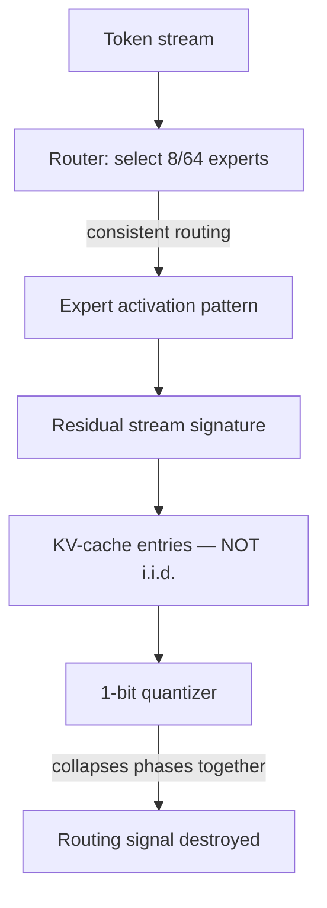

Given only the moment statistics of a layer's KV activations — no inference run, no calibration sweep — you can prove whether 1-bit quantization of that layer is achievable. Not "probably bad." Provably impossible, with an explicit bound on the information loss floor.

That is the MoEGauge result. This post walks through the phenomenon that makes it true — phase collapse — and the moment-ratio framework that turns the observation into a bound.

The full paper is at the [MoEGauge microsite](https://moe-gauge-paper.pages.dev/).

---

## A quick MoE primer

In a dense transformer, every token goes through every weight. In a Mixture-of-Experts transformer, a router selects a small subset of "expert" FFN blocks for each token — in OLMoE-1B-7B, 8 experts out of 64. The idea is that the model learns specialization: different experts handle different types of content, and the router learns to route accordingly.

This is computationally efficient for inference if you can afford to keep the expert weights in memory. The KV-cache — the accumulated key-value pairs from attention heads — is a separate cost. On long contexts, it's often the dominant memory bottleneck.

The obvious move: quantize the KV-cache aggressively. INT4, INT2, maybe 1-bit. This works for dense models to a degree. For MoE models, it goes wrong in a specific way.

---

## Phase collapse: what it is

Here's the observation that motivated the paper. In a dense model, the distribution of attention head activations across token positions is relatively diffuse. Different heads attend to different things, but no head has an extreme preference for a tiny cluster of positions.

In MoE models, something different happens. The attention head activations *concentrate* around a small number of position clusters — and those clusters correspond to the expert routing patterns. Specifically: when the router consistently selects the same expert combination for a particular type of token, the residual stream going into the attention layers picks up a structural signature from that routing decision. The KV-cache entries for those positions are not independent random vectors — they're clustered.

We call this **phase collapse**: the distribution of KV-cache activations collapses from a broad distribution to a small number of well-separated phases, each corresponding to a dominant expert routing pattern.

Why does 1-bit quantization destroy this? Because a 1-bit quantizer maps every value to ±1. The phase structure lives in the fine-grained distribution of values — the precise positions of the cluster centroids. A binary quantizer can't represent those centroids; it just records sign. The clustering information, which is the routing signal, is gone.

This is a structural incompatibility, not a precision issue. Going from INT4 to INT2 doesn't help; you need to resolve the clusters, not just reduce quantization granularity.

---

## The moment-ratio framework

The question is: can we quantify how much routing signal is destroyed by a given quantization scheme? And can we do this *without* running inference — from the weight statistics alone?

The insight is that the phase structure leaves statistical fingerprints in the second and fourth moments of the KV activations across token positions.

Define two quantities per attention head $h$ and layer $\ell$:

- $\sigma^2_{h,\ell}$: variance of KV activations across token positions
- $\kappa_{h,\ell}$: excess kurtosis (fourth standardized central moment minus 3)

For i.i.d. Gaussian activations, $\kappa \approx 0$. Positive kurtosis means heavy tails — a distribution with occasional very large values. Negative kurtosis means a distribution flatter than Gaussian.

Phase collapse produces a specific pattern: **high kurtosis combined with low variance**. Intuitively, the activations sit in a few tight clusters (low variance within each cluster, so low total variance), but the clusters are well-separated (occasional large values when comparing across clusters, hence elevated kurtosis).

The **moment ratio** $\mu_{h,\ell} = \kappa_{h,\ell} / \sigma^2_{h,\ell}$ is a heuristic indicator: high moment ratio signals heads where heavy tails coexist with low spread, the signature of well-separated clusters. The MoEGauge construction aggregates these per-head ratios into a single gauge value $G$ for the layer:

$$G_\ell = \frac{1}{H} \sum_{h=1}^{H} \max\left(0, \frac{\kappa_{h,\ell}}{\sigma^2_{h,\ell}}\right)$$

The gauge is constructed to be non-negative (negative moment ratios indicate heads that are already diffuse and not at risk of phase collapse) and averaged across heads.

---

## The MoEGauge theorem

The paper's core theoretical result bounds the information loss from quantization as a function of the gauge value.

Informally: if a layer has gauge value $G_\ell$, then any $b$-bit quantization scheme applied to its KV-cache suffers at least $f(G_\ell, b)$ bits of routing-signal information loss, where $f$ is an explicit function of the moment statistics and the quantization resolution.

This is a lower bound on loss — it says "you cannot do better than this, regardless of the quantization scheme." It's not a claim about a specific algorithm; it's a claim about the problem structure.

The bound has a practical use: given a budget of $b$ bits, you can compute the gauge and determine whether 1-bit quantization is *theoretically possible* for a given layer, or whether the phase structure is so strong that even the best possible 1-bit scheme will destroy routing signal beyond recovery.

For OLMoE-1B-7B at 1-bit resolution: several layers are in a regime where the gauge is high enough that no 1-bit scheme can preserve the routing signal. This is not a calibration problem. It is the bound.

---

## Why prove the bound in Lean

The MoEGauge theorem is proved in Lean 4 — a proof assistant where the compiler refuses to accept a proof unless every step checks out. What that buys for this paper: the bound is the foundation for the downstream claim "this layer cannot be 1-bit quantized." If the bound has a gap, the experimental design is compromised. A machine-checked proof rules that out.

It also forces the informal language to be precise. "The gauge captures phase structure" cannot be left fuzzy — phase structure has to be defined, the gauge construction has to be defined, the relationship has to be proved. Gaps in intuition become compile errors.

---

## From gauge to experiment

The paper's structure follows naturally from the gauge construction:

1. Define the moment-ratio gauge on real KV activations from OLMoE-1B-7B
2. Compute per-layer gauge values from forward passes on calibration data
3. Apply the bound to determine theoretically attainable resolution per layer
4. Test 1-bit quantization at layers predicted to be in the collapse regime vs. layers predicted to be safe
5. Verify that the bound is informative — that the predicted failures actually fail

This is the compression-falsification methodology applied to a formal object: the gauge is a prediction machine, and we test whether its predictions are correct.

The natural next question after establishing the KV-cache bound is whether the same phase-collapse phenomenon appears in FFN weights — and whether the β-lift observed in the gauge construction carries over to a rotation-based compression of FFN parameters. That's the subject of Part E of the paper, which [post C2](/blog/2026-04-25-moe-ffn-pivot/) covers.

The methodology for how we decided what counts as "the gauge is informative" — kill criteria, trap cells, τ-baselines — is the subject of the [pre-registration post](/blog/2026-04-20-preregistration-ml/), and the fuller worked example is in the [compression-falsification-ladder post](/blog/2026-04-28-compression-falsification-ladder/).

---

## What phase collapse tells you about MoE architecture

One thing worth pulling out: the phase-collapse result is not just a compression obstacle. It's a window into what MoE routing actually does to the residual stream.

The fact that KV activations cluster around routing patterns means the attention mechanism is, in part, tracking *who got routed where*. The key-value cache isn't just storing "what this position contained" — it's storing "how this position was processed." This has implications beyond compression: it suggests attention heads in MoE models have a partially different computational role than their dense-model counterparts.

We don't claim this as a theorem — it's an interpretation. But the gauge values are real, the clusters are real, and the quantization failures are real. Phase collapse is the name for a phenomenon that was always there; the moment-ratio framework just made it measurable.

Full paper and Lean source: [moe-gauge-paper.pages.dev](https://moe-gauge-paper.pages.dev/).
