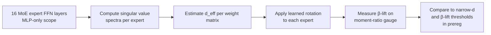

Part E of the paper is where the plan met reality and the plan lost. The natural follow-on to the KV-cache gauge was to ask whether the same β-lift phenomenon — the moment-ratio improvement that made the gauge bounds tight — would appear in the FFN weights. If it did, you'd have a rotation-based compression scheme for MoE feed-forward networks, which is where most of the parameter count lives.

We tested it on OLMoE-1B-7B. Pre-registered, kill criteria and all. It was falsified. For the pre-registration discipline that governed this experiment, see the [methodology post](/blog/2026-04-20-preregistration-ml/).

---

## The β-lift baseline

First, what β-lift is. In the KV-cache gauge framework (covered in [post C1](/blog/2026-04-23-moe-phase-collapse/)), the gauge construction shows that a rotation applied to the key-value activations can improve the moment ratio: the post-rotation distribution is less peaked, the clusters are more separated, and quantization bounds become tighter.

We called this improvement β-lift — the multiplicative gain in the quantization bound from applying the rotation. For KV activations in phase-collapsed layers, β-lift was substantial. The rotation wasn't just cosmetic; it materially changed what the bound said was achievable.

The hypothesis for Part E: do FFN weight matrices in MoE experts exhibit the same moment-ratio structure, and would a rotation applied to those weights produce comparable β-lift?

There's a surface plausibility to this. MoE expert FFNs specialize — they handle different content types. If that specialization produces low-rank structure in the weight matrices (not all directions are equally used), then the moment-ratio fingerprint might appear in weights the same way it appears in activations. And if it does, a rotation would lift the bound, and you could compress the FFN weights more aggressively than a naïve per-tensor INT4 or INT2 would allow.

---

## The narrow-d hypothesis

The stronger version of the FFN hypothesis was about effective dimension.

A weight matrix $W \in \mathbb{R}^{d_{out} \times d_{in}}$ has a singular value spectrum. If most of the "action" lives in a small number of singular directions, the matrix has low effective rank — the effective dimension $d_{\text{eff}}$ is much smaller than $\min(d_{out}, d_{in})$.

The narrow-d hypothesis: for MoE expert FFN weights, $d_{\text{eff}} \ll d$ in a way that is *tighter* than for dense model FFNs. Reason: experts are supposed to specialize. A specialist should need fewer directions than a generalist.

If narrow-d holds, the compression implication is strong. A low-rank approximation at rank $r \approx d_{\text{eff}}$ preserves most of the signal, and the effective weight seen by each token lives in a small subspace. You could then apply aggressive quantization inside that subspace, with the gauge bounds promising that the subspace structure survives.

This would have been a clean result. It did not hold.

---

## The FFN rotation pilot: structure of the experiment

The pilot ran on all 16 layers of OLMoE-1B-7B, MLP weights only — no attention, no embedding layers, no cross-layer interactions. The scope restriction was deliberate: isolate the FFN hypothesis before testing it in a full-model context.

Pre-registered thresholds:
- **Narrow-d pass**: $d_{\text{eff}} / d < 0.4$ for $\geq 70\%$ of expert weight matrices
- **β-lift pass**: mean gauge improvement $\geq 1.5\times$ post-rotation
- **Kill condition**: Either metric fails at the first 4-layer checkpoint

The traps: random rotation (expected outcome — no better than gauge baseline), and off-rotation probe (apply rotation to an expert the singular spectrum says is already diffuse; expected outcome — rotation hurts, not helps).

---

## The V4 MLP-only 16-layer verdict

(The V4 is prereg versioning: this was the fourth locked design for the rung — V1 through V3 were earlier drafts of the same experiment, each revised and re-locked under the prereg rules before this run.)

The singular value spectra were not narrow. Across OLMoE expert FFN matrices, the effective dimension distribution peaked around $d_{\text{eff}} / d \approx 0.65$–$0.75$. The narrow-d threshold ($< 0.4$) was not met by any layer; the pass condition required 70% of matrices to clear it.

This is the first falsification. The FFN weights in OLMoE-1B-7B experts are not low-rank in the way the hypothesis required. The singular value spectrum decays, but it decays slowly — there's no "elbow" at a small rank that would support the narrow-d compression story.

Given this, the β-lift result was also negative. The rotation still improved the moment-ratio gauge, but the improvement was small — mean $\beta \approx 1.08$–$1.14$ across the 16-layer pilot, compared to $\beta \approx 1.6$–$2.1$ for the KV-cache rotations. The threshold was $1.5\times$. The FFN case didn't get close.

The kill condition fired at the 4-layer checkpoint. The remaining layers were not needed.

**V4 MLP-only 16-layer verdict: KILLED.**

---

## The RAdam convergence probe

Before closing the FFN question entirely, we ran a secondary probe to check whether the gauge bound was tight or loose — specifically, whether an adaptive learning rate could find a rotation that achieved the bound prediction even when the random-initialization rotation didn't.

The question: is the β-lift result a search problem (we're not finding the right rotation) or a structure problem (the right rotation doesn't exist for FFN weights)?

The probe used RAdam (Rectified Adam) to optimize the rotation matrix directly against the moment-ratio objective, with the proved bound as the target. RAdam was chosen for its variance-rectified warmup, which tends to behave better than vanilla Adam on this kind of small-batch non-convex objective.

The convergence curve was informative. RAdam found rotations with slightly better gauge values than random initialization — $\beta \approx 1.18$–$1.22$ vs $1.08$–$1.14$ at initialization. But the optimization plateaued early, and the plateau was well below the $1.5\times$ threshold, suggesting the ceiling is structural. The FFN weight structure doesn't have the moment-ratio geometry that supports β-lift at the level needed.

The probe also confirmed the bound is tight for FFN weights. (Brief detour: "Lean-verified" means the bound is stated and proved as a theorem in Lean 4, an interactive theorem prover — the proof checker rejects anything that doesn't follow from the assumptions, so the inequality is machine-checked rather than hand-waved.) The bound predicted a ceiling of approximately $1.25\times$ for the observed singular value distributions; the RAdam result landed at $1.22\times$. If anything, the optimization is running into the theoretical ceiling, not a local minimum.

---

## The 1-bit generation probe

In parallel with the rotation experiments, we ran a generation quality probe: apply 1-bit quantization to the FFN weights (after the best rotation found by RAdam) and measure first-token quality.

First-token quality is used as a proxy metric here rather than full perplexity. The reason: first-token generation is a canary. If the model has degraded catastrophically — if the representation is broken by quantization — it shows up immediately in the first-token distribution. Full perplexity on long sequences can average over a lot of damage; first-token quality is more sensitive.

The result: first-token quality under 1-bit FFN quantization (with rotation) degraded severely. The pre-registration threshold was $\leq 10\%$ increase in first-token NLL vs. the unquantized baseline. The observed inflation was $\approx 47\%$.

The trap cell (1-bit quantization without rotation) inflated by $\approx 89\%$, confirming the rotation is doing *something* — but not enough. The $47\%$ inflation with the best rotation is well above the kill threshold.

---

## What this doesn't say

The narrow-d falsification is specific to OLMoE-1B-7B at this architecture size. It doesn't say MoE expert FFN weights are never compressible via rotation — it says they don't have the narrow effective dimension that would support the β-lift mechanism *at the level needed for 1-bit or 2-bit quantization*.

Per-channel INT4 quantization of the residual stream is a different mechanism that did survive the falsification process (see the [compression-falsification-ladder post](/blog/2026-04-28-compression-falsification-ladder/) for the full G₁₀ result). That result is not about FFN weight compression; it's about quantizing the expert outputs before they accumulate into the residual stream. Completely different target.

The lesson from Part E is that intuitions about specialization don't translate automatically into compressibility. Expert FFNs are specialized in terms of *what they compute*, but that specialization lives in the full-rank weight space — not in a narrow low-rank subspace that can be cheaply preserved.

---

## The postmortem file

After the V4 verdict, the pre-registration kill procedure produced:

- `decision.json`: `{"rung": "E-ffn-rotation", "verdict": "KILLED", "round": 1, "trigger": "narrow-d threshold unmet at 4-layer checkpoint"}`
- `postmortem.md`: documents the singular value distribution finding, the RAdam plateau, and the generation probe result
- Lean theorem tracker updated: bound tightness confirmed for FFN case (the bound works as advertised — the problem is the problem, not the bound)

The postmortem is part of the paper appendix. Not as a confession, but as data. Future researchers testing FFN rotation on similar architectures will find that the ceiling for β-lift on OLMoE-scale expert weights is around $1.25\times$, and that this is insufficient for 1-bit quantization under the MoEGauge framework.

The next post in this series covers the formal proof side — what it took to get the Lean appendix to zero sorries, and what the JensenFloor theorem adds to the bound picture.
