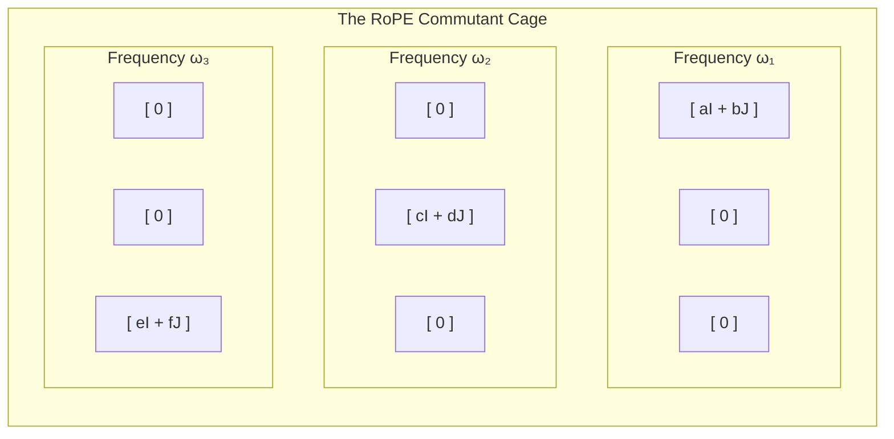

The question we started with was a bit of an architectural dare: can you rotate the attention heads of a Llama-style model into a more compressible format without changing a single logit?

The answer depends on the **RoPE commutant**. This post walks through the algebraic characterization of which symmetries survive RoPE, and which ones are "caged" by the rotation schedule.

---

## The 2D Commutant "Cage"

RoPE (Rotary Positional Embedding) works by rotating 2D pairs of the attention head's embedding space. If you want to apply a shared orthogonal transformation $R$ to the model's weights at zero inference cost, $R$ must commute with the RoPE operator.

In `LeanMining/VerifiedNeuralCompilation/Symmetry.lean`, we've recently landed a complete characterization for the 2D case.

**Theorem: `commutesWithQuarterTurn_iff`**
A matrix $R$ commutes with a $90^\circ$ RoPE block iff it is of the form $aI + bJ$ (a complex scalar in the 2D plane). If $R$ is orthogonal, then $a^2 + b^2 = 1$.

**Intuition**: The only orthogonal transformations that "survive" a single 2D RoPE block are rotations within that same 2D plane. Everything else is broken by the positional encoding.

## Lifting to Llama-like Schedules

Things get more restrictive when you lift this to a full head-dimension with multiple frequencies (like Llama's RoPE schedule). 

We've proven two key transport lemmas:
*   **`intertwiner_zero_of_cos_ne`**: This is a Schur-style vanishing lemma. It proves that if two RoPE blocks have different rotation frequencies, they admit **zero** nonzero intertwiners. 
*   **The Result**: Any shared symmetry $R$ across the whole head must be **block-diagonal**, with each block corresponding to a frequency class.

**Verdict**: You cannot rotate "across" frequencies. The RoPE schedule acts as a cage that forces your architectural symmetries into isolated 2x2 frequency-sectors.

## Why this matters for "Zero-Cost" Compilation

This isn't just an abstract algebra exercise. The theorem **`folded_qkvo_attention_block_invariant_of_commutes`** proves that if your rotation $R$ lives in this commutant cage, it can be folded into the weights at compile-time with **zero FLOPs** at inference.

By formalizing these intertwiner equations in Lean 4, we've moved beyond "hoping" that our quantization rotations are safe. We now have a machine-checked boundary: we know exactly where architectural symmetries end and where approximation—and its associated error—must begin.

Next: [Multi-Head Foldability](/blog/2026-05-16-rope-multi-head-foldability/), where we lift these single-head proofs to the entire Transformer block.
