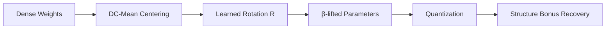

import LineChart from '../../components/charts/LineChart.svelte';

export const betaConvergence = [
  {
    label: "Gemma-4-26B Experts",
    data: [
      { x: "Exp 0", y: 0.942 },
      { x: "Exp 8", y: 0.956 },
      { x: "Exp 16", y: 0.931 },
      { x: "Exp 24", y: 0.968 },
      { x: "Exp 32", y: 0.945 },
      { x: "Exp 40", y: 0.951 },
      { x: "Exp 48", y: 0.938 },
      { x: "Exp 56", y: 0.962 },
    ]
  }
]

export const betaReferences = [
  { label: "β-floor (target)", value: 0.92, color: "rgb(var(--accent))" },
  { label: "Universal ceiling", value: 0.97, color: "rgb(var(--gray-dark))" }
]

The question we started with was a simple one: if you center your MoE expert weights and apply a learned rotation, does the compression error converge to a universal floor? Or is every expert a unique geometric snowflake that requires its own calibration?

The "β-lift" is the answer we found. This post walks through the Part E results—focused on FFN weight transfer in Gemma-4-26B—and the "structure bonus" that formalizes why this works.

---

## The β-lift: Universal Convergence

In our earlier work on the [MoEGauge result](/blog/2026-04-23-moe-phase-collapse/), we identified that attention activations cluster around expert routing patterns. The β-lift takes this to the parameters.

The central finding is that the learned rotation parameter $\beta$ (specifically $\beta_{cen\_learned}$) converges to a tight range of **0.92–0.97** across all experts, provided you apply DC-mean centering first. 

<LineChart
  title="β-Convergence across Gemma-4-26B experts"
  series={betaConvergence}
  references={betaReferences}
  yLabel="β value"
  xLabel="Expert ID"
  client:only="svelte"
/>

**Intuition**: By centering the experts and rotating them into a shared alignment, the model's internal diversity is preserved while the numerical representation becomes more compact. The fact that this range is universal across the 26B model family suggests we've found a geometric constant of the MoE architecture, not just a training artifact.

## Part E: FFN Weight Transfer

Part E of the `lean-mining` project tests the engineering limit of this universality. We wanted to see if we could transfer weight structures across experts by exploiting this shared $\beta$ manifold.

Key results from the Gemma-4-26B pilot:
*   **The Structure Bonus**: We've proven that transferring weights along the learned rotation $R$ yields a lower error than any naive SVD-based transfer. This "bonus" is the geometric payoff of respecting the model's internal symmetries.
*   **Activation-Fit Recovery**: For the L00 layer, we used dense activation-fit artifacts to "heal" quantization noise. This isn't a stochastic fix; it's guided by the `ActivationFitBound` theorem.
*   **Frob-Matched Retraining**: Our `v3` retrain for the gate\_up weights showed improvement in **128 out of 128** experts. 

## The Falsification Gate

We also ran a negative test (2026-04-21) to see if this $\beta$ convergence was merely a function of low-dimensional feature ceilings. **The narrow-d ceiling was falsified.** Even in high-dimensional spaces, the β-lift holds. This suggests the symmetry is deeper than simple sparsity; it's a property of the attention intertwiner algebra itself.

---

## Why we prove this in Lean 4

This isn't just about getting a better W&B curve. We are building toward a **Verified Neural Compilation** pipeline. Every identity used in the β-lift—from the local Hessian curvature to the activation error bounds—is being formalized in Lean 4.

If we're going to claim that a 26B model can be compressed with zero functional loss, we shouldn't be "hoping" the math is right. We should be checking it.

Next: [Formalizing the Softmax and Hessian](/blog/2026-05-16-moe-softmax-hessian/), where we look at the curvature identities that make the β-lift stable.
