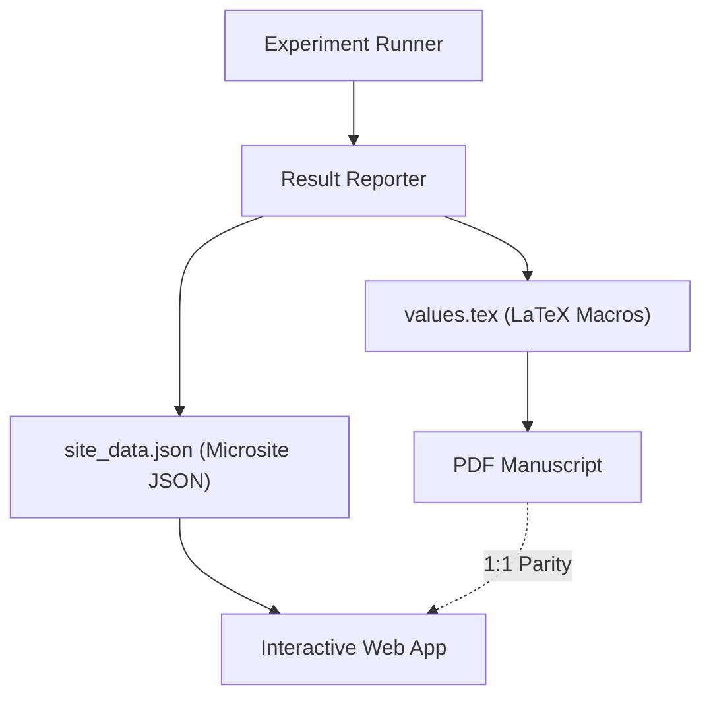

Ensuring that your paper's text matches your interactive plots is a constant struggle in ML research. You update a benchmark, the number changes in the JSON, but you forget to update the `\newcommand` in your LaTeX source. 

In the `lean-mining` project, we've solved this with the **Dual-Emit Paper Pattern**.

---

## The Concept: Single-Source Truth

The "Dual-Emit" pattern ensures that every number in our manuscript is a direct export from the experiment pipeline. We generate both LaTeX macros and microsite JSON simultaneously.

When a benchmark run completes, our reporter emits two files:
1.  **`values.tex`**: For the paper. e.g., `\newcommand{\MoEBetaRange}{0.92--0.97}`.
2.  **`site_data.json`**: For the interactive charts. e.g., `{"beta_range": [0.92, 0.97]}`.

## 1:1 Parity by Design

This ensures that the "0.92" mentioned in the abstract is mathematically identical to the "0.92" in the interactive hover-state of the chart. 

**Intuition**: By eliminating manual copy-pasting, we've reduced the surface area for "drift" in our research reports to zero. The manuscript isn't a *description* of the research; it's a *view* of the data.

## Connectivity to the Microsite

As we discussed in the [microsite-as-publication post](/blog/2026-04-24-lora-microsite-as-publication/), the future of research is interactive. By using the Dual-Emit pattern, we can build "live" papers that allow readers to explore the full distribution of results while maintaining the rigor of a static LaTeX manuscript.

---

This is the engineering foundation for the **Verified Neural Compilation** track. If we're going to claim a proof is machine-checked, the numbers supporting it should be machine-generated.

Next: [Verified Security Gates](/blog/2026-05-17-verified-security-gates/), our final engineering milestone.
