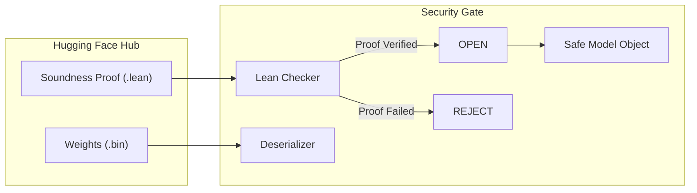

Pickle is a well-known "CVE factory" in the ML ecosystem. It's essentially an arbitrary code execution vector disguised as a serialization format. In the `falcon-secure` project, we're building **Verified Security Gates** to fix this.

This isn't about sandboxing; it's about **Proof-Gated Deserialization**.

---

## The Problem: The Insecurity of "Trusting" Tensors

When you load a `.bin` or `.pt` file from the Hub, you are trusting that the creator didn't include a malicious payload. Standard defenses (like `safetensors`) help by restricting the format, but they don't provide a machine-checked guarantee of *semantic* correctness.

## The Solution: Proof-Gated Deserialization

A **Verified Security Gate** requires a Lean 4 soundness proof that the data follows a specific, restricted type-stub schema. 

The workflow is:
1.  **Schema Definition**: We formally define the allowable tensor shapes and types in Lean.
2.  **Soundness Proof**: We prove that the deserializer *only* admits bytes that satisfy this formal schema.
3.  **Gate Implementation**: The deserializer runs in a "secure zone" that only opens if the proof is verified by the Lean compiler.

**Intuition**: It's like a bouncer at a club who only lets you in if you can prove your ID is genuine. But instead of an ID card, you're presenting a formal proof of your data's type-integrity.

## Beyond Sandboxing

As we discussed in [naming what fails](/blog/2026-05-08-naming-what-fails-obstacle-taxonomy/), traditional security is reactive. Verified Security Gates are proactive. They ensure that the process **cannot be compromised** via the deserialization path in the first place. 

This is the ultimate infrastructure component for the future of "trusted research artifacts." By bridging the gap between formal verification and Python-side deserialization, we are building a safer foundation for the entire ML research community.

---

This concludes our current series on **Infrastructure for Frontier Research**. We've gone from [HF-Streaming](/blog/2026-05-13-hf-streaming-large-artifacts/) to [Dual-Emit manuscripts](/blog/2026-05-16-dual-emit-paper-pattern/) and finally to [Verified Security Gates](/blog/2026-05-17-verified-security-gates/). 

The goal remains the same: building research infrastructure that is as rigorous as the research itself.
